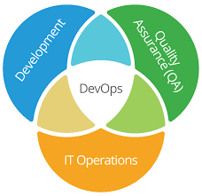
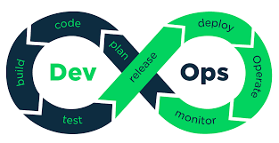

# 自动化运维

- [x] 批量运维：减少重复劳动和人为失误

- [x] 资源/服务监控：及时发现异常

- [x] 持续集成：通过CI/CD工具，结合Docker、K8s，运用自动部署工具或API等手段，完成项目持续迭代，应用的持续部署

- [x] 日志平台：性能分析、故障定位

- [ ] 配置管理：通过代码使基础架构的配置和管理自动化

- [ ] 代码审查：保证代码质量、代码安全

- [ ] ...

  

# DevOps

> DevOps 是一种文化、一种理念。

 or  

[DevOps 的核心价值观](https://www.oreilly.com/learning/why-use-terraform) 是 *团队文化(Culture)*、 *自动化(Automation)*、 *评估(Measurement)*和 *分享(Sharing)*（CAMS），同时，团队对 DevOps 的执行力也是 DevOps 能否成功的重要因素。

- **团队文化**让大家团结一致
- **自动化**是 DevOps 的基础
- **评估**保证了及时的改进
- **分享**让 CAMS 成为一个完整的循环过程

DevOps 的另一个思想是任何东西，包括服务器、数据库、网络、日志文件、应用配置、文档、自动化测试、部署流程等，都可以通过代码来管理。

