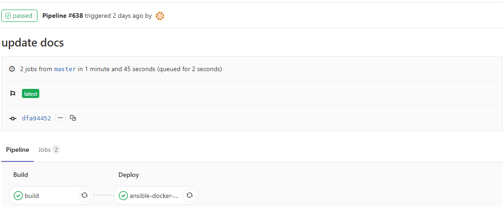

> [**GitLab CI/CD**](https://docs.gitlab.com/ce/ci/)是GitLab内置的工具，用于项目持续集成、持续部署。GitLab CI/CD 由位于代码仓库根目录的名为**.gitlab-ci.yml**的文件配置。而此文件中设置的脚本由GitLab Runner执行。

[本书](http://gitlab.keep.com/devops/docs) 通过GitLab CI/CD自动发布：

