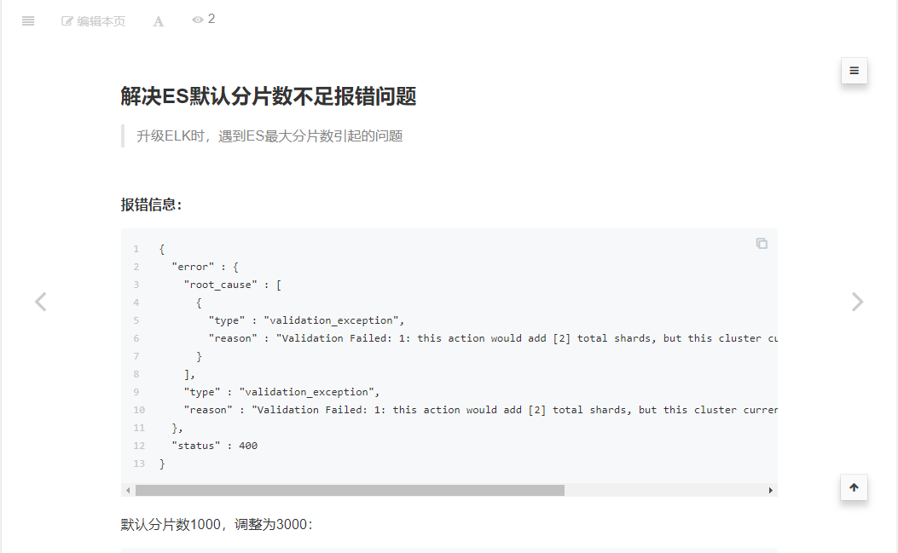
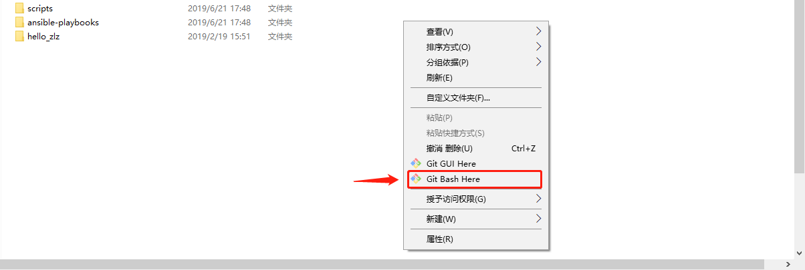
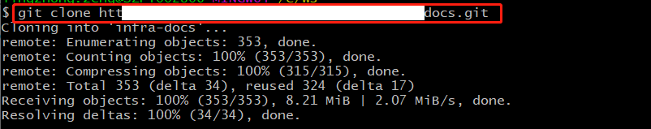
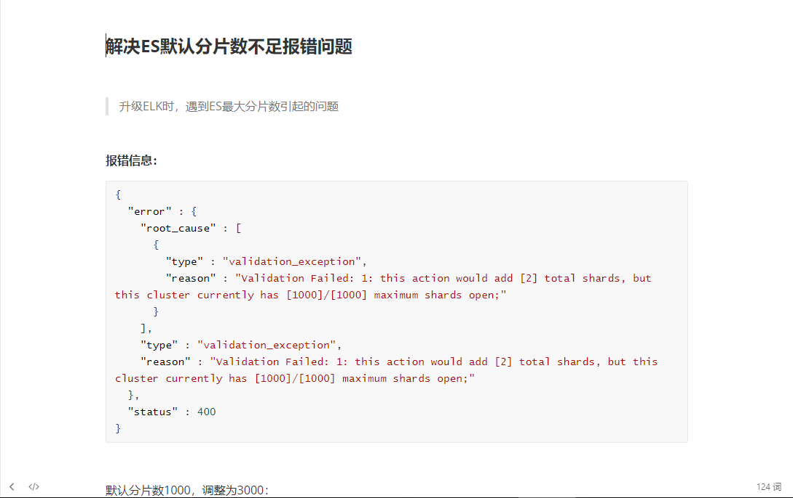
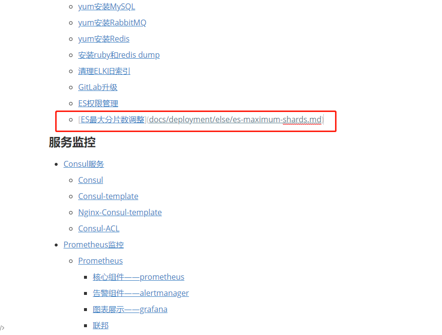
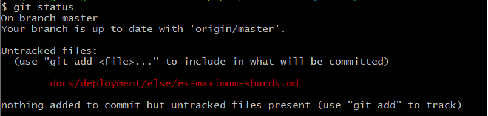
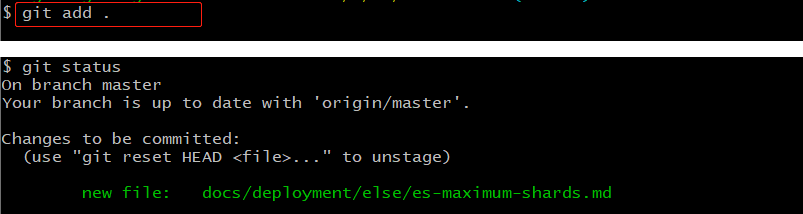
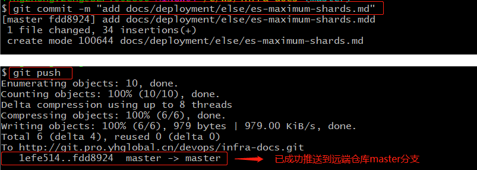
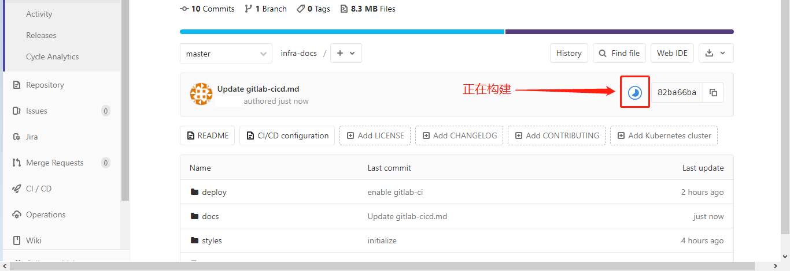

# 通过Gitlab发布Gitbook




## 安装git客户端

Windows版Git客户端：<https://gitforwindows.org/>


## 创建gitbook项目docs

gitbook项目docs的目录结构：

```
docs                 # 仓库根目录
├── book.json        # gitbook配置文件
├── deploy/          # 存放部署脚本
├── .gitlab-ci.yml   # gitlab ci配置文件
├── Dockerfile       # docker镜像编译脚本
├── docs/            # 文档集中存放目录
│   ├── assets/              # 图片目录
│   ├── cicd/                # 持续集成
│   ├── deployment/          # 应用部署
│   ├── task-sheduling/      # 任务调度
│   ├── config-management/   # 配置管理
│   └── monitoring/          # 运维监控
├── README.md    # 书籍首页
├── styles/      # css文件
└── SUMMARY.md   # 书籍目录文件

```


## 克隆gitbook项目

已安装好git客户端，空白处右键如图打开git客户端：




git clone 项目文件到本地：




## 添加一个文档

以下在原项目的docs/else目录下添加一个文档`es-maximum-shards.md`




并修改书籍目录




## 添加修改、提交、推送

- 查看、添加改动







- 提交到本地版本库、推送到远程版本库（master分支）

  git commit 提交时，"-m"参数写一点简明的备注信息。




## 自动构建、发布

git push成功之后，在gitlab上可以查看构建进度：




