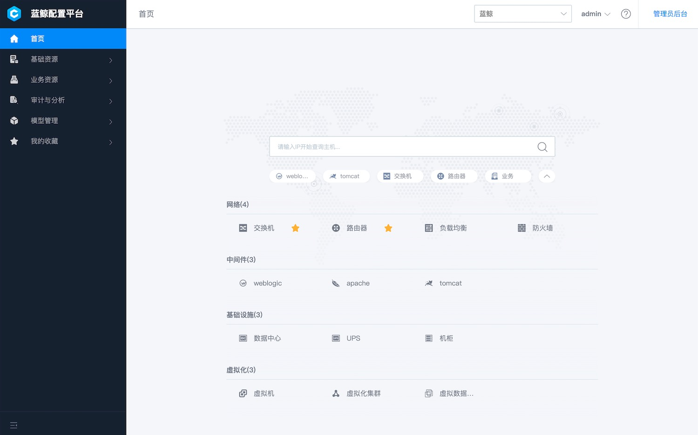

---

> **蓝鲸配置平台**（[蓝鲸CMDB](https://github.com/tencent/bk-cmdb)）是一个面向资产及应用的企业级配置管理平台。

蓝鲸配置平台提供了全新自定义模型管理，用户不仅可以方便地实现内置模型属性的拓展，同时也能够根据不同的企业需求随时新增模型和关联关系，把网络、中间件、虚拟资源等纳入到CMDB的管理中。除此之外还增加了更多符合场景需要的新功能：机器数据快照、数据自动发现、变更事件主动推送、更加精细的权限管理、可拓展的业务拓扑等功能。

在技术构建上，架构的核心聚焦于资源，我们把CMDB管理的原子资源分为主机、进程和通用对象三种类型，并构建了对这些资源的原子操作层。在这些原子操作之上，我们构建了更贴近用户操作的场景层，场景层通过对不同资源的组合操作来完成用户的请求。

