# Ansible简介

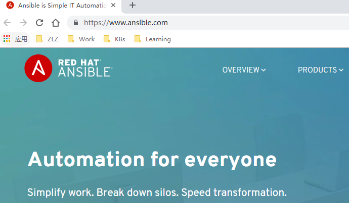


>  正如[Ansible官网](https://www.ansible.com/)的标题“Ansible is Simple IT Automation”含义，Ansible简化了IT自动化的实现，是高效运维的一个重要工具。


Ansible的设计初衷就是在若干服务器上从零开始执行所有必需的配置与操作。例如，在启动Web 服务器之前先启动数据库，或者为了实现零停机升级，将Web 服务器逐一从负载均衡上摘除并升级。Ansible通过极简的模型来控制各种操作按照所需顺序执行。其它同类工具有：Chef、Puppet 及Saltstack。


## 架构

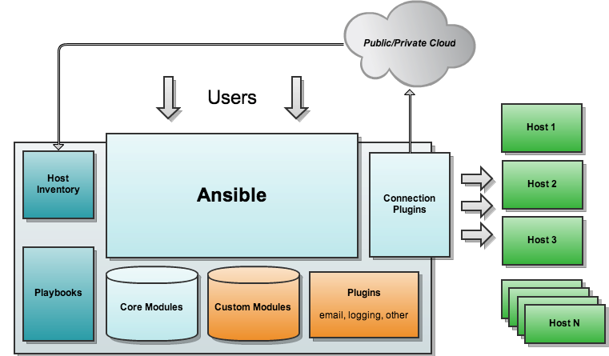


| 组件               | 功能                                                         |
| :----------------- | ------------------------------------------------------------ |
| ansible core       | ansible自身核心模块                                          |
| host inventory     | 主机清单，定义可管控的主机列表                               |
| connection plugins | 连接插件，一般默认基于ssh协议连接                            |
| modules            | core modules（自带的核心模块）、custom modules（自定义模块） |
| playbooks          | 剧本，按照所设定编排的顺序执行命令                           |


## 特性

+ 基于Python语言实现，由Paramiko（Python的一个可并发连接ssh主机功能库），PyYAML和Jinja2（模板化）三个关键模块实现
+ 模块化设计，ansible自身是一个核心组件，调用特定的模块来完成特定任务
+ 基于SSH协议工作，免客户端，有两种认证方式：密码、公钥
+ 使用yaml语言编排剧本，连续任务按先后设置顺序完成
+ 是一个**声明式**的管理工具，在编写脚本时使用的是声明式语言

```tex
声明式语言表示“期望目标是什么状态”，如果已经是则返回"ok"，否则改变目标状态并返回"changed"。
```

+ 具有**幂等性**的特点，执行一次或多次，安装出来的环境是一样的

```tex
HTTP/1.1中对“幂等性”的定义是：一次和多次请求某一个资源对于资源本身应该具有同样的结果（网络超时等问题除外）。
也就是说，其任意多次执行对资源本身所产生的影响均与一次执行的影响相同。
```


与SaltStack比较：

**共同点**：

- Ansible和SaltStack都是的目前最流行的自动化运维工具，能满足企业IT系统的自动化运维管理。这两个工具都是用python开发的，可以部署到不同的系统环境中和具有良好的二次开发特性。

- 在执行的命令的时候，Ansible和SaltStack都支持Ad-hoc操作模式，也可以支持将命令写入yaml格式文件中再批量执行。

- 在处理返回结果方面，Ansible和SaltStack的返回结果格式都是JSON格式，比较易懂和方便解析。


**差异**：

- **响应速度**：SaltStack更快，在文件传输方面快一个量级，但在批量脚本执行、多机器部署方面相近

	SaltStack的master和minion主机是通过ZeroMQ传输数据，而Ansible是通过标准SSH进行数据传输，SaltStack的响应速度要比Ansible快很多。标准SSH连接的时候比较耗费时间，ZeroMQ传输的速度会快很多，所以单单从响应速度方面考虑SaltStack会是更好的选择。但是在一般的运维场景下Ansible的响应速度也可以满足需求。 
	有测试数据表明，在执行命令、分发文件、读取文件方面，SaltStack的响应速度是Ansible的10倍左右。但在批量脚本执行、多机器部署方面，二者速度相当。

- **安全性**：Ansible更安全

	Ansible使用标准SSH连接传输数据，不需要在远程主机上启动守护进程，并且标准SSH数据传输本身就是加密传输，这样远程主机不容易被攻击。

- **自身运维**：Ansible更友好

	Ansible和远端主机之间的通过标准SSH通信，远程主机上只需要运行SSH进程就可以进行运维操作，而SSH是机房主机中一般都安装和启动的进程，所以Ansible对机房运维不会增加过多的运维成本。	


---

## 基础知识

### 常用模块

Ansible的常用模块主要有以下十来个：

| 模块名称 | 功能                                        |
| -------- | ------------------------------------------- |
| ping     | 尝试连接主机，如果测试成功会返回"pong"      |
| command  | 在远程节点执行命令                          |
| yum      | 使用yum软件包管理工具管理软件包             |
| shell    | 和command模块类似，执行命令，支持变量等符号 |
| cron     | 管理定时任务                                |
| service  | 管理程序服务                                |
| file     | 设置文件属性                                |
| copy     | 复制本地文件到远程主机                      |
| script   | 传送本地的一个脚本并在远程主机上执行        |
| setup    | 获取远程主机的参数信息                      |
| user     | 管理用户账户                                |
| group    | 添加或者删除用户组                          |
| ...      | ...                                         |


### 配置文件

Ansible配置是以ini格式存储数据的，在Ansible中，几乎所有配置都可以通过Playbook或环境变量来重新赋值。加载配置文件的优先顺序如下：

+ ANSIBLE_CONFIG：优先查找环境变量ANSIBLE_CONFIG指向的配置文件
+ ./ansible.cfg：当前目录下的ansible.cfg配置文件
+ ~/.ansible.cfg：当前用户home目录下的.ansible.cfg配置文件
+ /etc/ansible/ansible.cfg：安装ansible生成的默认配置文件

Ansible按顺序查找并应用最先找到的ansible配置。ansible.cfg中的配置可被playbook中的自定义配置覆盖

常用的配置参数：

| 配置项            | 含义                                                         |
| ----------------- | ------------------------------------------------------------ |
| inventory         | 资源清单文件，就是一些Ansible需要连接管理的主机列表          |
| library           | Ansible模块的安装目录                                        |
| forks             | 默认并发进程数5，可根据控制主机的性能和被管理节点的数量调整  |
| sudo_user         | 执行命令的用户，可在playbook中重新设置                       |
| remote_port       | SSH连接端口一般是22，如有个别特殊的，可在inventory中单独指定 |
| host_key_checking | 是否检查公钥，一般设置为false                                |
| timeout           | SSH连接的超时间隔，默认20s                                   |
| log_path          | ansible日志路径                                              |
| ...               | ...                                                          |


### 执行过程

- 加载自己的配置文件，默认`/etc/ansible/ansible.cfg`
- 查找对应的主机配置文件，找到要执行的主机或者组
- 加载自己对应的模块文件，如 command
- 通过ansible将模块或命令生成对应的临时py文件(python脚本)， 并将该文件传输至远程服务器
- 对应执行用户的家目录的`.ansible/tmp/XXX/XXX.PY`文件
- 给文件 +x 执行权限
- 执行并返回结果
- 删除临时py文件，`sleep 0`退出


### 剧本（Playbook）

**playbook的构成**：

- Target section：定义将要执行 playbook 的远程主机组
- Variable section：定义 playbook 运行时需要使用的变量
- Task section：定义将要在远程主机上执行的任务列表
- Handler section：定义 task 执行完成以后需要调用的任务

一般所需的**目录层**：

- vars：变量层
- tasks：任务层
- handlers：触发条件
- files：文件
- template：模板


## 安装

以root用户安装ansible为例，方式如下：

- 从Github获取源码安装

需预先安装好Python2.5以上版本。另外，对于Ansible，Windows系统不可以做控制主机。如果控制主机没有预装Python，从[Python官网](https://www.python.org/download/releases/)选择[2.7.15版本的源码包](https://www.python.org/ftp/python/2.7.15/Python-2.7.15.tgz)，解压到控制主机执行安装即可。

安装过Python环境之后，更新以下模块：

```sh
# 安装python的包管理工具pip
[root@VM_0_6_centos ~]# easy_install pip
# 通过pip安装ansible必需的若干python模块
[root@VM_0_6_centos ~]# pip install paramiko PyYAML Jinja2 httplib2 six

```

下载、安装ansible

```sh
git clone git://github.com/ansible/ansible.git --recursive
cd ./ansible
# Bash命令
source ./hacking/env-setup
```

- Yum安装

Fedora 用户可直接安装Ansible，但RHEL或CentOS用户，需要 [配置 EPEL](http://fedoraproject.org/wiki/EPEL)。

更新EPEL源

```sh
# rpm方式安装EPEL源
rpm -Uvh https://dl.fedoraproject.org/pub/epel/epel-release-latest-7.noarch.rpm
# 或者从阿里镜像源获取
wget -O /etc/yum.repos.d/epel.repo http://mirrors.aliyun.com/repo/epel-7.repo
```

然后更新一下缓存

```sh
[root@VM_0_6_centos ~]# yum clean all
[root@VM_0_6_centos ~]# yum makecache
```

安装ansible

```sh
[root@VM_0_6_centos ~]# yum install ansible -y
```

- 其它系统安装Ansible

其它操作系统，详见[Ansible安装方法](http://www.ansible.com.cn/docs/intro_installation.html)。


---

## 如何使用

我们主要使用ansible和ansible-playbook这两个命令。批量执行简单命令时，使用ansible；执行更复杂的批量安装部署时用ansible-playbook。以下是我在云主机上使用ansible的三个示例：

个人云主机主机环境如下：

```sh
[root@VM_0_7_centos ~]# cat /etc/redhat-release                                
CentOS Linux release 7.3.1611 (Core) 
[root@VM_0_7_centos ~]# df -h
Filesystem      Size  Used Avail Use% Mounted on
/dev/vda1        50G  6.8G   40G  15% /
devtmpfs        911M     0  911M   0% /dev
tmpfs           920M   24K  920M   1% /dev/shm
tmpfs           920M  436K  920M   1% /run
tmpfs           920M     0  920M   0% /sys/fs/cgroup
tmpfs           184M     0  184M   0% /run/user/0
tmpfs           184M     0  184M   0% /run/user/1000
```

### 使用ansible

#### 执行简单命令

安装好ansible之后，在当前目录编写一个hosts文件，定义一个主机群组vm，配置好待部署机器的主机别名、IP地址等信息，格式可以如下:

```sh
cat myhosts
[vm]
vm01 ansible_host=192.168.xxx.xx1 # ansible2.0之前的版本应该使用ansible_ssh_host
vm02 ansible_host=192.168.xxx.xx2
```

然后，通过指定`-i`参数指定自定义hosts文件执行一个简单的命令，如查询系统（redhat系列）版本：`cat /etc/redhat-release`


- 仅查询vm01

```sh
[root@VM_0_7_centos ~]# ansible -i myhosts vm01 -m shell -a "cat /etc/redhat-release"
vm01 | CHANGED | rc=0 >>
CentOS Linux release 7.3.1611 (Core) 
```


- 查询主机群组vm中的所有主机

```sh
[root@VM_0_7_centos ~]# ansible -i myhosts vm -m shell -a "cat /etc/redhat-release"
vm02 | CHANGED | rc=0 >>
CentOS Linux release 7.3.1611 (Core) 

vm01 | CHANGED | rc=0 >>
CentOS Linux release 7.3.1611 (Core)
```


- 查询hosts文件中的所有主机

```sh
[root@VM_0_7_centos ~]# ansible -i myhosts all -m shell -a "cat /etc/redhat-release"
vm02 | CHANGED | rc=0 >>
CentOS Linux release 7.3.1611 (Core) 

vm01 | CHANGED | rc=0 >>
CentOS Linux release 7.3.1611 (Core) 
```

**`command`模块不支持管道**。例如，企图通过`df -h |sed -n 2p`获取第一个列出的文件系统的数据时，报错如下：

```sh
[root@VM_0_7_centos ~]# ansible -i myhosts vm01 -m command -a "df -h |sed -n 2p"
vm01 | FAILED | rc=1 >>
df: invalid option -- 'n'
Try 'df --help' for more information.non-zero return code
```


此时，可以使用**`shell`模块**替代，如下：

```sh
[root@VM_0_7_centos ~]# ansible -i myhosts vm01 -m shell -a "df -h | sed -n 2p"
vm01 | CHANGED | rc=0 >>
/dev/vda1        50G  3.5G   44G   8% /
```


#### 执行控制主机上的脚本

如果需要执行多条shell命令，而又不想编写playbook，可以将包含这些命令的shell脚本放在控制主机上，通过script模块执行。

```sh
cat <<EOF > /root/test.sh
#!/bin/sh
yum install httpd -y
systemctl start httpd
systemctl status httpd
EOF

# 在vm01上安装httpd并启动
[root@VM_0_7_centos ~]# ansible -i myhosts vm01 -m script -a "/root/test.sh"
vm01 | CHANGED => {
    "changed": true, 
    "rc": 0, 
...
```


---

### 使用ansible-playbook

#### 使用ansible-playbook部署一个tomcat集群

此例演示如何将一个Web应用部署到由 `一个NginX节点 + 两个tomcat节点`集群，然后模拟升级、回退过程：

1+2集群设定：

| 主机        | 应用   | 监听端口 | 版本   |
| ----------- | ------ | -------- | ------ |
| vm_nginx    | NginX  | 80       | 1.12   |
| vm_tomcat_1 | tomcat | 8080     | 8.5.38 |
| vm_tomcat_2 | tomcat | 8080     | 8.5.38 |
|             |        |          |        |

为了模拟升级、回退操作，准备两个Web应用：

| Web应用      | 版本 | 说明           |
| ------------ | ---- | -------------- |
| examples.war | 1.0  | 旧版本，回退用 |
| examples.war | 2.0  | 新版本，升级用 |

接下来，编写playbook。

在不是特别清楚每个步骤该如何编写的情况下，先一条一条以文字形式罗列出来：

1. 更新所有节点的yum源
2. 在NginX节点通过yum安装NginX 1.12
3. 在tomcat节点通过yum安装Java 8
4. 解压tomcat安装包到tomcat节点的安装目录
5. 配置tomcat（添加环境变量、开机自启、开放8080端口等）
6. 将examples.war v1.0发布到tomcat并启动tomcat（因初始已有examples，改为替换首页）
7. 配置NginX并启动
8. 停止vm_tomcat_1上的tomcat，将examples.war v2.0发布到tomcat并启动
9. 等待vm_tomcat_1的tomcat启动正常
10. 停止vm_tomcat_2上的tomcat，将examples.war v2.0发布到tomcat并启动
11. 等待vm_tomcat_2的tomcat启动正常
12. 重复步骤8~11，但改用examples.war v1.0，模拟回退过程

---

据此，可作以下规划。

角色设定：

| role     | 说明                                     | 包含步骤 |
| -------- | ---------------------------------------- | -------- |
| tomcat   | 安装Java 8，tomcat 8，并替换examples首页 | 1，3 ~ 6 |
| nginx    | 安装NginX 1.12                           | 1，2，7  |
| upgrade  | 升级到examples.war v2.0                  | 8 ~ 11   |
| rollback | 回退到examples.war v1.0                  | 12       |

主机组划分：

| group | hosts                        | roles                             |
| ----- | ---------------------------- | --------------------------------- |
| lb    | vm_nginx                     | nginx                             |
| web   | vm_tomcat_1<br />vm_tomcat_2 | tomcat<br />upgrade<br />rollback |

入口playbook划分：

| name         | roles             |
| ------------ | ----------------- |
| start.yml    | tomcat<br />nginx |
| upgrade.yml  | upgrade           |
| rollback.yml | rollback          |

**完整的playbook目录结构如下:**

```sh
[root@VM_0_7_centos test]# tree ansible_tomcat_cluster/
ansible_tomcat_cluster/
|-- ansible.cfg
|-- group_vars
|   `-- web
|       `-- main.yaml # 对web组可见的变量（参数）
|-- hosts
`-- roles
    |-- nginx
    |   |-- files
    |   |   `-- nginx.conf # 用于替换/etc/nginx/nginx.conf，已作好负载均衡配置
    |   `-- tasks
    |       `-- main.yml # 每个tasks下的main.yml（或main.yaml)是对应role的主流程
    |-- rollback
    |   |-- files
    |   |   `-- examples.war # 此为1.0版本，真实环境中，一般会从远程版本库获取，此处是预先准备好
    |   |-- handlers
    |   |   `-- main.yml
    |   `-- tasks
    |       `-- main.yml
    |-- rollback.yml
    |-- start.yml # 执行此playbook，会对lb和web组分别执行nginx和tomcat role的主流程
    |-- tomcat
    |   |-- files
    |   |   `-- apache-tomcat-8.5.38.tar.gz # 预置的tomcat8解压安装包
    |   |-- tasks
    |   |   `-- main.yaml
    |   |-- templates
    |   |   `-- index.html # 首页模板，用于替换examples的首页。此处演示模板的变量注入
    |   `-- vars
    |       `-- main.yaml # 仅对role tomcat可见的变量（参数）
    |-- upgrade
    |   |-- files
    |   |   `-- examples.war # 此为2.0版本
    |   |-- handlers
    |   |   `-- main.yml # 此处演示处理器的用法，由notify触发（见upgrade/tasks/main.yml）
    |   `-- tasks
    |       `-- main.yml
    `-- upgrade.yml
```

+ inventory（即hosts文件）：

```sh
[root@VM_0_7_centos test]# cat ansible_tomcat/hosts
[web]
vm_tomcat_1 ansible_host=118.24.217.91 mytitle="this is vm01"
vm_tomcat_2 ansible_host=188.131.133.107 mytitle="this is vm02"

[lb]
vm_nginx ansible_host=188.131.133.107
```

+ role nginx的任务编排：

```yaml
---
- name: 安装NginX "{{ nginx_version }}"
  yum: name={{ item }} state=present
  with_items:
     - yum-utils
     - "nginx-{{ nginx_version }}"

- name: 配置NginX
  copy: src=nginx.conf dest=/etc/nginx/

- name: 启动NginX
  service: name=nginx state=started enabled=yes

- name: 启用防火墙
  service: name=firewalld state=started enabled=yes

- name: 开启80端口（临时）
  shell: firewall-cmd --zone=public --add-port=80/tcp

- name: 等待80端口启动
  wait_for:
    port: 80
    state: started
```

+ role tomcat的任务编排：

```yaml
[root@VM_0_7_centos test]# cat ansible_tomcat/roles/install/tasks/main.yaml 
---
- name: 安装Java8
  yum: name={{ item }} state=present
  with_items:
    - yum-utils
    - java-1.8.0

- name: 将tomcat8解压缩到安装目录下
  unarchive:
    src: "{{ app_name }}.tar.gz"
    dest: "{{ install_path }}"

- name: 注册tomcat环境变量
  lineinfile:
    dest: /etc/profile
    state: present
    line: "{{ item }}"
  with_items:
    - "export CATALINA_HOME=/usr/local/apache-tomcat-8.5.38/"
    - "export PATH=$CATALINA_HOME/bin:$PATH"

- name: 检测tomcat安装目录是否存在
  stat: path={{ tomcat_home }}
  # 此处演示register用法，可在后面的步骤中打印{{ check_tomcat_result }}以观察其值
  register: check_tomcat_result
  failed_when: not check_tomcat_result.stat.exists

  - name: 替换examples首页
  template: src=index.html  dest="{{ tomcat_home }}/webapps/examples/index.html"

- name: 启动tomcat
  shell: nohup "{{ tomcat_home }}/bin/startup.sh" &

- name: 启用防火墙
  service: name=firewalld state=started enabled=yes

- name: 开启8080端口（临时）
  shell: firewall-cmd --zone=public --add-port=8080/tcp

- name: 等待8080端口启动
  wait_for:
    port: 8080
    state: started

- name: 配置tomcat开机自启动
  lineinfile:
    dest: /etc/profile
    state: present
    line: "{{ item }}"
  with_items:
    - "{{ tomcat_home }}/bin/startup.sh &"
```

**执行nginx和tomcat的安装部署：**

```sh
[root@VM_0_7_centos test]# ansible-playbook roles/start.yml
```

结果如下图：

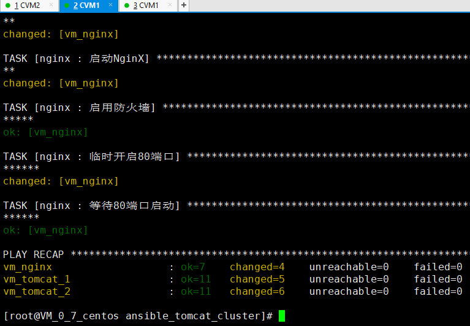

检验环境变量是否已写入`/etc/profile`：

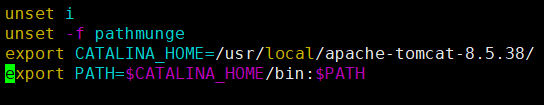

检验tomcat开机自启动是否已写入`/etc/rc.local`：

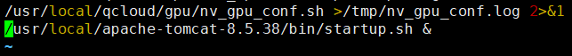

检验index.html模板是否注入成功：

预置的index.html模板：

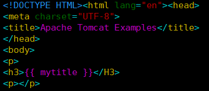

注入变量后，h3标签值变成了"this is vm01"（另一个节点是"this is vm02"）：

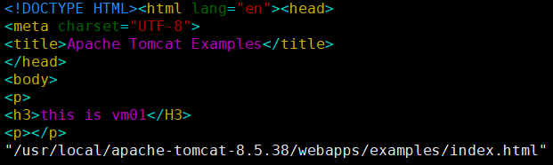

检验NginX负载均衡是否生效：

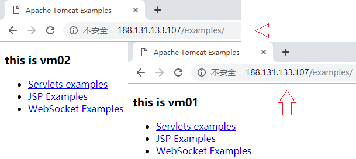

**执行逐个节点升级：**

upgrade.yml：

```yaml
- hosts: web
  serial: 1 # serial值为1，表示一个一个节点地执行
  roles:
  - { role: upgrade }
```

upgrade/tasks/main.yml：

```yaml
- name: 升级 |关闭tomcat
  command: sh "{{ tomcat_home }}/bin/shutdown.sh"

- name: 等待8080端口关闭
  wait_for:
    port: 8080
    state: stopped
  notify: clean tomcat cache # 通知handler "clean tomcat cache" 处理
（剩余略）
```

handlers/main.yml：

```yaml
- name: clean tomcat cache
  file: path="{{ tomcat_home }}/work/Catalina" state=absent
  ignore_errors: yes
```


模拟应用升级的过程过程如下：

```sh
[root@VM_0_7_centos ansible_tomcat_cluster]# ansible-playbook roles/upgrade.yml
```

先对vm_tomat_1：

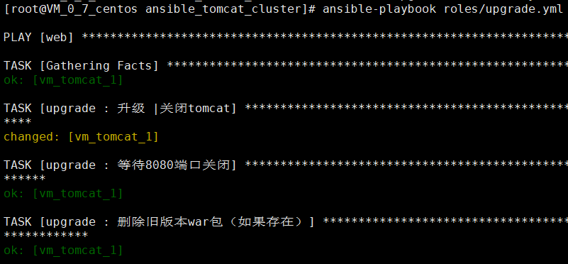

再对vm_tomcat_2：

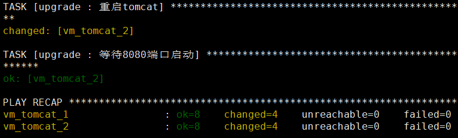

升级后，从浏览器访问变成了2.0版本（两个节点的页面一致，未作区分）：

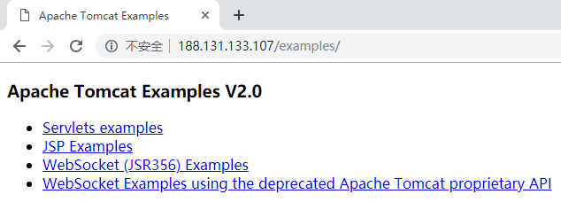

**执行逐个节点回退：**

rollback剧本内容与upgrade相似，从略。

```sh
[root@VM_0_7_centos ansible_tomcat_cluster]# ansible-playbook roles/rollback.yml
```

回退过程类似升级过程，结果如下：

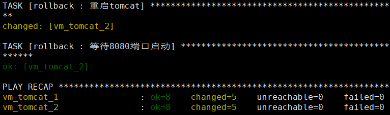

回退后，从浏览器访问变成了1.0版本：

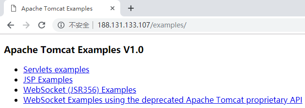

一切符合预期。

至此，NginX * 1 + Tomcat * 2方式部署war包，然后模拟升级、回退的过程演示完毕。完整的playbook见[gitlab仓库](http://git.pro.keep.com/lingzhong.zeng/ansible_zlz/tree/master/tomcat_cluster)


---

*P.s. 以上操作不是使用密码，需事先作SSH免密认证。*

```sh
# 控制主机生成ssh密钥对，简单点，直接ssh-keygen不带任何参数
ssh-keygen
# 发送给被控主机
ssh-copy-id root@localhost	# 如果要在控制主机执行部署，需发送公钥给自己
ssh-copy-id root@<目标主机IP>
```

*其它模块的用法，及高级特性，请结合实际需求，阅读官方文档《Ansible User Guide》。*


## 参考

1. [Ansible User Guide](https://docs.ansible.com/ansible/latest/user_guide/)

2. [Ansible中文权威指南](http://www.ansible.com.cn/)

3. [Ansible和SaltStack的比较和选型](https://blog.csdn.net/a105421548/article/details/53558598)

---

（End）
