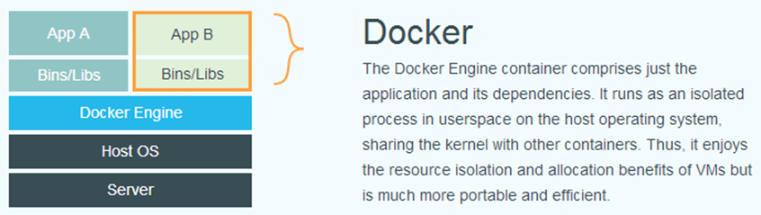
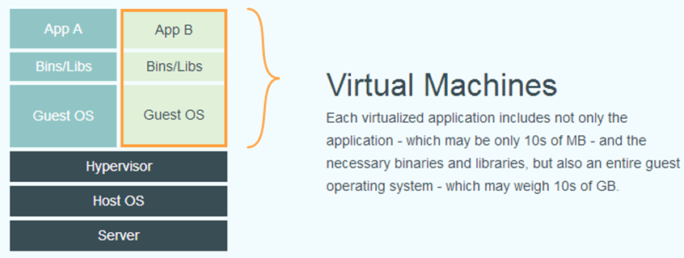

> [**Docker**](https://docs.docker.com/engine/docker-overview/) 使用客户端 - 服务器架构。Docker客户端与Docker守护进程通信，后者负责构建，运行和分发Docker容器。Docker客户端和守护程序可以在同一系统上运行，也可以将Docker客户端连接到远程Docker守护程序。Docker客户端和守护程序使用REST API，通过UNIX套接字或网络接口进行通信。

**Docker vs VM**

[docker-ce for centos](https://docs.docker.com/install/linux/docker-ce/centos/)