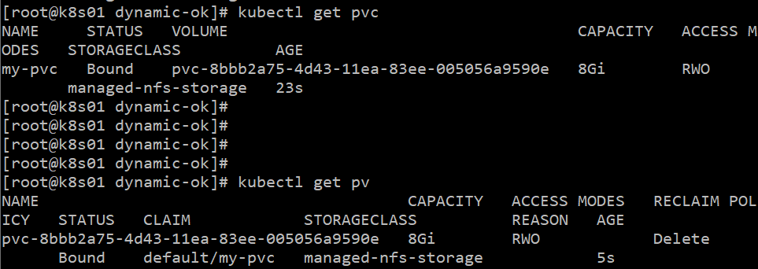
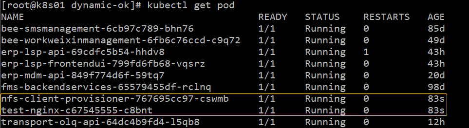
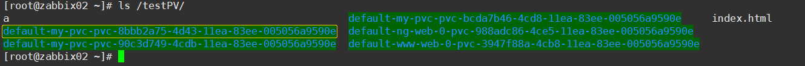
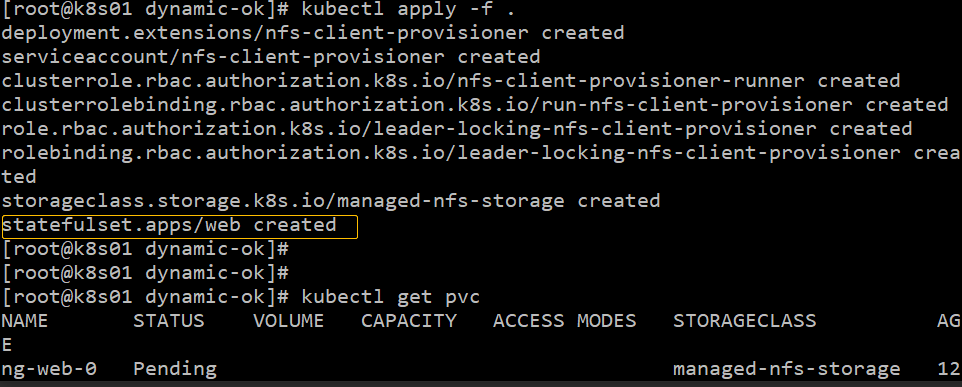
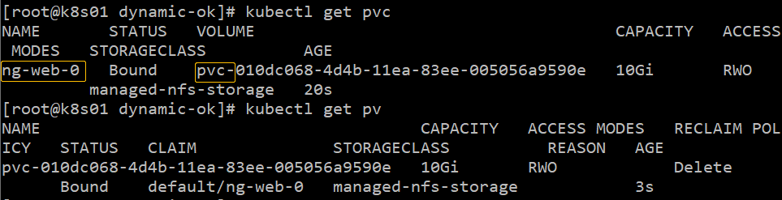

# 基于NFS文件系统的K8s动态PV


> 动态卷供应的实现基于 `storage.k8s.io` API 组中的 `StorageClass` API 对象。 集群管理员可以根据需要定义多个 `StorageClass` 对象，每个对象指定一个*卷插件*（又名 *provisioner*）， 卷插件向卷供应商提供在创建卷时需要的数据卷信息及相关参数。


## 步骤

1）使用NFS StorageClass动态创建PV的基本配置

StorageClass

```yaml
apiVersion: storage.k8s.io/v1
kind: StorageClass
metadata:
  name: managed-nfs-storage
provisioner: fuseim.pri/ifs
parameters:
  archiveOnDelete: "true"
```


rbac：

```yaml
kind: ServiceAccount
apiVersion: v1
metadata:
  name: nfs-client-provisioner
---
kind: ClusterRole
apiVersion: rbac.authorization.k8s.io/v1
metadata:
  name: nfs-client-provisioner-runner
rules:
  - apiGroups: [""]
    resources: ["persistentvolumes"]
    verbs: ["get", "list", "watch", "create", "delete"]
  - apiGroups: [""]
    resources: ["persistentvolumeclaims"]
    verbs: ["get", "list", "watch", "update"]
  - apiGroups: ["storage.k8s.io"]
    resources: ["storageclasses"]
    verbs: ["get", "list", "watch"]
  - apiGroups: [""]
    resources: ["events"]
    verbs: ["create", "update", "patch"]
---
kind: ClusterRoleBinding
apiVersion: rbac.authorization.k8s.io/v1
metadata:
  name: run-nfs-client-provisioner
subjects:
  - kind: ServiceAccount
    name: nfs-client-provisioner
    namespace: default
roleRef:
  kind: ClusterRole
  name: nfs-client-provisioner-runner
  apiGroup: rbac.authorization.k8s.io
---
kind: Role
apiVersion: rbac.authorization.k8s.io/v1
metadata:
  name: leader-locking-nfs-client-provisioner
rules:
  - apiGroups: [""]
    resources: ["endpoints"]
    verbs: ["get", "list", "watch", "create", "update", "patch"]
---
kind: RoleBinding
apiVersion: rbac.authorization.k8s.io/v1
metadata:
  name: leader-locking-nfs-client-provisioner
subjects:
  - kind: ServiceAccount
    name: nfs-client-provisioner
    # replace with namespace where provisioner is deployed
    namespace: default
roleRef:
  kind: Role
  name: leader-locking-nfs-client-provisioner
  apiGroup: rbac.authorization.k8s.io
```


nfs-client provisioner：

```yaml
kind: Deployment
apiVersion: extensions/v1beta1
metadata:
  name: nfs-client-provisioner
spec:
  replicas: 1
  strategy:
    type: Recreate
  template:
    metadata:
      labels:
        app: nfs-client-provisioner
    spec:
      serviceAccountName: nfs-client-provisioner
      containers:
        - name: nfs-client-provisioner
          image: nfs-client-provisioner
          volumeMounts:
            - name: nfs-client-root
              mountPath: /persistentvolumes
          env:
            - name: PROVISIONER_NAME
              value: fuseim.pri/ifs
            - name: NFS_SERVER
              value: 192.168.100.150
            - name: NFS_PATH
              value: /testPV
      volumes:
        - name: nfs-client-root
          nfs:
            server: 192.168.100.150
            path: /testPV
```


2）NFS文件系统搭建

上述配置中使用了在192.168.100.150上创建的测试用NFS文件系统，其搭建过程本文略过。


## 测试

- 测试pod示例

```yaml
apiVersion: v1
kind: Pod
metadata:
  name: my-pod
spec:
  containers:
    - name: nginx
      image: nginx:latest
      ports:
        - containerPort: 80
      volumeMounts:
        - name: www
          mountPath: /usr/share/nginx/html
  volumes:
    - name: www
      persistentVolumeClaim:
        claimName: my-pvc

---
apiVersion: v1
kind: PersistentVolumeClaim
metadata:
  name: my-pvc
spec:
  storageClassName: "managed-nfs-storage"
  accessModes:
    - ReadWriteMany
  resources:
    requests:
      storage: 5Gi
```


- 测试deployment示例

```yaml
apiVersion: extensions/v1beta1
kind: Deployment
metadata:
 name: test-nginx
spec:
  replicas: 1
  strategy:
    type: Recreate
  template:
    metadata:
      labels:
        app: test-nginx
    spec:
      containers:
        - name: test-nginx
          image: nginx

          volumeMounts:
            - name: www
              mountPath: /usr/share/nginx/html
      volumes:
        - name: www
          persistentVolumeClaim:
            claimName: my-pvc

---
apiVersion: v1
kind: PersistentVolumeClaim
metadata:
  name: my-pvc
spec:
  storageClassName: "managed-nfs-storage"
  accessModes:
    - ReadWriteOnce
  resources:
    requests:
      storage: 8Gi
```








查看nfs目录




- 测试statefulset示例：

```yaml
apiVersion: apps/v1beta1
kind: StatefulSet
metadata:
  name: web
spec:
  serviceName: "nginx"
  replicas: 1
  template:
    metadata:
      labels:
        app: nginx
    spec:
      serviceAccount: nfs-client-provisioner
      containers:
        - name: nginx
          image: nginx
          volumeMounts:
            - mountPath: "/data/nginx"
              name: ng
  volumeClaimTemplates:
    - metadata:
        name: ng
        annotations:
          volume.beta.kubernetes.io/storage-class: "managed-nfs-storage"
      spec:
        accessModes: [ "ReadWriteOnce" ]
        resources:
          requests:
            storage: 10Gi
```







