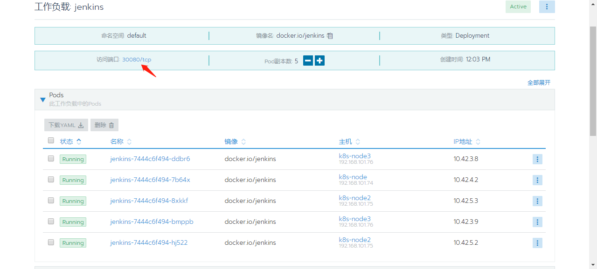

# 通过Rancher搭建K8s集群


## 集群组成

参考架构图：


主机列表：

| IP                   | role                                           | description                        | OS                              |
| -------------------- | ---------------------------------------------- | ---------------------------------- | ------------------------------- |
| 192.168.101.71       | rancher server<br />k8s-master (etcd, control) | 控制节点<br />***rancher server*** | centos7.6<br />16U24G<br />下同 |
| 192.168.101.72       | k8s-master (etcd, control)                     | 控制节点                           | -                               |
| 192.168.101.73       | k8s-master (etcd, control)                     | 控制节点                           | -                               |
| 192.168.101.74       | k8s-node (worker)                              | worker节点（可被调度）             | centos7.6<br />16U48G<br />下同 |
| 192.168.101.75       | k8s-node (worker)                              | worker节点                         | -                               |
| 192.168.101.76       | k8s-node (worker)                              | worker节点                         | -                               |
| 192.168.***101.70*** | VIP                                            | 虚拟 IP                            | -                               |


## 安装步骤

### 环境设置

  ```sh
  # /etc/hosts
  127.0.0.1   localhost localhost.localdomain localhost4 localhost4.localdomain4
  ::1         localhost localhost.localdomain localhost6 localhost6.localdomain6
  192.168.101.71  b71-k8s-m01     b71-k8s-m01.keep.com
  192.168.101.72  b72-k8s-m02     b72-k8s-m02.keep.com
  192.168.101.73  b73-k8s-m03     b73-k8s-m03.keep.com
  192.168.101.74  b74-k8s-c01     b74-k8s-c01.keep.com
  192.168.101.75  b75-k8s-c02     b75-k8s-c02.keep.com
  192.168.101.76  b76-k8s-c03     b76-k8s-c03.keep.com
  
  # 关闭firewalld
  systemctl stop firewalld.service
  systemctl disable firewalld.service
  
  # 无swap分区，不涉及swapoff操作
  
  # 关闭selinux
  setenforce 0
  sed -i '/^SELINUX=/s/=.*$/=disabled/' /etc/selinux/config
  
  # 安装docker-ce 18.06
  wget -P /etc/yum.repos.d https://mirrors.aliyun.com/docker-ce/linux/centos/docker-ce.repo
  yum install docker-ce-18.06.1.ce -y
  systemctl start docker.service
  systemctl enable docker.service
  ```
  

  haproxy + keepalived 配置：

  ```sh
  ### 对3个master节点：添加到文件/etc/sysctl.conf
  cat <<EOF >>/etc/sysctl.conf
  net.ipv4.ip_forward = 1
  net.ipv4.ip_nonlocal_bind = 1
  EOF
  
  ### 修改keepalived.conf
  cat > /etc/keepalived/keepalived.conf << EOF
  ! Configuration File for keepalived
  
  global_defs {
     router_id LVS_DEVEL
  }
  
  vrrp_script check_haproxy {
  	script "killall -0 haproxy"
  	interval 3
  	weight -2
  	fall 10
  	rise 2
  }
  
  vrrp_instance VI_1 {
  	state MASTER # 另2个分别是BACKUP、BACKUP
  	interface ens192
  	virtual_router_id 51
  	priority 120 # 优先级，另2个可以设置为100
  	advert_int 1
  	authentication {
  		auth_type PASS
  		auth_pass 59144e4504f2b953e7b9
  	}
  	virtual_ipaddress {
  		192.168.101.70
  	}
  	track_script {
  		check_haproxy
  	}
  }
  EOF
  
  # 安装killall
  yum install psmisc -y
  
  systemctl enable keepalived.service
  systemctl start keepalived.service
  [root@B72-k8s-m02 haproxy]# ip address show ens192
  2: ens192: <BROADCAST,MULTICAST,UP,LOWER_UP> mtu 1500 qdisc mq state UP group default qlen 1000
      link/ether 00:50:56:85:8a:00 brd ff:ff:ff:ff:ff:ff
      inet 192.168.101.72/24 brd 192.168.101.255 scope global noprefixroute ens192
         valid_lft forever preferred_lft forever
      inet 192.168.101.70/32 scope global ens192
         valid_lft forever preferred_lft forever
      inet6 fe80::250:56ff:fe85:8a00/64 scope link
         valid_lft forever preferred_lft forever
  
  ### 修改haproxy.cfg
  ...
  # main frontend which proxys to the backends
  #---------------------------------------------------------------------
  frontend kubernetes-apiserver
      mode                 tcp
      bind                 *:16443
      option               tcplog
      default_backend      kubernetes-apiserver
  
  backend kubernetes-apiserver
      mode        tcp
      balance     roundrobin
      server  b71-k8s-m01 192.168.101.71:6443 check weight 1
      server  b72-k8s-m02 192.168.101.72:6443 check weight 2
      server  b73-k8s-m03 192.168.101.73:6443 check weight 2
  
  listen stats
      bind                 *:1080
      stats auth           admin:password
      stats refresh        5s
      stats realm          HAProxy\ Statistics
      stats uri            /admin?stats
  
  # 启动haproxy
  systemctl enable haproxy.service
  systemctl start haproxy.service
  ```

  需开放的端口见 <https://rancher.com/docs/rancher/v2.x/en/installation/references/>。

  通过Rancher安装后，会自动配置iptables规则，查看rancher server节点的防火墙规则：

  ```sh
  [root@B71-k8s-m01 ~]# iptables -L -n
  Chain INPUT (policy ACCEPT)
  target     prot opt source               destination         
  KUBE-EXTERNAL-SERVICES  all  --  0.0.0.0/0            0.0.0.0/0            ctstate NEW 
  KUBE-FIREWALL  all  --  0.0.0.0/0            0.0.0.0/0           
  
  Chain FORWARD (policy DROP)
  target     prot opt source               destination         
  KUBE-FORWARD  all  --  0.0.0.0/0            0.0.0.0/0            
  DOCKER-USER  all  --  0.0.0.0/0            0.0.0.0/0           
  ...
  ```

  

### 安装rancher server

  在节点101.71上执行：

  ```sh
  docker run -d --restart=unless-stopped -p 80:80 -p 443:443 rancher/rancher:stable
  ```

  

### 登录Rancher Web创建集群

  Url: <https://192.168.101.71/>

  

  

  添加master节点时，是按如下设置的：


复制命令在待添加的节点机器上执行，依次添加完3个master节点后如下，其中101.71是第二个添加的：


在机器数量足够的情况下，可将rancher server单独部署，此处是与K8s_master共用。经反复试验，添加master节点时，先添加101.72或101.73，**不要首先添加rancher server所在节点101.71**。否则，后续添加master时会出**问题**：


上图显示101.72一直处于Registering状态，不能添加进集群。

在添加节点异常时，先通过Web管理界面删除问题节点，然后在重新执行添加前，通过以下脚本清理一下待添加节点的环境：

```sh
# 清理安装文件目录
DLIST="/var/lib/etcd /etc/kubernetes /etc/cni /opt/cni /var/lib/cni /var/run/calico /opt/rke"
for dir in $DLIST; do
  echo "Removing $dir"
  rm -rf $dir
done
```

```sh
# 清理docker
CLIST=$(docker ps -qa)
if [ "x"$CLIST == "x" ]; then
  echo "No containers exist - skipping container cleanup"
else
  docker stop -f $CLIST && docker rm -f $CLIST
fi

ILIST=$(docker images -a -q)
if [ "x"$ILIST == "x" ]; then
  echo "No images exist - skipping image cleanup"
else
  docker rmi $ILIST
fi

VLIST=$(docker volume ls -q)
if [ "x"$VLIST == "x" ]; then
  echo "No volumes exist - skipping volume cleanup"
else
  docker volume rm -f $VLIST
fi

systemctl restart docker.service
```


下图是添加完3个master和3个node后的主机界面：


### 部署服务

  


测试部署5个jenkins实例：





访问 Jenkins：


---

### 执行kubectl命令行

通过Rancher Web界面来执行kubectl命令行：


如果直接登录主机，找不到kubectl命令，需进入相关的容器


### 添加Dashboard

  


  


  找到kubernetes-dashboard，并部署（启动）

  

  

  

  

  


