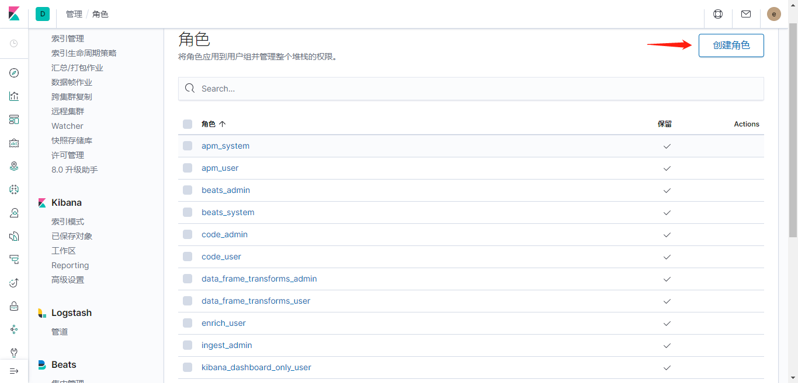
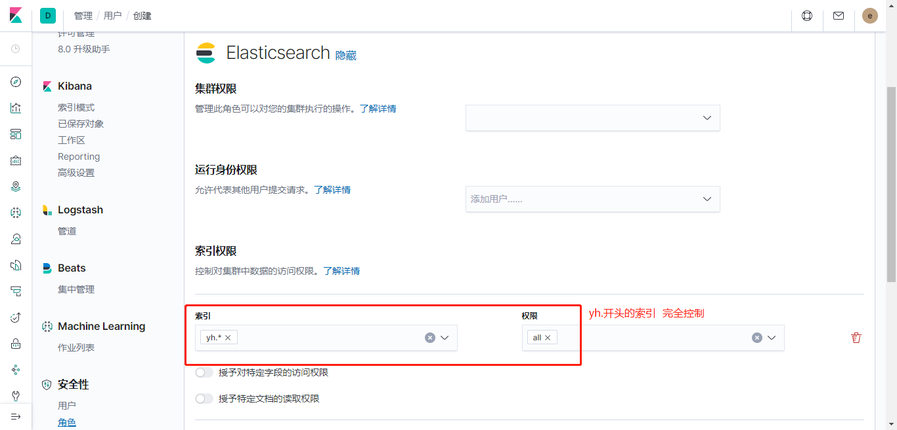
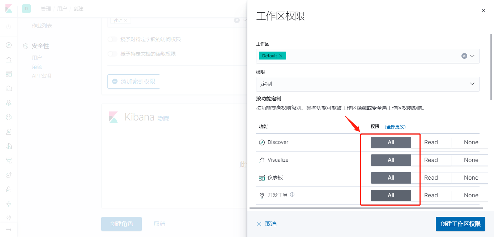
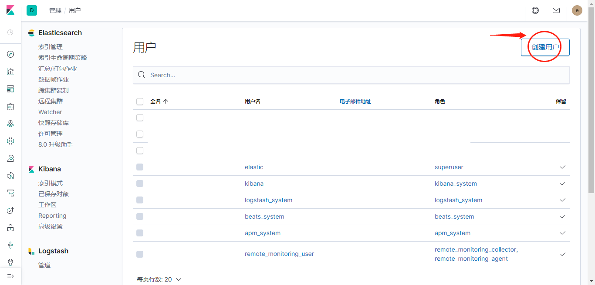
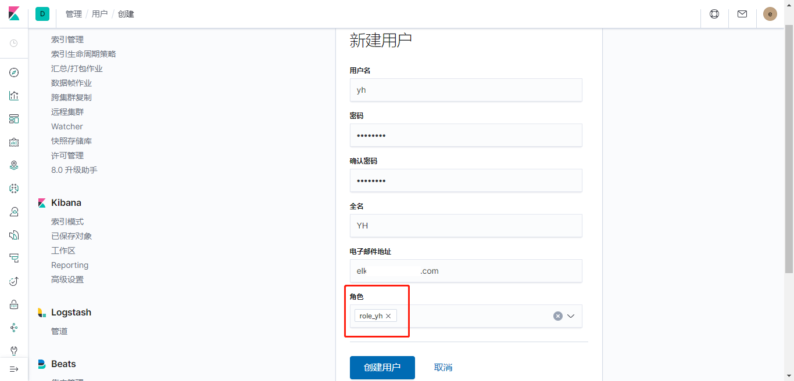
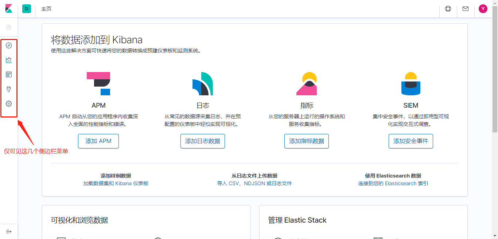
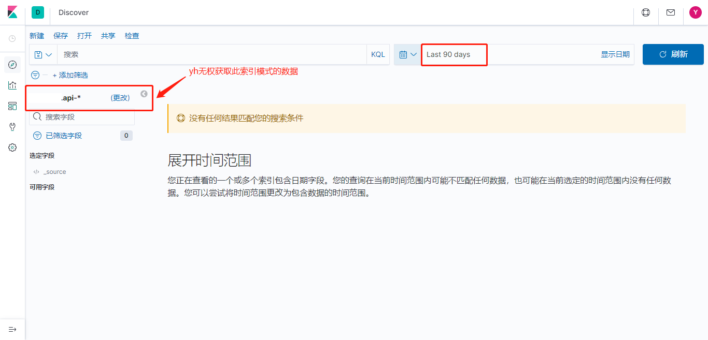
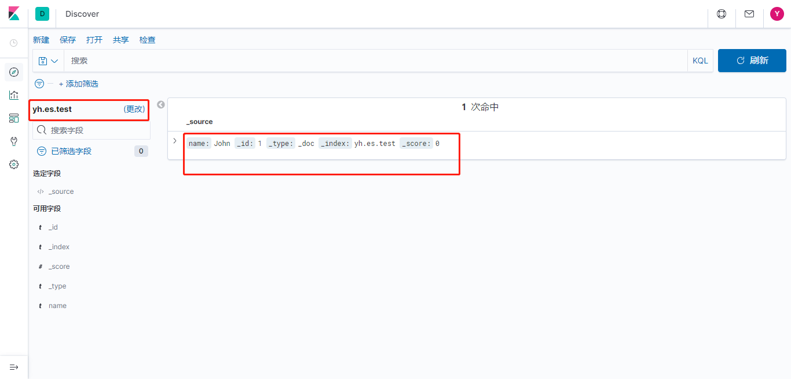

# ES分组权限管理的账号设置

> 基于X-Pack权限控制版ES，给不同项目组、用户分配不同的权限


## 创建角色




### 设置角色的ES权限




### 设置角色的Kibana权限




## 创建用户







### 新用户登录







### 测试ES索引权限

```sh
curl -XPUT -u yh:password "http://es.platform.development.keep.com/yh-es-privilege-test/_doc/1?pretty" -H 'Content-Type: application/json' -d '
{
  "name": "John"
}'
```

```json
{
  "error" : {
    "root_cause" : [
      {
        "type" : "security_exception",
        "reason" : "action [indices:admin/create] is unauthorized for user [yh]"
      }
    ],
    "type" : "security_exception",
    "reason" : "action [indices:admin/create] is unauthorized for user [yh]"
  },
  "status" : 403
}
```

权限不够，不能创建该索引。


使用elastic账号查看已创建的role_yh具体有哪些权限：

```sh
curl -XGET -u elastic:xxxxxx "http://es.platform.development.keep.com/_xpack/security/role/role_yh"
```

```sh
{
  "role_yh": {
    "cluster": [],
    "indices": [
      {
        "names": [
          "yh.*"
        ],
        "privileges": [
          "all"
        ],
        "field_security": {
          "grant": [
            "*"
          ],
          "except": []
        },
        "allow_restricted_indices": false
      }
    ],
    "applications": [
      {
        "application": "kibana-.kibana",
        "privileges": [
          "feature_discover.all",
          "feature_visualize.all",
          "feature_dashboard.all",
          "feature_dev_tools.all",
          "feature_indexPatterns.all"
        ],
        "resources": [
          "space:default"
        ]
      }
    ],
    "run_as": [],
    "metadata": {},
    "transient_metadata": {
      "enabled": true
    }
  }
}
```


由于给role_yh角色分配的ES索引权限是仅名称以`yh.`开头，故无权创建。改为创建`yh.es.test`再试则成功：

```json
{
  "_index" : "yh.es.test",
  "_type" : "_doc",
  "_id" : "1",
  "_version" : 1,
  "result" : "created",
  "_shards" : {
    "total" : 2,
    "successful" : 1,
    "failed" : 0
  },
  "_seq_no" : 0,
  "_primary_term" : 1
}
```




## 账号规划

根据以上，初步设置了以下账号：

| 角色 | 现有账号 | ES索引权限         | Kibana工作区权限                                             |
| ---- | ------------------- | ------------------------------------------------------------ | ------------------------------------------------------------ |
| role_yh | **yh** | yh.*                | 发现  feature_discover.all<br/>可视化  feature_visualize.all<br/>仪表板  feature_dashboard.all<br/>开发工具  feature_dev_tools.all<br/>索引模式  eature_indexPatterns.all |
| role_erp | **erp** | erp.*<br>k8s.erp\* | 同上 |
| role_k8s | **k8s** | k8s* | 同上 |
| role_etms | **etms** | etms* | 同上 |

