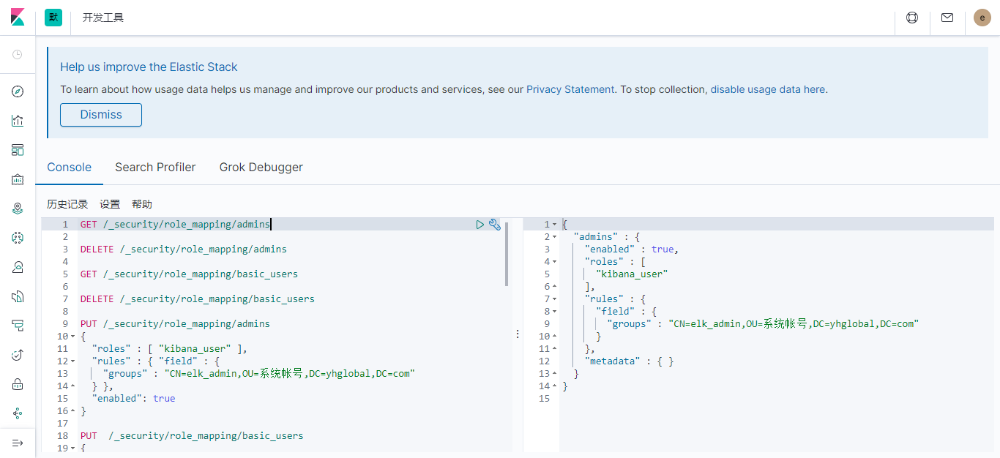
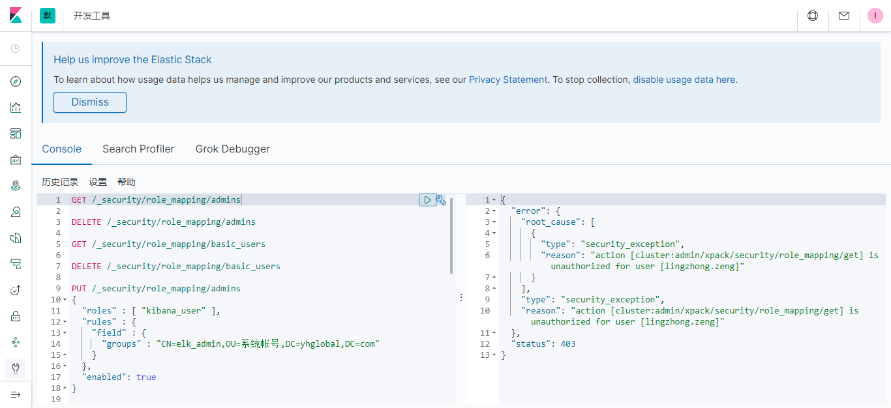

# ELK部署至K8s并启用AD认证（单节点&多节点）


>- 单节点、多节点示例
>
>- 使用基于NFS的动态PV
>
>- 启用Windows AD域账号认证


## 部署

镜像准备

```sh
docker push lzzeng/es-xpack:7.5.1	 # xpack组件破解版
```


### 单节点

[K8s ELK single-node](k8s-elk-auth-kibana-via-ad.assets/elk-single-node/)

```sh
# sh run-es.sh; sh run-kb.sh; sh run-logstash.sh
```


### 多节点

[K8s ELK cluster](k8s-elk-auth-kibana-via-ad.assets/elk-cluster/)

```sh
# sh run-es.sh; sh run-kb.sh; sh run-logstash.sh
```


---


## AD域账号认证

es配置字典 es-cm2.yml:

```yaml
apiVersion: v1
kind: ConfigMap
metadata:
  name: es-config
  namespace: elk
  labels:
    k8s-app: elasticsearch
data:
  # 如果要初始绑定role_mapping.yml:
  # role_mapping.yml: |-
  #   kibana_user:
  #     - "CN=elk_user,OU=系统帐号,DC=keep,DC=com"
  #     - "CN=堡垒机,CN=Users,DC=keep,DC=com"
  #   superuser:
  #     - "CN=elk_admin,OU=系统帐号,DC=keep,DC=com"
  elasticsearch.yml: |-
    cluster.name: "docker-cluster"
    network.host: 0.0.0.0
    discovery.zen.minimum_master_nodes: 1
    discovery.type: single-node
    xpack.security.authc.realms.active_directory:
      my_ad:
        order: 0
        domain_name: keep.com
        url: ldap://192.168.100.20:389, ldap://192.168.100.29:389
        bind_dn: xxx@keep.com
        bind_password: ******
        load_balance:
          type: "round_robin"
        user_search:
          base_dn: "dc=keep,dc=com"
          filter: "(&(objectClass=user)(sAMAccountName={0}))"
        group_search:
          base_dn: "dc=keep,dc=com"
        # 如果要初始绑定role_mapping.yml:
        #files:
        #  role_mapping: "/usr/share/elasticsearch/config/role_mapping.yml"
        #unmapped_groups_as_roles: true
```


另有如下命令添加bind_dn的密码：

```sh
bin/elasticsearch-keystore add xpack.security.authc.realms.active_directory.my_ad.secure_bind_password
```


集群正常启动后，以管理账号在Kibana的开发工具界面调用ES的API作【用户-角色】后绑定的方法示例：




```sh
# GET /_security/role_mapping/admins
# DELETE /_security/role_mapping/admins
# GET /_security/role_mapping/basic_users
# DELETE /_security/role_mapping/basic_users

# 对管理员的绑定
PUT /_security/role_mapping/admins
{
  "roles" : [ "kibana_user", ... ],    # 需要分配的角色
  "rules" : { "field" : {
    "groups" : "CN=elk_admin,OU=系统帐号,DC=keep,DC=com"
  } },
  "enabled": true
}

# 对普通用户的绑定
PUT  /_security/role_mapping/basic_users
{
    "enabled" : true,
    "roles" : [ "kibana_user" ],
    "rules" : {
      "any" : [
        {
          "field" : {
            "groups" : "CN=elk_user,OU=系统帐号,DC=keep,DC=com"
          }
        },
        {
          "field" : {
            "dn" : "CN=堡垒机,CN=Users,DC=keep,DC=com"
          }
        }
      ]
    },
    "metadata" : { }
}

```




## Logstash配置

```yaml
kind: ConfigMap
metadata:
  name: log-config
  namespace: elk
apiVersion: v1
data:
  logstash.yml: |-
    http.host: "0.0.0.0"
    path.config: /usr/share/logstash/pipeline
    xpack.monitoring.enabled: false

---
kind: ConfigMap
metadata:
  name: log-pipeline
  namespace: elk
apiVersion: v1
data:
  tcp-input.conf: |-
    input {
      tcp {
        port => 514
        type => syslog
      }
      beats {
        port => 5044
        type => beatlog
      }
    }
  # kafka-input.conf: |-
  #   input {
  #     kafka {
  #       bootstrap_servers => "bootstrap.kafka.svc.cluster.local:9092"
  #       topics => ["fail2ban", "rsyslog", "dummy", "docker", "k8s", "twitter"]
  #       group_id => "logstash_elastic"
  #       client_id => "logstash"
  #       consumer_threads => 1
  #       auto_offset_reset => "earliest"
  #       codec => plain { format => "%{message}" }
  #       decorate_events => true
  #     }
  #   }
  elasticsearch-output.conf: |-
    output {
      elasticsearch {
        index => "logstash-%{+YYYY.MM.dd}"
        # hosts => "elasticsearch:9200"
        hosts => ["http://es-cluster-0.elasticsearch-headless.elk:9200", "http://es-cluster-1.elasticsearch-headless.elk:9200", "http://es-cluster-2.elasticsearch-headless.elk:9200"]
        user => "elastic"
        password => "******"
      }
    }
```


以NodePort方式暴露logstash服务，

```sh
The Service "logstash" is invalid: spec.clusterIP: Invalid value: "None": may not be set to 'None' for NodePort services
```

此方式 clusterIP不能为None。


## 其它

### Elasticsearch cluster host地址

ES的service描述文件如下：

```yaml
kind: Service
apiVersion: v1
metadata:
  name: elasticsearch
  namespace: elk
  labels:
    app: elasticsearch
spec:
  type: NodePort
  selector:
    app: elasticsearch
  ports:
    - port: 9200
      name: es-http
      nodePort: 32200

---
apiVersion: v1
kind: Service
metadata:
  name: elasticsearch-headless
  namespace: elk
  labels:
    app: elasticsearch
spec:
  ports:
  - name: elasticsearch
    port: 9200
  selector:
    app: elasticsearch
  clusterIP: None
```


在集群内部，从kibana访问es：

```sh
sh-4.2$ curl http://es-cluster-1.elasticsearch.elk:9200 -u elastic:******
curl: (6) Could not resolve host: es-cluster-1.elasticsearch.elk; Unknown error

# 负载节点每次都变化
sh-4.2$ curl http://elasticsearch:9200 -u elastic:******
{
  "name" : "es-cluster-0",
  "cluster_name" : "es-cluster",
  "cluster_uuid" : "VP2AdLR9RzqPVz3tnmSdEw",
  "version" : {
    "number" : "7.5.1",
    "build_flavor" : "default",
    "build_type" : "docker",
    "build_hash" : "3ae9ac9a93c95bd0cdc054951cf95d88e1e18d96",
    "build_date" : "2019-12-16T22:57:37.835892Z",
    "build_snapshot" : false,
    "lucene_version" : "8.3.0",
    "minimum_wire_compatibility_version" : "6.8.0",
    "minimum_index_compatibility_version" : "6.0.0-beta1"
  },
  "tagline" : "You Know, for Search"
}

# 负载节点每次都变化
sh-4.2$ curl http://elasticsearch.elk:9200 -u elastic:******
{
  "name" : "es-cluster-2",
  "cluster_name" : "es-cluster",
  "cluster_uuid" : "VP2AdLR9RzqPVz3tnmSdEw",
  "version" : {
    "number" : "7.5.1",
    "build_flavor" : "default",
    "build_type" : "docker",
    "build_hash" : "3ae9ac9a93c95bd0cdc054951cf95d88e1e18d96",
    "build_date" : "2019-12-16T22:57:37.835892Z",
    "build_snapshot" : false,
    "lucene_version" : "8.3.0",
    "minimum_wire_compatibility_version" : "6.8.0",
    "minimum_index_compatibility_version" : "6.0.0-beta1"
  },
  "tagline" : "You Know, for Search"
}

# 负载节点不常变化
sh-4.2$ curl http://elasticsearch-headless.elk:9200 -u elastic:******
{
  "name" : "es-cluster-0",
  "cluster_name" : "es-cluster",
  "cluster_uuid" : "VP2AdLR9RzqPVz3tnmSdEw",
  "version" : {
    "number" : "7.5.1",
    "build_flavor" : "default",
    "build_type" : "docker",
    "build_hash" : "3ae9ac9a93c95bd0cdc054951cf95d88e1e18d96",
    "build_date" : "2019-12-16T22:57:37.835892Z",
    "build_snapshot" : false,
    "lucene_version" : "8.3.0",
    "minimum_wire_compatibility_version" : "6.8.0",
    "minimum_index_compatibility_version" : "6.0.0-beta1"
  },
  "tagline" : "You Know, for Search"
}

# 指定节点
sh-4.2$ curl http://es-cluster-0.elasticsearch-headless.elk:9200 -u elastic:******
{
  "name" : "es-cluster-0",
  "cluster_name" : "es-cluster",
  "cluster_uuid" : "VP2AdLR9RzqPVz3tnmSdEw",
  "version" : {
    "number" : "7.5.1",
    "build_flavor" : "default",
    "build_type" : "docker",
    "build_hash" : "3ae9ac9a93c95bd0cdc054951cf95d88e1e18d96",
    "build_date" : "2019-12-16T22:57:37.835892Z",
    "build_snapshot" : false,
    "lucene_version" : "8.3.0",
    "minimum_wire_compatibility_version" : "6.8.0",
    "minimum_index_compatibility_version" : "6.0.0-beta1"
  },
  "tagline" : "You Know, for Search"
}
```


### helm 安装ELK参考

```yaml
# helm repo add stable https://kubernetes-charts.storage.googleapis.com
helm repo add elastic https://helm.elastic.co
# 获取helm chart
helm fetch stable/elasticsearch
# 修改后应用
helm install elastic/elasticsearch -n elk-es --namespace elk -f elasticsearch/values.yaml
```


强制删除pod：

```sh
kubectl delete pod -n elk kibana-75cd5fcbc5-jxn44  --force --grace-period=0
```


AD认证：<https://www.elastic.co/guide/en/elasticsearch/reference/7.x/active-directory-realm.html#ad-realm-configuration>