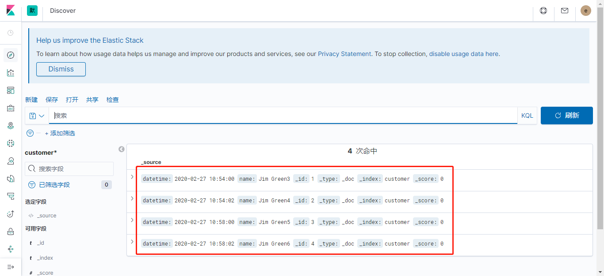

# ELK 整改优化

> 为了将测试环境、仿真环境和生产环境的ELK合并为一个部署到K8s中管理，作一些测试验证，并尝试集成STS单点登录。


## 测试NFS可用性


>  测试应用使用的MySQL数据目录是通过NFS挂载的，每GET请求一次 `http://192.168.100.157:9000/visit/add/` 会新增一条记录到数据库。通过脚本每0.01秒请求一次，共请求10000次的过程中：当人为停止NFS服务时，MySQL数据目录挂载失效，导致请求接口无法访问；重新开启NFS服务后，恢复正常，并且最终记录总数一致。


### NFS供应节点

```sh
[root@zabbix02 elk]# cat /etc/exports
/testPV *(rw,sync)
/helloPV *(rw,no_root_squash,async)
```


### 测试节点

```sh
[root@157-xxl-job testPV]# df -h
Filesystem                Size  Used Avail Use% Mounted on
...
192.168.100.150:/helloPV  292G   42G  250G  15% /helloPV
```

```yaml
db:
    image: mysql:5.7
    environment:
      TZ: 'Asia/Shanghai'
      MYSQL_ROOT_PASSWORD: qwerasdf
      MYSQL_DATABASE: testpv
    restart: always
    command: ['mysqld', '--character-set-server=utf8']
    volumes:
      - "/helloPV/db:/var/lib/mysql"
```


### 查看数据库

```sh
mysql> select count(id) from visit_record;
+-----------+
| count(id) |
+-----------+
|      9999 |
+-----------+
1 row in set (0.00 sec)

mysql> select * from visit_record limit 1;
+----+----------------------+----------------------------+
| id | ip_addr              | visit_date                 |
+----+----------------------+----------------------------+
|  1 | 192.168.100.157:9000 | 2020-02-28 01:13:38.370327 |
+----+----------------------+----------------------------+
1 row in set (0.00 sec)

mysql> select * from visit_record order by id desc limit 1;
+------+----------------------+----------------------------+
| id   | ip_addr              | visit_date                 |
+------+----------------------+----------------------------+
| 9999 | 192.168.100.157:9000 | 2020-02-28 01:18:10.755606 |
+------+----------------------+----------------------------+
1 row in set (0.00 sec)
```


## PV数据恢复验证

### 文档写入、更新

- 初始写入2个文档

```sh
curl -X PUT "http://es.staging.keep.com/customer/_doc/1?pretty" -H 'Content-Type: application/json' -u elastic:elastic -d '
{
  "datetime": "2020-02-27 10:50:00",
  "name": "Jim Green"
}'

curl -X PUT "http://es.staging.keep.com/customer/_doc/2?pretty" -H 'Content-Type: application/json' -u elastic:elastic -d '
{
  "datetime": "2020-02-27 10:51:00",
  "name": "Jim Green2"
}
```


- 更新文档

```sh
curl -X PUT "http://es.staging.keep.com/customer/_doc/1?pretty" -H 'Content-Type: application/json' -u elastic:elastic -d '
{
  "datetime": "2020-02-27 10:54:00",
  "name": "Jim Green3"
}'

curl -X PUT "http://es.staging.keep.com/customer/_doc/2?pretty" -H 'Content-Type: application/json' -u elastic:elastic -d '
{
  "datetime": "2020-02-27 10:54:02",
  "name": "Jim Green4"
}
```


- 增加2个文档

```sh
curl -X PUT "http://es.staging.keep.com/customer/_doc/3?pretty" -H 'Content-Type: application/json' -u elastic:elastic -d '
{
  "datetime": "2020-02-27 10:58:00",
  "name": "Jim Green5"
}'

curl -X PUT "http://es.staging.keep.com/customer/_doc/4?pretty" -H 'Content-Type: application/json' -u elastic:elastic -d '
{
  "datetime": "2020-02-27 10:58:02",
  "name": "Jim Green6"
}'
```


### 修改请求的容量

NFS StorageClass Provider自动为ES创建的PV目录为：

```sh
[root@zabbix02 ~]# ls /testPV/
yhelk-es-data-elasticsearch-0-pvc-94de2142-590a-11ea-ac5d-005056a941c1
```


#### 不删PV仅修改编排的容量需求

```yaml
  # 原先20Gi
  volumeClaimTemplates:
  - metadata:
      name: es-data
    spec:
      storageClassName: "managed-nfs-storage"
      accessModes: [ "ReadWriteOnce" ]
      resources:
        requests:
          storage: 40Gi
```


重新部署ES

```sh
[root@zabbix02 4cp]# kubectl apply -f es-ss.yml 
The StatefulSet "elasticsearch" is invalid: spec: Forbidden: updates to statefulset spec for fields other than 'replicas', 'template', and 'updateStrategy' are forbidden
```


因为是statefulset.apps，提示不能直接apply，先delete再apply

```sh
[root@zabbix02 4cp]# kubectl delete -f es-ss.yml 
statefulset.apps "elasticsearch" deleted
[root@zabbix02 4cp]# kubectl apply -f es-ss.yml 
statefulset.apps/elasticsearch created
```


PV目录未变化，并且从Kibana查看数据还是容量变更前的样子


说明不删除已创建的PV情况下，修改请求PV容量值`resources.requests.storage`，不影响已有数据。


#### 删PV重建ES

```sh
[root@zabbix02 4cp]# sh run-es.sh down
ingress.extensions "elasticsearch" deleted
service "elasticsearch" deleted
statefulset.apps "elasticsearch" deleted
configmap "es-config" deleted
secret "rp-client-secret" deleted
[root@zabbix02 4cp]# kubectl delete pvc -n yhelk es-data-elasticsearch-0
persistentvolumeclaim "es-data-elasticsearch-0" deleted

[root@zabbix02 4cp]# sh run-es.sh
namespace/yhelk unchanged
secret/rp-client-secret created
configmap/es-config created
statefulset.apps/elasticsearch created
service/elasticsearch created
ingress.extensions/elasticsearch created
```


删除PV后，PV目录被归档

```sh
[root@zabbix02 4cp]# ls /testPV/
archived-yhelk-es-data-elasticsearch-0-pvc-94de2142-590a-11ea-ac5d-005056a941c1
```


重建后，生成了新的PV目录

```sh
[root@zabbix02 4cp]# ls /testPV/
archived-yhelk-es-data-elasticsearch-0-pvc-94de2142-590a-11ea-ac5d-005056a941c1
yhelk-es-data-elasticsearch-0-pvc-cb8ea87c-5912-11ea-ac5d-005056a941c1
```


显然，之前的保存的文档不在新目录中，查看Kibana也显示没有任何索引：


尝试恢复旧数据如下：

通过移动归档的PV目录替换现在使用的PV目录，并删除es的pod以使其被重新调度：

```sh
[root@zabbix02 4cp]# mv /testPV/yhelk-es-data-elasticsearch-0-pvc-cb8ea87c-5912-11ea-ac5d-005056a941c1/ /testPV/yhelk-es-data-elasticsearch-0-pvc-cb8ea87c-5912-11ea-ac5d-005056a941c1.old
[root@zabbix02 4cp]# ls /testPV/
archived-yhelk-es-data-elasticsearch-0-pvc-94de2142-590a-11ea-ac5d-005056a941c1
yhelk-es-data-elasticsearch-0-pvc-cb8ea87c-5912-11ea-ac5d-005056a941c1.old
[root@zabbix02 4cp]# mv /testPV/archived-yhelk-es-data-elasticsearch-0-pvc-94de2142-590a-11ea-ac5d-005056a941c1/ /testPV/yhelk-es-data-elasticsearch-0-pvc-cb8ea87c-5912-11ea-ac5d-005056a941c1
[root@zabbix02 4cp]# ls /testPV/
yhelk-es-data-elasticsearch-0-pvc-cb8ea87c-5912-11ea-ac5d-005056a941c1
yhelk-es-data-elasticsearch-0-pvc-cb8ea87c-5912-11ea-ac5d-005056a941c1.old
[root@zabbix02 4cp]# kubectl get pod -n yhelk
NAME                      READY   STATUS    RESTARTS   AGE
elasticsearch-0           1/1     Running   0          7m17s
kibana-6564b7c688-bvmf4   1/1     Running   0          61m
[root@zabbix02 4cp]# kubectl delete pod -n yhelk elasticsearch-0 
pod "elasticsearch-0" deleted
[root@zabbix02 4cp]# kubectl get pod -n yhelk
NAME                      READY   STATUS    RESTARTS   AGE
elasticsearch-0           1/1     Running   0          16s
kibana-6564b7c688-bvmf4   1/1     Running   0          62m
```


待kibana重新连接es后，显示旧文档已恢复：




---


### 数据迁移到新的集群

#### 创建一个新ELK环境

在另一个名称空间 yhelk2 再创建一个ELK环境：

对应的PV目录：


#### 复制迁移数据

先删除刚创建出来的ES，仅保留PVC和PV。如果删除PVC（和PV），原数据（目录）会被归档，重新部署后会重建PV。


再将对应yhelk空间的原有ELK环境的PV目录复制一份替换新ELK环境的PV目录

```sh
mv /testPV/yhelk2-es-data-elasticsearch-0-pvc-a2488669-5929-11ea-ac5d-005056a941c1{,.old}

cp -rp /testPV/yhelk-es-data-elasticsearch-0-pvc-cb8ea87c-5912-11ea-ac5d-005056a941c1  /testPV/yhelk2-es-data-elasticsearch-0-pvc-a2488669-5929-11ea-ac5d-005056a941c1
```


重建yhelk2空间的ES，因对应的PV目录名称不变，将会加载该目录中的数据。在Kibana中可以看到，新、旧环境ELK中的索引、文档是相同的：


> 这说明两个不同名称空间的ELK集群的数据，可以通过复制数据目录的方式从一个环境迁移到另一个。可以作出合理推测：1. 如果两个ES集群的节点数一样（对应的PV目录数一样），数据可以通过直接复制的方式迁移。2. ES对供应PV的NFS文件系统是无感知的，NFS文件系统自身扩容、缩容，只要满足pod需求，数据就可以正常使用。


---


## ES账号设置

启用了AD认证后，除了几个内置的用户和已授权的AD账号外，新创建的用户（未被AD管理的）无法使用：

```sh
{
  "error" : {
    "root_cause" : [
      {
        "type" : "security_exception",
        "reason" : "unable to authenticate user [etms_dev] for REST request [/dev.etms.abc/_doc/1?pretty]",
        "header" : {
          "WWW-Authenticate" : "Basic realm=\"security\" charset=\"UTF-8\""
        }
      }
    ],
    "type" : "security_exception",
    "reason" : "unable to authenticate user [etms_dev] for REST request [/dev.etms.abc/_doc/1?pretty]",
    "header" : {
      "WWW-Authenticate" : "Basic realm=\"security\" charset=\"UTF-8\""
    }
  },
  "status" : 401
}
```


### 用户组权限设置

只能设置两类权限

```sh
PUT /_security/role_mapping/admins
{
  "roles" : [ "superuser" ],
  "rules" : {
    "field" : {
      "groups" : "CN=elk_admin,OU=Elasticsearch,OU=系统帐号,DC=keep,DC=com"
    }
  },
  "enabled": true
}

PUT  /_security/role_mapping/basic_users
{
    "enabled" : true,
    "roles" : [
      "kibana_user"
    ],
    "rules" : {
      "any" : [
        {
          "field" : {
            "groups" : "CN=elk_user,OU=Elasticsearch,OU=系统帐号,DC=keep,DC=com"
          }
        }
      ]
    },
    "metadata" : { }
}
```


### 设置指定用户的权限


> 刚开始所有用户要么属于elk_admin组，要么属于elk_user组，并具有对应的两类权限。如果要进一步单独设置组内某个用户的权限，可按以下步骤进行：

- 先按传统方法添加一个包含所需权限的角色
- 在kibana手动创建一个与AD账号同名的用户，密码随意设置，并与刚刚创建的角色绑定
- 以该用户名及相应的AD密码登录Kibana即可发现权限已变更


```sh
# 查看、删除admins的role_mapping
GET /_security/role_mapping/admins
DELETE /_security/role_mapping/admins

# 查看、删除basic_users的role_mapping
GET /_security/role_mapping/basic_users
DELETE /_security/role_mapping/basic_users

PUT /_security/role_mapping/admins
{
  "roles" : [ "superuser" ],
  "rules" : {
    "field" : {
      "groups" : "CN=elk_admin,OU=Elasticsearch,OU=系统帐号,DC=keep,DC=com"
    }
  },
  "enabled": true
}

PUT  /_security/role_mapping/basic_users
{
    "enabled" : true,
    "roles" : [
      "kibana_user"
    ],
    "rules" : {
      "any" : [
        {
          "field" : {
            "groups" : "CN=elk_user,OU=Elasticsearch,OU=系统帐号,DC=keep,DC=com"
          }
        }
      ]
    },
    "metadata" : { }
}
```


### 索引名称规范

**建议按**

`<环境名称>.<系统>[.<应用>][.<日志类型>]_<YYYY.MM.dd>`

的形式取索引名称，例如：

`dev.etms.webhost.error-log_2020.02.28`


据以上，可以针对 项目组及个人设置ELK权限。比如设置ETMS组成员dev环境的权限：

1. 创建角色`role_etms_dev`

```sh
PUT /_security/role/role_etms_dev
{
    "cluster" : [ ],
    "indices" : [
      {
        "names" : [
          "dev.etms.*"
        ],
        "privileges" : [
          "all"
        ],
        "field_security" : {
          "grant" : [
            "*"
          ],
          "except" : [ ]
        },
        "allow_restricted_indices" : false
      }
    ],
    "applications" : [
      {
        "application" : "kibana-.kibana",
        "privileges" : [
          "feature_discover.all",
          "feature_visualize.all",
          "feature_dashboard.all",
          "feature_dev_tools.all",
          "feature_indexPatterns.all"
        ],
        "resources" : [
          "space:default"
        ]
      }
    ],
    "run_as" : [ ],
    "metadata" : { },
    "transient_metadata" : {
      "enabled" : true
    }
}
```

2. 创建etms组成员AD账号同名的ES账号并绑定角色


3. 登录查看效果


---

## ELK集成STS登录调试过程记录

> 因为ES不支持在配置文件中直接配置：rp.client_secret ，以及其它一些集成OpenID的参数设置不清晰，作了如下大量尝试：


### 使用配置字典的方式

OIDC realm配置到es-cm.yml

```yaml
apiVersion: v1
kind: ConfigMap
metadata:
  name: es-config
  namespace: elk
  labels:
    k8s-app: elasticsearch
data:
  #role_mapping.yml: |-
  #  kibana_user:
  #    - "CN=elk_user,OU=系统帐号,DC=keep,DC=com"
  #    - "CN=堡垒机,CN=Users,DC=keep,DC=com"
  #  superuser:
  #    - "CN=elk_admin,OU=系统帐号,DC=keep,DC=com"

  elasticsearch.yml: |-
    cluster.name: "docker-cluster"
    network.host: 0.0.0.0
    discovery.zen.minimum_master_nodes: 1
    discovery.type: single-node
    xpack.security.authc.realms.active_directory:
      my_ad:
        order: 0
        domain_name: keep.com
        url: ldap://192.168.100.120:389, ldap://192.168.100.129:389
        bind_dn: xxx@keep.com
        bind_password: ******
        load_balance:
          type: "round_robin"
        user_search:
          base_dn: "dc=keep,dc=com"
          filter: "(&(objectClass=user)(sAMAccountName={0}))"
        group_search:
          base_dn: "dc=keep,dc=com"
        #files:
        #  role_mapping: "/usr/share/elasticsearch/config/role_mapping.yml"
        #unmapped_groups_as_roles: true
    xpack.security.authc.realms.oidc.oidc1:
      order: 2
      rp.client_id: "kibana"
      # rp.client_secret: "secret"  # rp.client_secret 不能这样写在配置文件，有下面报错信息
      rp.response_type: code
      rp.requested_scopes: [openid,profile]
      rp.redirect_uri: "http://kibana.staging.keep.com/api/security/v1/oidc"
      rp.post_logout_redirect_uri: "http://kibana.staging.keep.com/logged_out"
      op.issuer: "https://sts.keep.cn"
      op.authorization_endpoint: "http://sts.staging.keep.com/connect/authorize"
      op.token_endpoint: "http://sts.staging.keep.com/connect/token"
      #op.userinfo_endpoint: "http://sts.staging.keep.com/connect/userinfo"
      #op.end_session_endpoint: "http://sts.staging.keep.com/connect/endsession"
      claims.principal: email_verified
      claim_patterns.principal: "^([^@]+)@keep\\.com$"
```


kb-cm.yml

```yaml
xpack.security.authc.providers: [oidc, basic]
xpack.security.authc.oidc.realm: "oidc1"
server.xsrf.whitelist: [/api/security/v1/oidc, /logged_out]
```


错误信息如下：

```
"Caused by: java.lang.IllegalArgumentException: unknown setting [xpack.security.authc.realms.oidc.oidc1.op.end_session_endpoint] please check that any required plugins are installed, or check the breaking changes documentation for removed settings",
...

[xpack.security.authc.realms.oidc.oidc1.rp.client_secret] is a secure setting and must be stored inside the Elasticsearch keystore, but was found inside elasticsearch.yml",
...
```


遇到的异常主要有：

- [xpack.security.authc.realms.oidc.oidc1.op.end_session_endpoint] please check that any required plugins are installed, or check the breaking changes documentation for removed settings"

- Setting [xpack.security.authc.realms.oidc.oidc1.rp.client_secret] is a secure setting and must be stored inside the Elasticsearch keystore, but was found inside elasticsearch.yml

- java.lang.IllegalStateException: security initialization failed"

  The configuration setting [xpack.security.authc.realms.oidc.oidc1.rp.client_secret] is required"


### 使用环境变量+保密字典的方式

```yaml
apiVersion: v1
kind: Secret
metadata:
  name: rp-client-secret
type: Opaque
data:
  xpack.security.authc.realms.oidc.oidc1.rp.client_secret: c2VjcmV0Cg==
```

```yaml
        env:
          - name: "xpack.security.authc.realms.oidc.oidc1.rp.client_secret"
            valueFrom:
              secretKeyRef:
                name: rp-client-secret
                key: xpack.security.authc.realms.oidc.oidc1.rp.client_secret
```

报错同上，失败


### initContainers方式

```yaml
    spec:
      initContainers:
      - image: lzzeng/es-xpack:7.5.1
        name: inites
        command:
          - sh
          - -c
          - |                
            echo -e "y\nsecret" | /usr/share/elasticsearch/bin/elasticsearch-keystore add --stdin xpack.security.authc.realms.oidc.oidc1.rp.client_secret
            exit 0
        volumeMounts:
        - name: config
          subPath: elasticsearch.keystore
          mountPath: /usr/share/elasticsearch/config/elasticsearch.keystore
```


企图通过initContainer与es共享配置的方式设置rp.client_secret，initContainer正常初始化后，es pod异常退出，主要错误原因如下：

```sh
[root@zabbix02 4cp-err]# kubectl logs -f -n yhelk elasticsearch-0 
Exception in thread "main" java.lang.IllegalStateException: unable to read from standard input; is standard input open and a tty attached?
	at org.elasticsearch.cli.Terminal$SystemTerminal.readText(Terminal.java:207)
	at org.elasticsearch.cli.Terminal.promptYesNo(Terminal.java:140)
	at org.elasticsearch.common.settings.CreateKeyStoreCommand.execute(CreateKeyStoreCommand.java:43)
	at org.elasticsearch.cli.EnvironmentAwareCommand.execute(EnvironmentAwareCommand.java:86)
	at org.elasticsearch.cli.Command.mainWithoutErrorHandling(Command.java:125)
	at org.elasticsearch.cli.MultiCommand.execute(MultiCommand.java:77)
	at org.elasticsearch.cli.Command.mainWithoutErrorHandling(Command.java:125)
	at org.elasticsearch.cli.Command.main(Command.java:90)
	at org.elasticsearch.common.settings.KeyStoreCli.main(KeyStoreCli.java:41)
```

失败


### 直接修改es镜像的方式

直接修改es镜像，在镜像中生成elasticsearch.keystore，并完成其它配置。

```yaml
FROM lzzeng/es-xpack:7.5.1

ENV RP_CLIENT_SECRET secret

ADD elasticsearch.yml /usr/share/elasticsearch/config/
RUN echo -e "y\n${RP_CLIENT_SECRET}" | /usr/share/elasticsearch/bin/elasticsearch-keystore add --stdin xpack.security.authc.realms.oidc.oidc1.rp.client_secret; /usr/share/elasticsearch/bin/elasticsearch-keystore list > /opt/elasticsearch.keystore
```


elasticsearch.yml:

```yaml
cluster.name: "docker-cluster"
network.host: 0.0.0.0
discovery.zen.minimum_master_nodes: 1
discovery.type: single-node
xpack.security.authc.realms.active_directory:
  my_ad:
    order: 0
    domain_name: keep.com
    url: ldap://192.168.100.120:389, ldap://192.168.100.129:389
    bind_dn: xxx@keep.com
    bind_password: xxxxxx
    load_balance:
      type: "round_robin"
    user_search:
      base_dn: "dc=keep,dc=com"
      filter: "(&(objectClass=user)(sAMAccountName={0}))"
    group_search:
      base_dn: "dc=keep,dc=com"
    #files:
    #  role_mapping: "/usr/share/elasticsearch/config/role_mapping.yml"
    #unmapped_groups_as_roles: true
xpack.security.authc.realms.oidc.oidc1:
  order: 2
  rp.client_id: "kibana"
  rp.response_type: code
  rp.requested_scopes: [openid, profile]
  rp.redirect_uri: "http://kibana.staging.keep.com/api/security/v1/oidc"
  op.issuer: "https://sts.keep.cn"
  op.authorization_endpoint: "http://sts.staging.keep.com/connect/authorize"
  op.token_endpoint: "http://sts.staging.keep.com/connect/token"
  claims.principal: email_verified
  claim_patterns.principal: "^([^@]+)@keep\\.com$"
```


重新部署，报错如下：

```sh
"Caused by: org.elasticsearch.common.settings.SettingsException: found settings for the realm [oidc1] (with type [oidc]) in the secure settings (elasticsearch.keystore), but this realm does not have any settings in elasticsearch.yml. Please remove these settings from the keystore, or update their names to match one of the realms that are defined in elasticsearch.yml - [xpack.security.authc.realms.oidc.oidc1.rp.client_secret]",
```

失败


### postStart方式

```yaml
    containers:
      - image:
        ...
        
        lifecycle:
          postStart:
            exec:
              command:
                - sh
                - -c
                - |
                  rm -f /usr/share/elasticsearch/config/elasticsearch.keystore*
                  echo -e "y\nsecret" | /usr/share/elasticsearch/bin/elasticsearch-keystore add --stdin xpack.security.authc.realms.oidc.oidc1.rp.client_secret
                  exit 0
```


再反复根据错误提示修改配置字典，报错信息有：

```sh
"Caused by: org.elasticsearch.common.settings.SettingsException: The configuration setting [xpack.security.authc.realms.oidc.oidc1.op.jwkset_path] is required",
"at org.elasticsearch.xpack.security.authc.oidc.OpenIdConnectRealm.require(OpenIdConnectRealm.java:329) ~[?:?]",
"at org.elasticsearch.xpack.security.authc.oidc.OpenIdConnectRealm.buildOpenIdConnectProviderConfiguration(OpenIdConnectRealm.java:283) ~[?:?]",
"at org.elasticsearch.xpack.security.authc.oidc.OpenIdConnectRealm.<init>(OpenIdConnectRealm.java:105) ~[?:?]",
"at org.elasticsearch.xpack.security.authc.InternalRealms.lambda$getFactories$7(InternalRealms.java:119) ~[?:?]",
```


```sh
"Caused by: org.elasticsearch.common.settings.SettingsException: The configuration setting [xpack.security.authc.realms.oidc.oidc1.rp.client_secret] is required",
"at org.elasticsearch.xpack.security.authc.oidc.OpenIdConnectRealm.buildRelyingPartyConfiguration(OpenIdConnectRealm.java:259) ~[?:?]",
"at org.elasticsearch.xpack.security.authc.oidc.OpenIdConnectRealm.<init>(OpenIdConnectRealm.java:104) ~[?:?]",
"at org.elasticsearch.xpack.security.authc.InternalRealms.lambda$getFactories$7(InternalRealms.java:119) ~[?:?]",
"at org.elasticsearch.xpack.security.authc.Realms.initRealms(Realms.java:218) ~[?:?]",
"at org.elasticsearch.xpack.security.authc.Realms.<init>(Realms.java:72) ~[?:?]",
```


```sh
"Caused by: java.lang.IllegalStateException: OpenID Connect Realm requires that the token service be enabled (xpack.security.authc.token.enabled)",
"at org.elasticsearch.xpack.security.authc.oidc.OpenIdConnectRealm.<init>(OpenIdConnectRealm.java:114) ~[?:?]",
"at org.elasticsearch.xpack.security.authc.InternalRealms.lambda$getFactories$7(InternalRealms.java:119) ~[?:?]",
```


```sh
{"type": "server", "timestamp": "2020-02-27T01:47:32,863Z", "level": "WARN", "component": "o.e.b.ElasticsearchUncaughtExceptionHandler", "cluster.name": "docker-cluster", "node.name": "elasticsearch-0", "message": "uncaught exception in thread [main]", 
"stacktrace": ["org.elasticsearch.bootstrap.StartupException: java.lang.IllegalStateException: security initialization failed",
"at org.elasticsearch.bootstrap.Elasticsearch.init(Elasticsearch.java:163) ~[elasticsearch-7.5.1.jar:7.5.1]",
...

"Caused by: java.lang.IllegalStateException: Unable to create a IDTokenValidator instance",
"at org.elasticsearch.xpack.security.authc.oidc.OpenIdConnectAuthenticator.createIdTokenValidator(OpenIdConnectAuthenticator.java:619) ~[?:?]",
"at org.elasticsearch.xpack.security.authc.oidc.OpenIdConnectAuthenticator.<init>(OpenIdConnectAuthenticator.java:143) ~[?:?]",
"at org.elasticsearch.xpack.security.authc.oidc.OpenIdConnectRealm.<init>(OpenIdConnectRealm.java:116) ~[?:?]",
```


```sh
"Caused by: java.lang.IllegalStateException: security initialization failed",
...

"Caused by: java.lang.IllegalStateException: Unable to create a IDTokenValidator instance",
"at org.elasticsearch.xpack.security.authc.oidc.OpenIdConnectAuthenticator.createIdTokenValidator(OpenIdConnectAuthenticator.java:619) ~[?:?]",
...

"Caused by: java.nio.file.NoSuchFileException: /usr/share/elasticsearch/config/oidc/jwkset.json",
"at sun.nio.fs.UnixException.translateToIOException(UnixException.java:92) ~[?:?]",
```


> **op.jwkset_path**
>
> The path to a file or a URL containing a JSON Web Key Set with the key material that the OpenID Connect Provider uses for signing tokens and claims responses.
>

**当前错误原因：缺少JSON Web密钥集的文件或URL，需由STS提供 op.jwkset_path 信息，以进一步尝试。**


