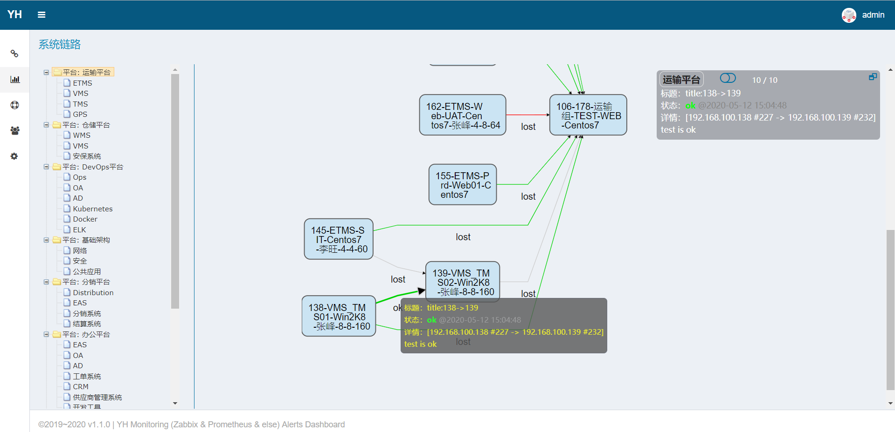
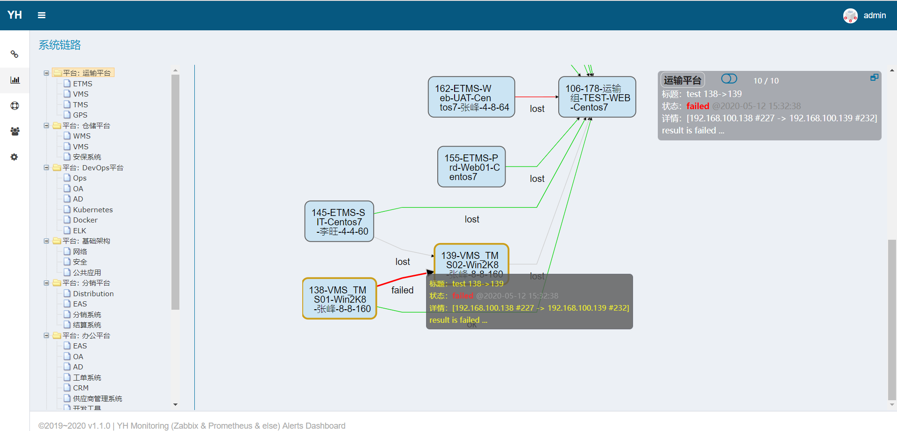
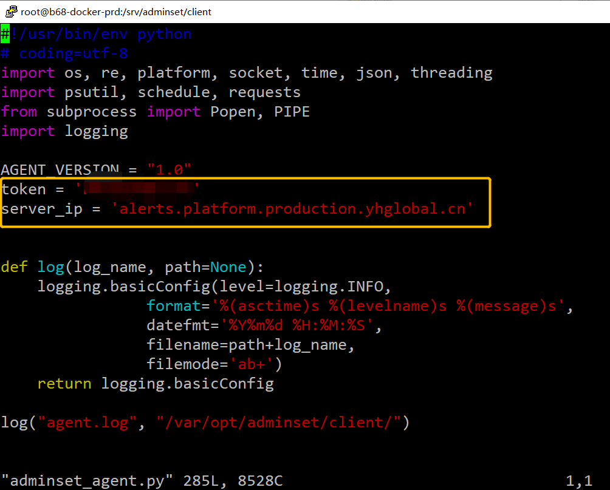

# 系统链路、主机目录功能说明


## 系统链路


【系统链路】根据各平台、系统内的**各主机主动上报**的检测数据，自动生成**主机连接关系图**，直观反映系统内的连接状态，效果图如下（图为模拟连接数据）：


连接线的状态说明：

- 最近5分钟内A->B检测数据status为"ok"开头，则A->B连线为 <b><font color="#0F0">绿色</font></b>
- 最近5分钟内A->B检测数据status为"fail"开头，则A->B连线为 <b><font color="#F00">红色</font></b>
- 最近5分钟内A->B检测数据status为其它字符，A->B连线为 <b><font color="#AAA">灰色</font></b>
- 最近5分钟内A->B无数据，但最近7天内有数据，status将被置为"lost"，连线也是 <b><font color="#AAA">灰色</font></b>


### 如何上传检测结果

以下给出2种示例


### 通过shell curl

以图中 `138 -> 139 failed` 为例，通过简单的HTTP请求脚本 `post_syslink_data.sh` :

```sh
#!/bin/sh

set -x

# url="http://alerts.keep.com/monitor/received/syslink/info/"
url="http://192.168.101.68/monitor/received/syslink/data/ -H Host:alerts.keep.com"

ts=`date +%s`
from="$1"
to="$2"
sta="$3"
ttl="$4"
res="$5"

curl -XPOST -i $url -H "Content-Type:application/json" -d '{
  "timestamp": '"$ts"',
  "from": "'"$from"'",
  "to": "'"$to"'",
  "status": "'"$sta"'",
  "title": "'"$ttl"'",
  "result": "'"$res"'",
  "token": "xxxxxxxxxxxxxxx"		# 通过【系统配置】查看token
}'

echo "end."
```


发送检测结果给服务端接收：

```sh
[root@zabbix02 test]# sh post_syslink_data.sh "192.168.100.138"  "192.168.100.139"  "ok"  "title:138->139"  "test is ok"

HTTP/1.1 200 OK
Server: nginx/1.17.1
Date: Tue, 12 May 2020 07:02:24 GMT
Content-Type: text/html; charset=utf-8
Content-Length: 35
Connection: keep-alive
X-Frame-Options: SAMEORIGIN

Post the syslink Data successfully!+ echo end.
end.
```

*注意：此脚本的参数不能含某些特殊字符，如 "!"*


等待几秒后，原 `138->139 failed` 的连接状态将变为绿色`ok` :




### 通过python requests

HTTP请求脚本 `post_syslink_data.py` :

```python
#!/usr/bin/python2
# coding=utf8
import os
import sys
import json
import requests
import logging


reload(sys)
sys.setdefaultencoding('utf-8')
logging.basicConfig(level=logging.INFO,
                    format='%(asctime)s [%(levelname)s] %(message)s (%(filename)s:L%(lineno)d)',
                    datefmt='%Y-%m-%d %H:%M:%S',
                    filename='/tmp/post_syslink.log',
                    filemode='a')
logger = logging.getLogger(__name__)
token = 'xxxxxxxxxxx'
server_ip = '192.168.101.68'
server_name = 'alerts.keep.com'
headers = {"Host": server_name}
# url = "http://{}/monitor/received/syslink/info/".format(server_ip)
url = "http://{}/monitor/received/syslink/data/".format(server_ip)


def post_data(payload):
    try:
        logger.info("payload is: {}".format(payload))
        r = requests.post(url, data=json.dumps(payload), headers=headers)
        logger.info("r.status_code is: {}".format(r.status_code))
        if r.text:
            logger.info(r.text)
            print("{} {}".format(r.status_code, r.text))
        else:
            logger.info("Server return http status code: {0}".format(r.status_code))
    except Exception as msg:
        logger.info(msg)


if __name__ == '__main__':
    try:
        para01 = sys.argv[1]
        if '-f' == para01:
            para02 = sys.argv[2]
            if not os.path.exists(para02):
                print("No such file: {}".format(para02))
                exit(1)
            else:
                with open(para02, 'r') as f:
                    para01 = f.read()
        try:
            data = json.loads(para01)
        except:
            exit(2)
        
        payload = {"token": token}
        if isinstance(data, list):
            payload["data"] = data
        else:
            payload.update(data)
        post_data(payload)
    except Exception as e:
        print(str(e))
```


发送的数据须符合json格式：

单条数据：

```json
{
  "timestamp": 1589268730,
  "from": "192.168.100.138",
  "to": "192.168.100.139",
  "status": "ok",
  "title": "test 138->139",
  "result": "result is ok ..."
}
```


多条数据：

```json
[
  {
    "timestamp": 1589268445,
    "from": "192.168.100.138",
    "to": "192.168.106.178",
    "status": "ok",
    "title": "test is ok",
    "result": "result is ok ..."
  },
  {
    "timestamp": 1589268445,
    "from": "192.168.100.138",
    "to": "192.168.100.139",
    "status": "ok",
    "title": "test 138->139",
    "result": "result is ok ..."
  }
]
```


发送命令：

```sh
# 假设检测结果数据存放于文件result.json

# 则可以
python post_syslink_data.py "`cat result.json`"

# 或
python post_syslink_data.py -f result.json
```


示例1：

```sh
[root@zabbix02 test]# cat check_res.txt 
{
  "timestamp": 1589268307,
  "from": "192.168.100.138",
  "to": "192.168.100.139",
  "status": "failed",
  "title": "test 138->139",
  "result": "result is failed ..."
}
[root@zabbix02 test]# python post_syslink_data.py -f check_res.txt 
200 Post the syslink Data successfully!
```


示例2（多条数据）：

```sh
[root@zabbix02 test]# cat check_res2.txt 
[
  {
    "timestamp": 1589268445,
    "from": "192.168.100.138",
    "to": "192.168.106.178",
    "status": "ok",
    "title": "test is ok",
    "result": "result is ok ..."
  },
  {
    "timestamp": 1589268445,
    "from": "192.168.100.138",
    "to": "192.168.100.139",
    "status": "ok",
    "title": "test 138->139",
    "result": "result is ok ..."
  }
]
[root@zabbix02 test]# python post_syslink_data.py  -f check_res2.txt 
200 Post the syslink Data successfully!
```


示例3（命令的结果作为参数1）：

```sh
[root@zabbix02 test]# cat check_res.txt 
{
  "timestamp": 1589268730,
  "from": "192.168.100.138",
  "to": "192.168.100.139",
  "status": "failed",
  "title": "test 138->139",
  "result": "result is failed ..."
}
[root@zabbix02 test]# python post_syslink_data.py "`cat check_res.txt`"
200 Post the syslink Data successfully!
```




*注意： 不支持管道输入！*

错误示例：

```sh
[root@zabbix02 test]# cat check_res.txt |python post_syslink_data.py 
list index out of range
```


---


## 主机目录

根据各主机上报的监控数据显示主机CPU、磁盘、网卡等监控图，效果如下


监控数据定时采集及上报**依赖于运行在目标机器上的agent服务**，执行配套的脚本安装、启动即可。当前仅在两三个主机上安装了监控的agent。


### 安装client (agent)

以图示主机为例，其安装脚本临时存放在：

```sh
[root@b68-docker-prd client]# pwd
/srv/adminset/client
[root@b68-docker-prd client]# tree
.
├── adminset_agent.py
├── adminsetd
├── adminsetd.pid
├── adminsetd.service
├── install.sh
└── uninstall.sh

```


安装前，修改adminset_agent.py脚本中的token和server_ip：




然后执行一次 `install.sh` 即完成安装，查看是否已经启动：

```sh
[root@b68-docker-prd client]# service adminsetd status
Redirecting to /bin/systemctl status adminsetd.service
● adminsetd.service - Adminset Agent Script
   Loaded: loaded (/usr/lib/systemd/system/adminsetd.service; enabled; vendor preset: disabled)
   Active: active (running) since Mon 2020-03-23 15:32:25 CST; 1 months 19 days ago
...
```


agent的安装目录是 `/var/opt/adminset/client/` :

```sh
[root@b68-docker-prd client]# pwd
/var/opt/adminset/client
[root@b68-docker-prd client]# ls
adminset_agent.py  adminsetd.pid  agent.log  uninstall.sh  venv
[root@b68-docker-prd client]#
```

按上述安装过之后，即可删除 `/srv/adminset/client` 这个临时安装脚本目录。


由于：

- 所有主机已通过zabbix监控并运行了zabbix agent

- 多运行一个程序或多或少会占用一定的系统资源

因此，**不建议安装**此后台监控脚本，但可针对少数想关注的机器安装，如本例。


---


## 数据清理

通过【系统配置】-> 【清理监控数据】清理mongodb中保存的历史监控数据


