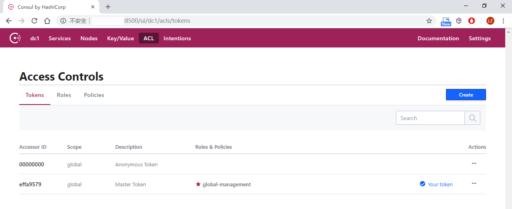

# Consul ACL


systemd service

```ini
[Unit]
Description=consul agent
Requires=network-online.target
After=network-online.target

[Service]
EnvironmentFile=-/etc/sysconfig/consul
Environment=GOMAXPROCS=2
Restart=on-failure
ExecStart=/usr/local/bin/consul agent -config-dir=/opt/consul/conf -rejoin
ExecReload=/bin/kill -HUP $MAINPID
KillSignal=SIGTERM

[Install]
WantedBy=multi-user.target
```


acl.json

启用ACL，需在配置加载目录下添加acl配置文件

```json
{
  "acl_datacenter": "dc1",
  "acl_master_token": "xxxxxxxxx",
  "acl_default_policy": "deny",
  "acl_down_policy": "extend-cache"
}
```





deregitster

```sh
curl  -X PUT http://192.168.100.140:8500/v1/agent/service/deregister/<id> -H "X-Consul-Token:xxx"
```


register

- 仅node check

```sh
curl http://10.1.100.57:8500/v1/agent/service/register -X PUT -i -H "Content-Type:application/json" -H "X-Consul-Token:xxx" -d '{
        "ID": "test.swms.api3",
        "Name": "test-swms-api3",
        "Tags": ["test", "swms"],
        "Address": "192.168.101.35",
        "Port": 9003,
        "Meta": {
            "version": "1.0"
        },
        "EnableTagOverride": false
}'
```


- node check + service check

```sh
curl http://10.1.100.57:8500/v1/agent/service/register -X PUT -i -H "Content-Type:application/json" -H "X-Consul-Token:xxxxxxxxxxx" -d '{
	"ID": "test.swms.api2",
	"Name": "test-swms-api2",
	"Tags": ["test", "swms"],
	"Address": "192.168.101.35",
	"Port": 9003,
	"Check": {
		"DeregisterCriticalServiceAfter": "90m",
		"Args": [],
		"HTTP": "http://192.168.101.35:9003/hc",
		"Interval": "15s"
	},
	"Meta": {
		"version": "1.0"
	},
	"EnableTagOverride": false
}'
```

*Name不能包含小数点*


---

创建一个agent token:

```sh
curl \
    --request PUT \
    --header "X-Consul-Token: xxxxxxxxxxxxxxxx" \
    --data \
'{
  "Name": "Agent Token",
  "Type": "client",
  "Rules": "node \"\" { policy = \"write\" } service \"\" { policy = \"read\" }"
}' http://127.0.0.1:8500/v1/acl/create
```

Type: client


WebUI token的policy可以设置为只读:

```sh
service_prefix "" {
  policy = "read"
  }
key_prefix "" {
  policy = "read"
  }
node_prefix "" {
  policy = "read"
  }
```


---

示例：


```sh
[root@VM_0_4_centos ins_exporter]# cat deReg.sh 
curl -i --request PUT \
     --header "X-Consul-Token: xxxxxxxxxxxxxxxxxx" \
     http://10.1.100.57:8500/v1/agent/service/deregister/$1
     
[root@VM_0_4_centos ins_exporter]# sh deReg.sh id-xxl-vm04
HTTP/1.1 200 OK
Vary: Accept-Encoding
Date: Sun, 07 Jul 2019 08:45:42 GMT
Content-Length: 0

[root@VM_0_4_centos ins_exporter]# cat regXXL.sh 
curl http://10.1.100.57:8500/v1/agent/service/register -X PUT -i -H "Content-Type:application/json" \
 --header "X-Consul-Token: xxxxxxxxxxxxxxxxxx" -d '{
    "ID": "id-xxl-vm04",
    "Name": "xxl",
    "Tags": ["xxl-job", "http"],
    "Address": "192.168.100.150",
    "Port": 9977,
    "Check": {
        "DeregisterCriticalServiceAfter": "90m",
        "HTTP": "http://baidu.com",
        "Interval": "15s"
    },
    "Meta": {
        "version": "1.0",
        "type": "app",
        "hostname": "vm03"
    },
    "EnableTagOverride": false
}'

[root@VM_0_4_centos ins_exporter]# sh regXXL.sh 
HTTP/1.1 200 OK
Vary: Accept-Encoding
Date: Sun, 07 Jul 2019 08:47:47 GMT
Content-Length: 0

# 不带token被禁止
[root@VM_0_4_centos ins_exporter]# curl -i -X PUT http://10.1.100.57:8500/v1/agent/service/deregister/id-xxl-vm04
HTTP/1.1 403 Forbidden
Vary: Accept-Encoding
Date: Sun, 07 Jul 2019 08:48:54 GMT
Content-Length: 17
Content-Type: text/plain; charset=utf-8
```

