# Grafana的安装与使用


> 系统：CentOS 7.5
>
> 软件版本：通过docker安装最新版本


## 简介

官网：<https://grafana.com/grafana>


> Grafana是一个跨平台、开源的指标度量分析和可视化工具，提供了强大和优雅的方式去创建、共享、浏览数据。Grafana非常适于和时间序列数据库结合展示数据，如[Graphite](http://docs.grafana.org/features/datasources/graphite/), [InfluxDB](http://docs.grafana.org/features/datasources/influxdb/), [OpenTSDB](http://docs.grafana.org/features/datasources/opentsdb/), [Prometheus](http://docs.grafana.org/features/datasources/prometheus/)。


---

## 快速安装

```sh
# 拉取镜像
docker pull grafana/grafana
# 运行grafana（admin登录密码为admin）
docker run -d -i -p 3000:3000 \
-e "GF_SERVER_ROOT_URL=http://grafana.server.name" \
-e "GF_SECURITY_ADMIN_PASSWORD=admin" \
--net=host \
grafana/grafana
```


在192.168.100.150上执行，通过浏览器访问：<http://192.168.100.150:3000>，以admin/admin登录

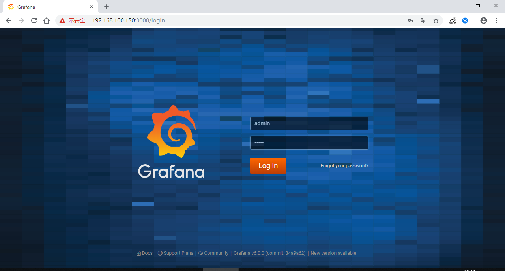


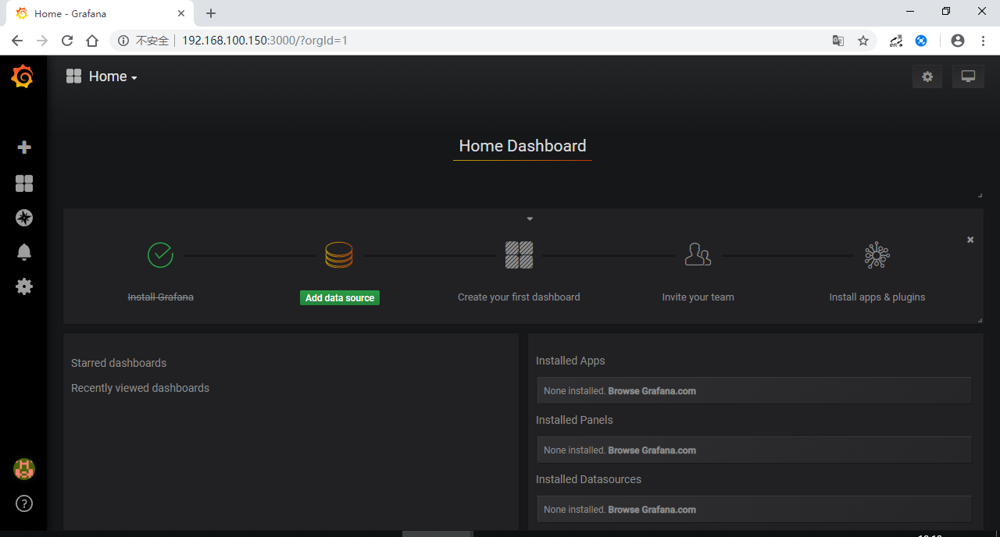


可以看到只有Install Grafana是已完成状态，待添加数据源、创建仪表盘、添加用户、安装插件等。

*官网安装指导：<http://docs.grafana.org/installation/docker/*>


---

## 创建一个Dashboard

先不管Add data source这一步，直接来尝试创建一个Dashboard。

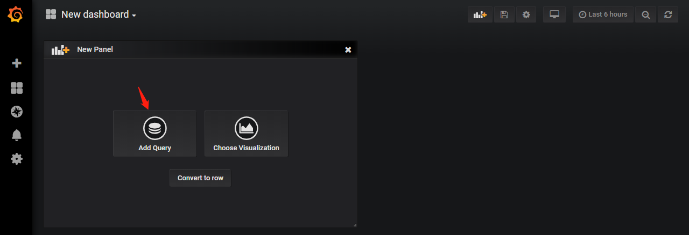


- 修改数据源

default是grafana提供的默认数据源，作演示用没有实际意义。A系列是随机产生的数据。

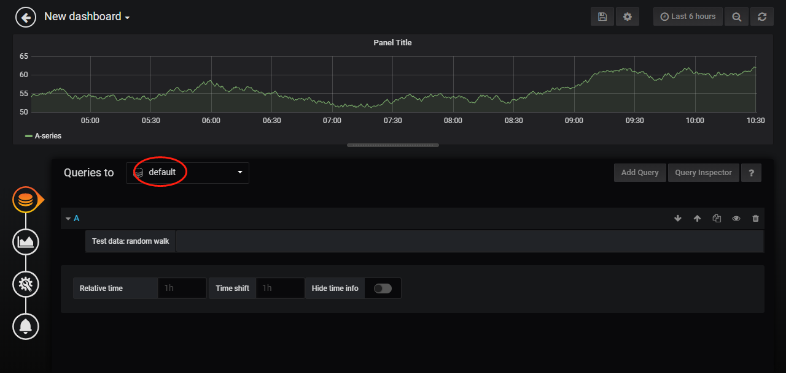


- 修改图表样式

可以在此页签内设置图表类型、线型、阴影、显示的系列等。

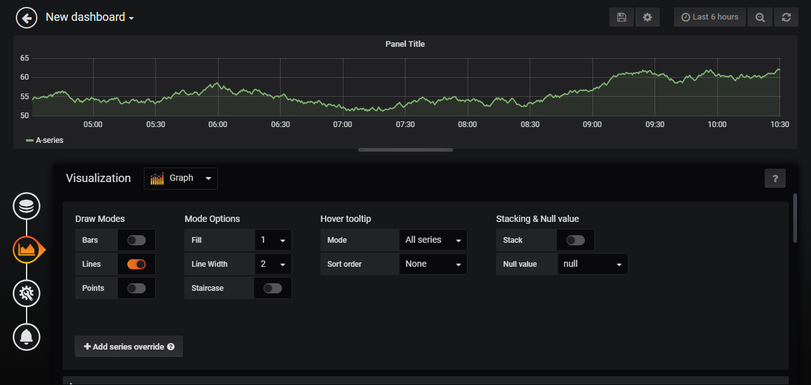


- 修改通用设置

图表标题、描述信息等。


- 保存bashboard

调整图表宽高，保存自定义的dashboard。

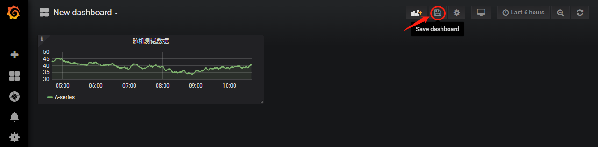


---

## 对接Zabbix

Grafana没有预装zabbix数据源插件。安装过程如下：

点击Install app & plugins 会跳转到<https://grafana.com/plugins>，选择zabbix。

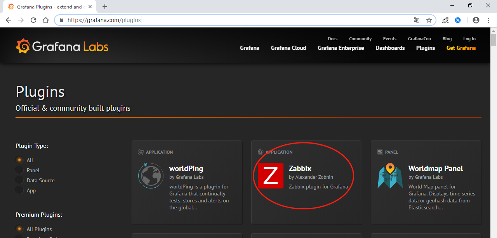


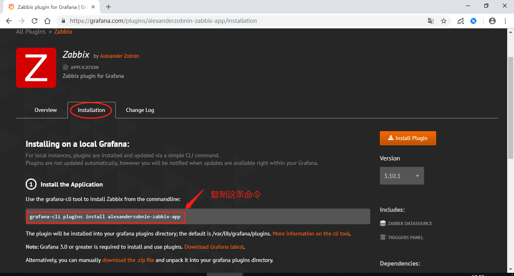


由于是通过容器运行grafana的，需进入容器执行插件安装。

```sh
# 列出容器
docker ps -a
# 进入grafana的容器
docker exec -it <id> bash

## grafana容器内
# 安装grafana的zabbix插件
grafana-cli plugins install alexanderzobnin-zabbix-app
exit

# 重启容器，然后刷新浏览器页面
docker restart <id>
```


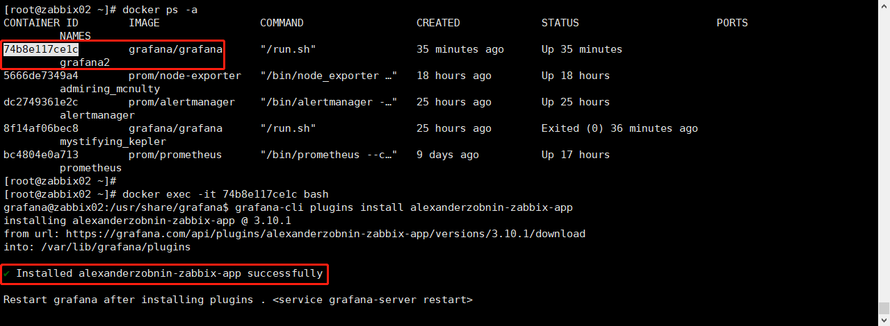


重启容器后刷新浏览器，可以看到zabbix插件已安装，并启用之。

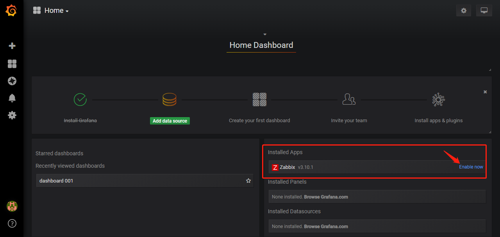


添加zabbix数据源


要从zabbix平台<http://192.168.100.220/zabbix>获取数据，URL填<http://192.168.100.220/zabbix/api_jsonrpc.php>。

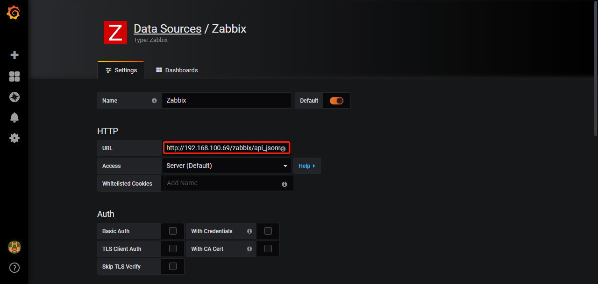


保存后，切换到Dashboards页签，导入相关的zabbix插件提供的dashboard。

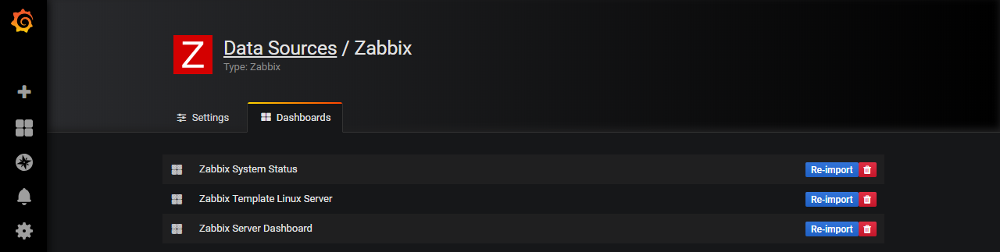


回到Home，查看已有的dashboard。

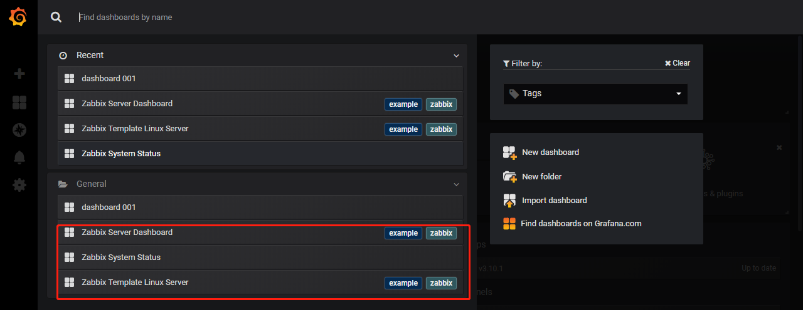


查看zabbix监控数据在grafana上的展示效果。

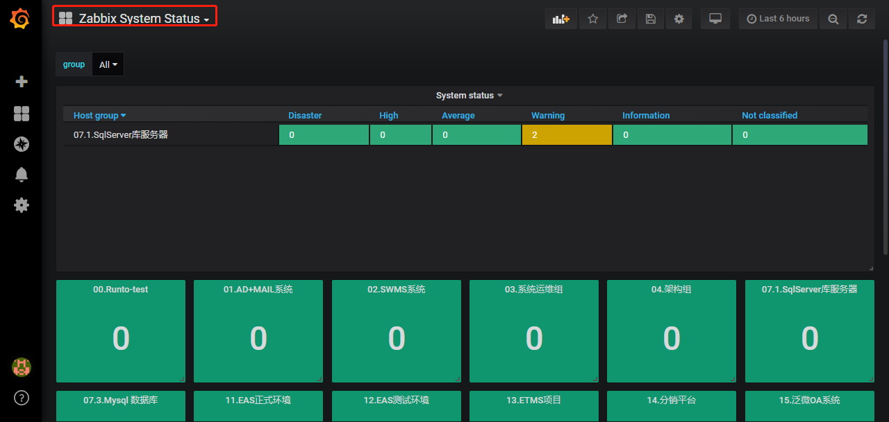


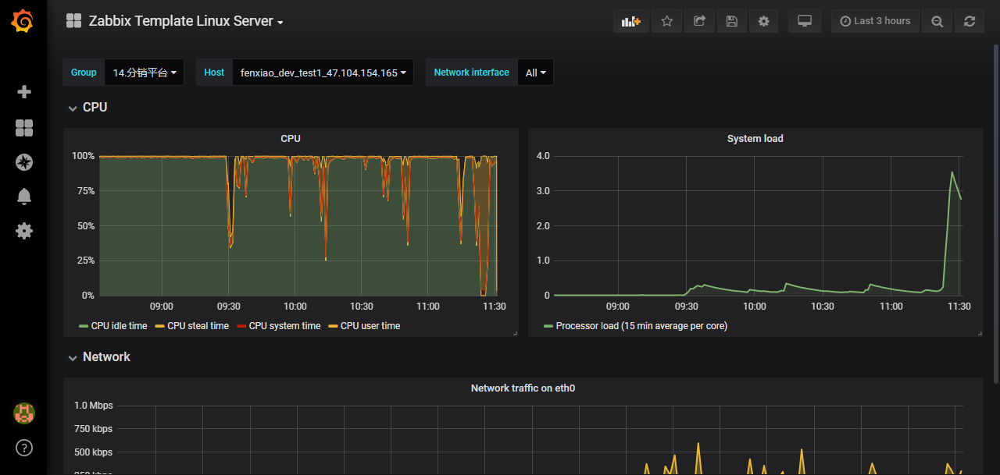


---

(End)
