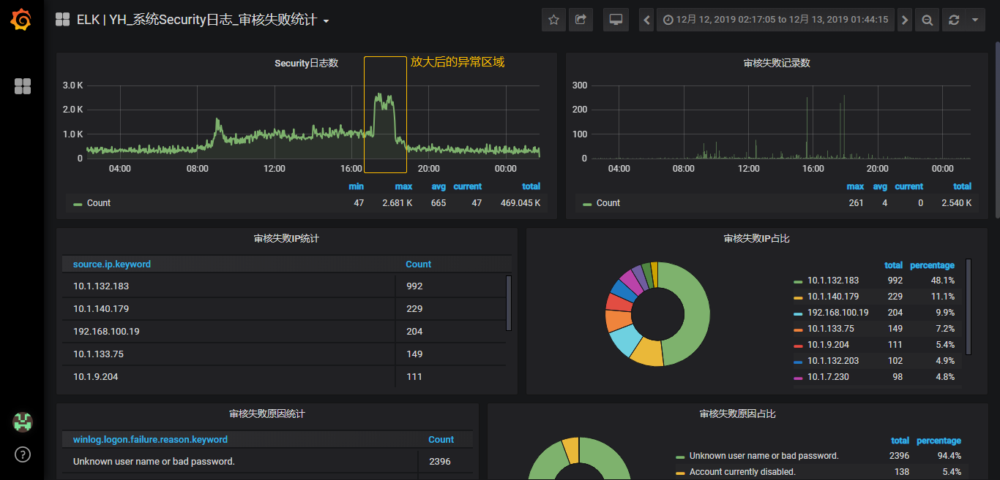

# Grafana模板 - 日志统计





```json
{
  "annotations": {
    "list": [
      {
        "builtIn": 1,
        "datasource": "-- Grafana --",
        "enable": true,
        "hide": true,
        "iconColor": "rgba(0, 211, 255, 1)",
        "name": "Annotations & Alerts",
        "type": "dashboard"
      }
    ]
  },
  "editable": true,
  "gnetId": null,
  "graphTooltip": 0,
  "id": 29,
  "links": [],
  "panels": [
    {
      "aliasColors": {},
      "bars": false,
      "dashLength": 10,
      "dashes": false,
      "datasource": "Elasticsearch_beats-5170",
      "description": "",
      "fill": 1,
      "gridPos": {
        "h": 6,
        "w": 13,
        "x": 0,
        "y": 0
      },
      "id": 8,
      "interval": "",
      "legend": {
        "alignAsTable": true,
        "avg": true,
        "current": true,
        "max": true,
        "min": true,
        "rightSide": false,
        "show": true,
        "total": true,
        "values": true
      },
      "lines": true,
      "linewidth": 2,
      "links": [],
      "nullPointMode": "null",
      "options": {},
      "percentage": false,
      "pointradius": 2,
      "points": false,
      "renderer": "flot",
      "seriesOverrides": [],
      "spaceLength": 10,
      "stack": false,
      "steppedLine": false,
      "targets": [
        {
          "bucketAggs": [
            {
              "field": "@timestamp",
              "id": "2",
              "settings": {
                "interval": "auto",
                "min_doc_count": 0,
                "trimEdges": 0
              },
              "type": "date_histogram"
            }
          ],
          "metrics": [
            {
              "field": "select field",
              "id": "1",
              "type": "count"
            }
          ],
          "query": "winlog.channel: \"Security\"",
          "refId": "A",
          "timeField": "@timestamp"
        }
      ],
      "thresholds": [],
      "timeFrom": null,
      "timeRegions": [],
      "timeShift": null,
      "title": "Security日志数",
      "tooltip": {
        "shared": true,
        "sort": 0,
        "value_type": "individual"
      },
      "type": "graph",
      "xaxis": {
        "buckets": null,
        "mode": "time",
        "name": null,
        "show": true,
        "values": []
      },
      "yaxes": [
        {
          "format": "short",
          "label": null,
          "logBase": 1,
          "max": null,
          "min": null,
          "show": true
        },
        {
          "format": "short",
          "label": null,
          "logBase": 1,
          "max": null,
          "min": null,
          "show": true
        }
      ],
      "yaxis": {
        "align": false,
        "alignLevel": null
      }
    },
    {
      "aliasColors": {},
      "bars": true,
      "dashLength": 10,
      "dashes": false,
      "datasource": "Elasticsearch_beats-5170",
      "description": "",
      "fill": 1,
      "gridPos": {
        "h": 6,
        "w": 11,
        "x": 13,
        "y": 0
      },
      "id": 3,
      "interval": "",
      "legend": {
        "alignAsTable": true,
        "avg": true,
        "current": true,
        "hideEmpty": false,
        "hideZero": false,
        "max": true,
        "min": false,
        "rightSide": false,
        "show": true,
        "total": true,
        "values": true
      },
      "lines": false,
      "linewidth": 1,
      "links": [],
      "nullPointMode": "null",
      "options": {},
      "percentage": false,
      "pointradius": 2,
      "points": false,
      "renderer": "flot",
      "seriesOverrides": [],
      "spaceLength": 10,
      "stack": false,
      "steppedLine": false,
      "targets": [
        {
          "bucketAggs": [
            {
              "field": "@timestamp",
              "id": "2",
              "settings": {
                "interval": "auto",
                "min_doc_count": 0,
                "trimEdges": 0
              },
              "type": "date_histogram"
            }
          ],
          "metrics": [
            {
              "field": "select field",
              "id": "1",
              "type": "count"
            }
          ],
          "query": "winlog.keywords: \"审核失败\" AND winlog.channel: \"Security \"",
          "refId": "A",
          "timeField": "@timestamp"
        }
      ],
      "thresholds": [],
      "timeFrom": null,
      "timeRegions": [],
      "timeShift": null,
      "title": "审核失败记录数",
      "tooltip": {
        "shared": true,
        "sort": 0,
        "value_type": "individual"
      },
      "type": "graph",
      "xaxis": {
        "buckets": null,
        "mode": "time",
        "name": null,
        "show": true,
        "values": []
      },
      "yaxes": [
        {
          "format": "short",
          "label": null,
          "logBase": 1,
          "max": null,
          "min": null,
          "show": true
        },
        {
          "format": "short",
          "label": null,
          "logBase": 1,
          "max": null,
          "min": null,
          "show": true
        }
      ],
      "yaxis": {
        "align": false,
        "alignLevel": null
      }
    },
    {
      "cacheTimeout": null,
      "columns": [],
      "datasource": "Elasticsearch_beats-5170",
      "description": "",
      "fontSize": "100%",
      "gridPos": {
        "h": 6,
        "w": 12,
        "x": 0,
        "y": 6
      },
      "id": 4,
      "links": [],
      "options": {},
      "pageSize": null,
      "pluginVersion": "6.2.0",
      "scroll": true,
      "showHeader": true,
      "sort": {
        "col": null,
        "desc": false
      },
      "styles": [
        {
          "alias": "Time",
          "dateFormat": "YYYY-MM-DD HH:mm:ss",
          "link": false,
          "pattern": "Time",
          "type": "date"
        },
        {
          "alias": "",
          "colorMode": null,
          "colors": [
            "rgba(245, 54, 54, 0.9)",
            "rgba(237, 129, 40, 0.89)",
            "rgba(50, 172, 45, 0.97)"
          ],
          "decimals": 0,
          "pattern": "/.*/",
          "thresholds": [],
          "type": "number",
          "unit": "none"
        }
      ],
      "targets": [
        {
          "bucketAggs": [
            {
              "field": "source.ip.keyword",
              "id": "2",
              "settings": {
                "min_doc_count": 1,
                "order": "desc",
                "orderBy": "_count",
                "size": "10"
              },
              "type": "terms"
            }
          ],
          "metrics": [
            {
              "field": "select field",
              "id": "1",
              "type": "count"
            }
          ],
          "query": "winlog.keywords: \"审核失败\" AND winlog.channel: \"Security \"",
          "refId": "A",
          "timeField": "@timestamp"
        }
      ],
      "timeFrom": null,
      "timeShift": null,
      "title": "审核失败IP统计",
      "transform": "table",
      "type": "table"
    },
    {
      "aliasColors": {},
      "breakPoint": "25%",
      "cacheTimeout": null,
      "combine": {
        "label": "Others",
        "threshold": "0"
      },
      "datasource": "Elasticsearch_beats-5170",
      "decimals": 0,
      "description": "",
      "fontSize": "80%",
      "format": "none",
      "gridPos": {
        "h": 6,
        "w": 12,
        "x": 12,
        "y": 6
      },
      "id": 6,
      "interval": null,
      "legend": {
        "header": "",
        "percentage": true,
        "percentageDecimals": 1,
        "show": true,
        "sideWidth": null,
        "values": true
      },
      "legendType": "Right side",
      "links": [],
      "maxDataPoints": 3,
      "nullPointMode": "connected",
      "options": {},
      "pieType": "donut",
      "pluginVersion": "6.2.0",
      "strokeWidth": "1",
      "targets": [
        {
          "bucketAggs": [
            {
              "fake": true,
              "field": "source.ip.keyword",
              "id": "3",
              "settings": {
                "min_doc_count": 1,
                "order": "desc",
                "orderBy": "_count",
                "size": "10"
              },
              "type": "terms"
            },
            {
              "field": "@timestamp",
              "id": "2",
              "settings": {
                "interval": "auto",
                "min_doc_count": 0,
                "trimEdges": 0
              },
              "type": "date_histogram"
            }
          ],
          "metrics": [
            {
              "field": "select metric",
              "id": "1",
              "meta": {},
              "pipelineAgg": "select metric",
              "pipelineVariables": [
                {
                  "name": "var1",
                  "pipelineAgg": "select metric"
                }
              ],
              "settings": {},
              "type": "count"
            }
          ],
          "query": "winlog.keywords: \"审核失败\" AND winlog.channel: \"Security \"",
          "refId": "A",
          "timeField": "@timestamp"
        }
      ],
      "timeFrom": null,
      "timeShift": null,
      "title": "审核失败IP占比",
      "type": "grafana-piechart-panel",
      "valueName": "total"
    },
    {
      "cacheTimeout": null,
      "columns": [],
      "datasource": "Elasticsearch_beats-5170",
      "description": "",
      "fontSize": "100%",
      "gridPos": {
        "h": 6,
        "w": 11,
        "x": 0,
        "y": 12
      },
      "id": 5,
      "links": [],
      "options": {},
      "pageSize": null,
      "pluginVersion": "6.2.0",
      "scroll": true,
      "showHeader": true,
      "sort": {
        "col": null,
        "desc": false
      },
      "styles": [
        {
          "alias": "Time",
          "dateFormat": "YYYY-MM-DD HH:mm:ss",
          "link": false,
          "pattern": "Time",
          "type": "date"
        },
        {
          "alias": "",
          "colorMode": null,
          "colors": [
            "rgba(245, 54, 54, 0.9)",
            "rgba(237, 129, 40, 0.89)",
            "rgba(50, 172, 45, 0.97)"
          ],
          "decimals": 0,
          "pattern": "/.*/",
          "thresholds": [],
          "type": "number",
          "unit": "none"
        }
      ],
      "targets": [
        {
          "bucketAggs": [
            {
              "field": "winlog.logon.failure.reason.keyword",
              "id": "2",
              "settings": {
                "min_doc_count": 1,
                "order": "desc",
                "orderBy": "_count",
                "size": "10"
              },
              "type": "terms"
            }
          ],
          "metrics": [
            {
              "field": "select field",
              "id": "1",
              "type": "count"
            }
          ],
          "query": "winlog.keywords: \"审核失败\" AND winlog.channel: \"Security \"",
          "refId": "A",
          "timeField": "@timestamp"
        }
      ],
      "timeFrom": null,
      "timeShift": null,
      "title": "审核失败原因统计",
      "transform": "table",
      "type": "table"
    },
    {
      "aliasColors": {},
      "breakPoint": "25%",
      "cacheTimeout": null,
      "combine": {
        "label": "Others",
        "threshold": "0"
      },
      "datasource": "Elasticsearch_beats-5170",
      "decimals": 0,
      "description": "",
      "fontSize": "80%",
      "format": "none",
      "gridPos": {
        "h": 6,
        "w": 13,
        "x": 11,
        "y": 12
      },
      "id": 9,
      "interval": null,
      "legend": {
        "header": "",
        "percentage": true,
        "percentageDecimals": 1,
        "show": true,
        "sideWidth": null,
        "values": true
      },
      "legendType": "Right side",
      "links": [],
      "maxDataPoints": 3,
      "nullPointMode": "connected",
      "options": {},
      "pieType": "donut",
      "pluginVersion": "6.2.0",
      "strokeWidth": "1",
      "targets": [
        {
          "bucketAggs": [
            {
              "fake": true,
              "field": "winlog.logon.failure.reason.keyword",
              "id": "3",
              "settings": {
                "min_doc_count": 1,
                "order": "desc",
                "orderBy": "_count",
                "size": "10"
              },
              "type": "terms"
            },
            {
              "field": "@timestamp",
              "id": "2",
              "settings": {
                "interval": "auto",
                "min_doc_count": 0,
                "trimEdges": 0
              },
              "type": "date_histogram"
            }
          ],
          "metrics": [
            {
              "field": "select metric",
              "id": "1",
              "meta": {},
              "pipelineAgg": "select metric",
              "pipelineVariables": [
                {
                  "name": "var1",
                  "pipelineAgg": "select metric"
                }
              ],
              "settings": {},
              "type": "count"
            }
          ],
          "query": "winlog.keywords: \"审核失败\" AND winlog.channel: \"Security \"",
          "refId": "A",
          "timeField": "@timestamp"
        }
      ],
      "timeFrom": null,
      "timeShift": null,
      "title": "审核失败原因占比",
      "type": "grafana-piechart-panel",
      "valueName": "total"
    },
    {
      "cacheTimeout": null,
      "columns": [],
      "datasource": "Elasticsearch_beats-5170",
      "description": "",
      "fontSize": "100%",
      "gridPos": {
        "h": 19,
        "w": 14,
        "x": 0,
        "y": 18
      },
      "id": 7,
      "links": [],
      "options": {},
      "pageSize": null,
      "pluginVersion": "6.2.0",
      "scroll": true,
      "showHeader": true,
      "sort": {
        "col": null,
        "desc": false
      },
      "styles": [
        {
          "alias": "Time",
          "dateFormat": "YYYY-MM-DD HH:mm:ss",
          "link": false,
          "pattern": "Time",
          "type": "date"
        },
        {
          "alias": "",
          "colorMode": null,
          "colors": [
            "rgba(245, 54, 54, 0.9)",
            "rgba(237, 129, 40, 0.89)",
            "rgba(50, 172, 45, 0.97)"
          ],
          "decimals": 0,
          "pattern": "/.*/",
          "thresholds": [],
          "type": "number",
          "unit": "none"
        }
      ],
      "targets": [
        {
          "bucketAggs": [
            {
              "fake": true,
              "field": "winlog.logon.failure.reason.keyword",
              "id": "3",
              "settings": {
                "min_doc_count": 1,
                "order": "desc",
                "orderBy": "_count",
                "size": "10"
              },
              "type": "terms"
            },
            {
              "field": "source.ip.keyword",
              "id": "2",
              "settings": {
                "min_doc_count": 1,
                "order": "desc",
                "orderBy": "_count",
                "size": "10"
              },
              "type": "terms"
            }
          ],
          "metrics": [
            {
              "field": "select field",
              "id": "1",
              "type": "count"
            }
          ],
          "query": "winlog.keywords: \"审核失败\" AND winlog.channel: \"Security \"",
          "refId": "A",
          "timeField": "@timestamp"
        }
      ],
      "timeFrom": null,
      "timeShift": null,
      "title": "审核失败原因及IP",
      "transform": "table",
      "type": "table"
    }
  ],
  "refresh": false,
  "schemaVersion": 18,
  "style": "dark",
  "tags": [
    "ELK",
    "Windows"
  ],
  "templating": {
    "list": []
  },
  "time": {
    "from": "2020-05-15T00:19:36.111Z",
    "to": "2020-05-15T01:39:44.459Z"
  },
  "timepicker": {
    "refresh_intervals": [
      "5s",
      "10s",
      "30s",
      "1m",
      "5m",
      "15m",
      "30m",
      "1h",
      "2h",
      "1d"
    ],
    "time_options": [
      "5m",
      "15m",
      "1h",
      "6h",
      "12h",
      "24h",
      "2d",
      "7d",
      "30d"
    ]
  },
  "timezone": "",
  "title": "ELK | 系统Security日志_审核失败统计"
}
```

