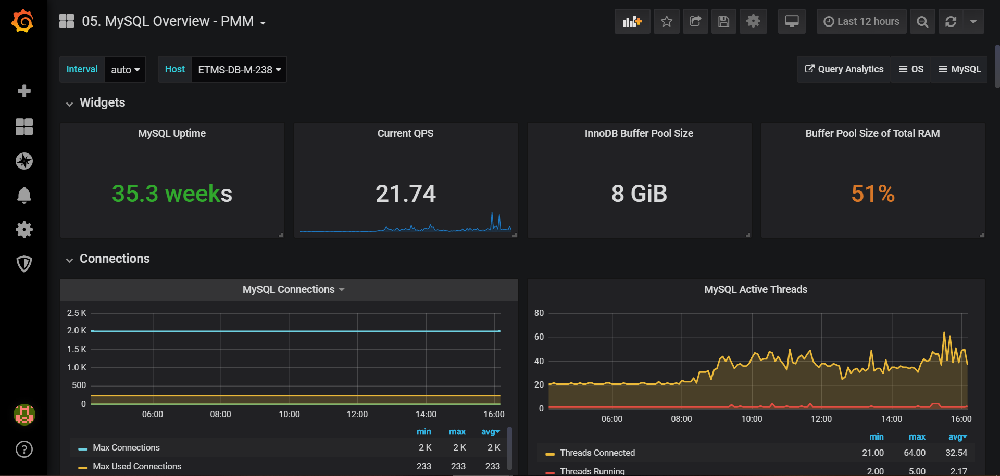

# Grafana模板 - PMM MySQL Overview




```json
{
  "annotations": {
    "list": [
      {
        "builtIn": 1,
        "datasource": "-- Grafana --",
        "enable": true,
        "hide": true,
        "iconColor": "rgba(0, 211, 255, 1)",
        "name": "Annotations & Alerts",
        "type": "dashboard"
      }
    ]
  },
  "editable": true,
  "gnetId": null,
  "graphTooltip": 1,
  "id": 3,
  "iteration": 1589530249880,
  "links": [
    {
      "icon": "external link",
      "includeVars": true,
      "keepTime": true,
      "tags": [],
      "targetBlank": true,
      "title": "Query Analytics",
      "type": "link",
      "url": "http://10.1.100.200/qan/"
    },
    {
      "asDropdown": true,
      "icon": "external link",
      "includeVars": true,
      "keepTime": true,
      "tags": [
        "OS",
        "PMM"
      ],
      "targetBlank": true,
      "title": "OS",
      "type": "dashboards"
    },
    {
      "asDropdown": true,
      "icon": "external link",
      "includeVars": true,
      "keepTime": true,
      "tags": [
        "MySQL",
        "PMM"
      ],
      "targetBlank": true,
      "title": "MySQL",
      "type": "dashboards"
    }
  ],
  "panels": [
    {
      "collapsed": false,
      "gridPos": {
        "h": 1,
        "w": 24,
        "x": 0,
        "y": 0
      },
      "id": 55,
      "panels": [],
      "repeat": null,
      "title": "Widgets",
      "type": "row"
    },
    {
      "cacheTimeout": null,
      "colorBackground": false,
      "colorValue": true,
      "colors": [
        "rgba(245, 54, 54, 0.9)",
        "rgba(237, 129, 40, 0.89)",
        "rgba(50, 172, 45, 0.97)"
      ],
      "datasource": "Prometheus-PMM",
      "decimals": 1,
      "editable": true,
      "error": false,
      "format": "s",
      "gauge": {
        "maxValue": 100,
        "minValue": 0,
        "show": false,
        "thresholdLabels": false,
        "thresholdMarkers": true
      },
      "gridPos": {
        "h": 4,
        "w": 6,
        "x": 0,
        "y": 1
      },
      "height": "125px",
      "id": 12,
      "interval": "$interval",
      "links": [],
      "mappingType": 1,
      "mappingTypes": [
        {
          "name": "value to text",
          "value": 1
        },
        {
          "name": "range to text",
          "value": 2
        }
      ],
      "maxDataPoints": 100,
      "nullPointMode": "connected",
      "nullText": null,
      "options": {},
      "postfix": "s",
      "postfixFontSize": "80%",
      "prefix": "",
      "prefixFontSize": "80%",
      "rangeMaps": [
        {
          "from": "null",
          "text": "N/A",
          "to": "null"
        }
      ],
      "sparkline": {
        "fillColor": "rgba(31, 118, 189, 0.18)",
        "full": false,
        "lineColor": "rgb(31, 120, 193)",
        "show": false
      },
      "tableColumn": "",
      "targets": [
        {
          "calculatedInterval": "10m",
          "datasourceErrors": {},
          "errors": {},
          "expr": "mysql_global_status_uptime{instance=\"$host\"}",
          "interval": "5m",
          "intervalFactor": 1,
          "legendFormat": "",
          "metric": "",
          "refId": "A",
          "step": 300
        }
      ],
      "thresholds": "300,3600",
      "title": "MySQL Uptime",
      "type": "singlestat",
      "valueFontSize": "80%",
      "valueMaps": [],
      "valueName": "current"
    },
    {
      "cacheTimeout": null,
      "colorBackground": false,
      "colorValue": false,
      "colors": [
        "rgba(245, 54, 54, 0.9)",
        "rgba(237, 129, 40, 0.89)",
        "rgba(50, 172, 45, 0.97)"
      ],
      "datasource": "Prometheus-PMM",
      "decimals": 2,
      "editable": true,
      "error": false,
      "format": "short",
      "gauge": {
        "maxValue": 100,
        "minValue": 0,
        "show": false,
        "thresholdLabels": false,
        "thresholdMarkers": true
      },
      "gridPos": {
        "h": 4,
        "w": 6,
        "x": 6,
        "y": 1
      },
      "height": "125px",
      "id": 13,
      "interval": "$interval",
      "links": [],
      "mappingType": 1,
      "mappingTypes": [
        {
          "name": "value to text",
          "value": 1
        },
        {
          "name": "range to text",
          "value": 2
        }
      ],
      "maxDataPoints": 100,
      "nullPointMode": "connected",
      "nullText": null,
      "options": {},
      "postfix": "",
      "postfixFontSize": "50%",
      "prefix": "",
      "prefixFontSize": "80%",
      "rangeMaps": [
        {
          "from": "null",
          "text": "N/A",
          "to": "null"
        }
      ],
      "sparkline": {
        "fillColor": "rgba(31, 118, 189, 0.18)",
        "full": false,
        "lineColor": "rgb(31, 120, 193)",
        "show": true
      },
      "tableColumn": "",
      "targets": [
        {
          "calculatedInterval": "10m",
          "datasourceErrors": {},
          "errors": {},
          "expr": "rate(mysql_global_status_queries{instance=\"$host\"}[$interval]) or irate(mysql_global_status_queries{instance=\"$host\"}[5m])",
          "interval": "$interval",
          "intervalFactor": 1,
          "legendFormat": "",
          "metric": "",
          "refId": "A",
          "step": 300
        }
      ],
      "thresholds": "35,75",
      "title": "Current QPS",
      "type": "singlestat",
      "valueFontSize": "80%",
      "valueMaps": [],
      "valueName": "current"
    },
    {
      "cacheTimeout": null,
      "colorBackground": false,
      "colorValue": false,
      "colors": [
        "rgba(50, 172, 45, 0.97)",
        "rgba(237, 129, 40, 0.89)",
        "rgba(245, 54, 54, 0.9)"
      ],
      "datasource": "Prometheus-PMM",
      "decimals": 0,
      "editable": true,
      "error": false,
      "format": "bytes",
      "gauge": {
        "maxValue": 100,
        "minValue": 0,
        "show": false,
        "thresholdLabels": false,
        "thresholdMarkers": true
      },
      "gridPos": {
        "h": 4,
        "w": 6,
        "x": 12,
        "y": 1
      },
      "height": "125px",
      "id": 51,
      "interval": "$interval",
      "links": [],
      "mappingType": 1,
      "mappingTypes": [
        {
          "name": "value to text",
          "value": 1
        },
        {
          "name": "range to text",
          "value": 2
        }
      ],
      "maxDataPoints": 100,
      "nullPointMode": "connected",
      "nullText": null,
      "options": {},
      "postfix": "",
      "postfixFontSize": "50%",
      "prefix": "",
      "prefixFontSize": "80%",
      "rangeMaps": [
        {
          "from": "null",
          "text": "N/A",
          "to": "null"
        }
      ],
      "sparkline": {
        "fillColor": "rgba(31, 118, 189, 0.18)",
        "full": false,
        "lineColor": "rgb(31, 120, 193)",
        "show": false
      },
      "tableColumn": "",
      "targets": [
        {
          "calculatedInterval": "10m",
          "datasourceErrors": {},
          "errors": {},
          "expr": "mysql_global_variables_innodb_buffer_pool_size{instance=\"$host\"}",
          "interval": "5m",
          "intervalFactor": 1,
          "legendFormat": "",
          "metric": "",
          "refId": "A",
          "step": 300
        }
      ],
      "thresholds": "90,95",
      "title": "InnoDB Buffer Pool Size",
      "type": "singlestat",
      "valueFontSize": "80%",
      "valueMaps": [],
      "valueName": "current"
    },
    {
      "cacheTimeout": null,
      "colorBackground": false,
      "colorValue": true,
      "colors": [
        "rgba(245, 54, 54, 0.9)",
        "rgba(237, 129, 40, 0.89)",
        "rgba(50, 172, 45, 0.97)"
      ],
      "datasource": "Prometheus-PMM",
      "decimals": 0,
      "editable": true,
      "error": false,
      "format": "percent",
      "gauge": {
        "maxValue": 100,
        "minValue": 0,
        "show": false,
        "thresholdLabels": false,
        "thresholdMarkers": true
      },
      "gridPos": {
        "h": 4,
        "w": 6,
        "x": 18,
        "y": 1
      },
      "height": "125px",
      "id": 52,
      "interval": "$interval",
      "links": [],
      "mappingType": 1,
      "mappingTypes": [
        {
          "name": "value to text",
          "value": 1
        },
        {
          "name": "range to text",
          "value": 2
        }
      ],
      "maxDataPoints": 100,
      "nullPointMode": "connected",
      "nullText": null,
      "options": {},
      "postfix": "",
      "postfixFontSize": "50%",
      "prefix": "",
      "prefixFontSize": "80%",
      "rangeMaps": [
        {
          "from": "null",
          "text": "N/A",
          "to": "null"
        }
      ],
      "repeat": null,
      "sparkline": {
        "fillColor": "rgba(31, 118, 189, 0.18)",
        "full": false,
        "lineColor": "rgb(31, 120, 193)",
        "show": false
      },
      "tableColumn": "",
      "targets": [
        {
          "calculatedInterval": "10m",
          "datasourceErrors": {},
          "errors": {},
          "expr": "(mysql_global_variables_innodb_buffer_pool_size{instance=\"$host\"} * 100) / on (instance) node_memory_MemTotal{instance=\"$host\"}",
          "interval": "5m",
          "intervalFactor": 1,
          "legendFormat": "",
          "metric": "",
          "refId": "A",
          "step": 300
        }
      ],
      "thresholds": "40,80",
      "title": "Buffer Pool Size of Total RAM",
      "type": "singlestat",
      "valueFontSize": "80%",
      "valueMaps": [],
      "valueName": "current"
    },
    {
      "collapsed": false,
      "gridPos": {
        "h": 1,
        "w": 24,
        "x": 0,
        "y": 5
      },
      "id": 56,
      "panels": [],
      "repeat": null,
      "title": "Connections",
      "type": "row"
    },
    {
      "aliasColors": {},
      "bars": false,
      "dashLength": 10,
      "dashes": false,
      "datasource": "Prometheus-PMM",
      "decimals": 0,
      "editable": true,
      "error": false,
      "fill": 2,
      "grid": {},
      "gridPos": {
        "h": 7,
        "w": 12,
        "x": 0,
        "y": 6
      },
      "height": "250px",
      "id": 2,
      "legend": {
        "alignAsTable": true,
        "avg": true,
        "current": false,
        "max": true,
        "min": true,
        "show": true,
        "sort": "avg",
        "sortDesc": true,
        "total": false,
        "values": true
      },
      "lines": true,
      "linewidth": 2,
      "links": [],
      "nullPointMode": "null",
      "options": {},
      "percentage": false,
      "pointradius": 5,
      "points": false,
      "renderer": "flot",
      "seriesOverrides": [
        {
          "alias": "Max Connections",
          "fill": 0
        }
      ],
      "spaceLength": 10,
      "stack": false,
      "steppedLine": false,
      "targets": [
        {
          "calculatedInterval": "2m",
          "datasourceErrors": {},
          "errors": {},
          "expr": "rate(mysql_global_status_connections{instance=\"$host\"}[$interval]) or irate(mysql_global_status_connections{instance=\"$host\"}[5m])",
          "interval": "$interval",
          "intervalFactor": 1,
          "legendFormat": "Connections",
          "metric": "",
          "refId": "A",
          "step": 300
        },
        {
          "calculatedInterval": "2m",
          "datasourceErrors": {},
          "errors": {},
          "expr": "mysql_global_status_max_used_connections{instance=\"$host\"}",
          "interval": "$interval",
          "intervalFactor": 1,
          "legendFormat": "Max Used Connections",
          "metric": "",
          "refId": "C",
          "step": 300,
          "target": ""
        },
        {
          "calculatedInterval": "2m",
          "datasourceErrors": {},
          "errors": {},
          "expr": "mysql_global_variables_max_connections{instance=\"$host\"}",
          "interval": "$interval",
          "intervalFactor": 1,
          "legendFormat": "Max Connections",
          "metric": "",
          "refId": "B",
          "step": 300,
          "target": ""
        }
      ],
      "thresholds": [],
      "timeFrom": null,
      "timeRegions": [],
      "timeShift": null,
      "title": "MySQL Connections",
      "tooltip": {
        "msResolution": false,
        "shared": true,
        "sort": 0,
        "value_type": "cumulative"
      },
      "type": "graph",
      "xaxis": {
        "buckets": null,
        "mode": "time",
        "name": null,
        "show": true,
        "values": []
      },
      "yaxes": [
        {
          "format": "short",
          "label": "",
          "logBase": 1,
          "max": null,
          "min": 0,
          "show": true
        },
        {
          "format": "short",
          "label": "",
          "logBase": 1,
          "max": null,
          "min": 0,
          "show": true
        }
      ],
      "yaxis": {
        "align": false,
        "alignLevel": null
      }
    },
    {
      "aliasColors": {},
      "bars": false,
      "dashLength": 10,
      "dashes": false,
      "datasource": "Prometheus-PMM",
      "decimals": 2,
      "editable": true,
      "error": false,
      "fill": 2,
      "grid": {},
      "gridPos": {
        "h": 7,
        "w": 12,
        "x": 12,
        "y": 6
      },
      "id": 10,
      "legend": {
        "alignAsTable": true,
        "avg": true,
        "current": false,
        "max": true,
        "min": true,
        "rightSide": false,
        "show": true,
        "sort": "avg",
        "sortDesc": true,
        "total": false,
        "values": true
      },
      "lines": true,
      "linewidth": 2,
      "links": [],
      "nullPointMode": "null",
      "options": {},
      "percentage": false,
      "pointradius": 5,
      "points": false,
      "renderer": "flot",
      "seriesOverrides": [
        {
          "alias": "Threads Running",
          "color": "#E24D42"
        },
        {
          "alias": "Threads Connected",
          "color": "#EAB839"
        }
      ],
      "spaceLength": 10,
      "stack": false,
      "steppedLine": false,
      "targets": [
        {
          "calculatedInterval": "2m",
          "datasourceErrors": {},
          "errors": {},
          "expr": "mysql_global_status_threads_connected{instance=\"$host\"}",
          "hide": false,
          "interval": "$interval",
          "intervalFactor": 1,
          "legendFormat": "Threads Connected",
          "metric": "",
          "refId": "A",
          "step": 300
        },
        {
          "calculatedInterval": "2m",
          "datasourceErrors": {},
          "errors": {},
          "expr": "mysql_global_status_threads_running{instance=\"$host\"}",
          "interval": "$interval",
          "intervalFactor": 1,
          "legendFormat": "Threads Running",
          "metric": "",
          "refId": "B",
          "step": 300
        }
      ],
      "thresholds": [],
      "timeFrom": null,
      "timeRegions": [],
      "timeShift": null,
      "title": "MySQL Active Threads",
      "tooltip": {
        "msResolution": false,
        "shared": true,
        "sort": 0,
        "value_type": "individual"
      },
      "type": "graph",
      "xaxis": {
        "buckets": null,
        "mode": "time",
        "name": null,
        "show": true,
        "values": []
      },
      "yaxes": [
        {
          "format": "short",
          "logBase": 1,
          "max": null,
          "min": 0,
          "show": true
        },
        {
          "format": "short",
          "logBase": 1,
          "max": null,
          "min": 0,
          "show": true
        }
      ],
      "yaxis": {
        "align": false,
        "alignLevel": null
      }
    },
    {
      "collapsed": false,
      "gridPos": {
        "h": 1,
        "w": 24,
        "x": 0,
        "y": 13
      },
      "id": 57,
      "panels": [],
      "repeat": null,
      "title": "Table Locks",
      "type": "row"
    },
    {
      "aliasColors": {},
      "bars": false,
      "dashLength": 10,
      "dashes": false,
      "datasource": "Prometheus-PMM",
      "decimals": null,
      "editable": true,
      "error": false,
      "fill": 2,
      "grid": {},
      "gridPos": {
        "h": 7,
        "w": 12,
        "x": 0,
        "y": 14
      },
      "id": 53,
      "legend": {
        "alignAsTable": true,
        "avg": true,
        "current": false,
        "max": true,
        "min": true,
        "rightSide": false,
        "show": true,
        "total": false,
        "values": true
      },
      "lines": true,
      "linewidth": 2,
      "links": [],
      "nullPointMode": "null",
      "options": {},
      "percentage": false,
      "pointradius": 5,
      "points": false,
      "renderer": "flot",
      "seriesOverrides": [],
      "spaceLength": 10,
      "stack": false,
      "steppedLine": false,
      "targets": [
        {
          "calculatedInterval": "2m",
          "datasourceErrors": {},
          "errors": {},
          "expr": "rate(mysql_global_status_questions{instance=\"$host\"}[$interval]) or irate(mysql_global_status_questions{instance=\"$host\"}[5m])",
          "interval": "$interval",
          "intervalFactor": 1,
          "legendFormat": "Questions",
          "metric": "",
          "refId": "A",
          "step": 300
        }
      ],
      "thresholds": [],
      "timeFrom": null,
      "timeRegions": [],
      "timeShift": null,
      "title": "MySQL Questions",
      "tooltip": {
        "msResolution": false,
        "shared": true,
        "sort": 0,
        "value_type": "individual"
      },
      "type": "graph",
      "xaxis": {
        "buckets": null,
        "mode": "time",
        "name": null,
        "show": true,
        "values": []
      },
      "yaxes": [
        {
          "format": "short",
          "logBase": 1,
          "max": null,
          "min": 0,
          "show": true
        },
        {
          "format": "short",
          "logBase": 1,
          "max": null,
          "min": 0,
          "show": true
        }
      ],
      "yaxis": {
        "align": false,
        "alignLevel": null
      }
    },
    {
      "aliasColors": {},
      "bars": false,
      "dashLength": 10,
      "dashes": false,
      "datasource": "Prometheus-PMM",
      "decimals": 2,
      "editable": true,
      "error": false,
      "fill": 2,
      "grid": {},
      "gridPos": {
        "h": 7,
        "w": 12,
        "x": 12,
        "y": 14
      },
      "id": 11,
      "legend": {
        "alignAsTable": true,
        "avg": true,
        "current": false,
        "max": true,
        "min": true,
        "rightSide": false,
        "show": true,
        "sort": "avg",
        "sortDesc": true,
        "total": false,
        "values": true
      },
      "lines": true,
      "linewidth": 2,
      "links": [],
      "nullPointMode": "null",
      "options": {},
      "percentage": false,
      "pointradius": 5,
      "points": false,
      "renderer": "flot",
      "seriesOverrides": [
        {
          "alias": "Threads Created",
          "fill": 0
        }
      ],
      "spaceLength": 10,
      "stack": false,
      "steppedLine": false,
      "targets": [
        {
          "calculatedInterval": "2m",
          "datasourceErrors": {},
          "errors": {},
          "expr": "mysql_global_variables_thread_cache_size{instance=\"$host\"}",
          "interval": "$interval",
          "intervalFactor": 1,
          "legendFormat": "Thread Cache Size",
          "metric": "",
          "refId": "B",
          "step": 300
        },
        {
          "calculatedInterval": "2m",
          "datasourceErrors": {},
          "errors": {},
          "expr": "mysql_global_status_threads_cached{instance=\"$host\"}",
          "interval": "$interval",
          "intervalFactor": 1,
          "legendFormat": "Threads Cached",
          "metric": "",
          "refId": "C",
          "step": 300
        },
        {
          "calculatedInterval": "2m",
          "datasourceErrors": {},
          "errors": {},
          "expr": "rate(mysql_global_status_threads_created{instance=\"$host\"}[$interval]) or irate(mysql_global_status_threads_created{instance=\"$host\"}[5m])",
          "interval": "$interval",
          "intervalFactor": 1,
          "legendFormat": "Threads Created",
          "metric": "",
          "refId": "A",
          "step": 300
        }
      ],
      "thresholds": [],
      "timeFrom": null,
      "timeRegions": [],
      "timeShift": null,
      "title": "MySQL Thread Cache",
      "tooltip": {
        "msResolution": false,
        "shared": true,
        "sort": 0,
        "value_type": "individual"
      },
      "type": "graph",
      "xaxis": {
        "buckets": null,
        "mode": "time",
        "name": null,
        "show": true,
        "values": []
      },
      "yaxes": [
        {
          "format": "short",
          "logBase": 1,
          "max": null,
          "min": 0,
          "show": true
        },
        {
          "format": "short",
          "logBase": 1,
          "max": null,
          "min": 0,
          "show": true
        }
      ],
      "yaxis": {
        "align": false,
        "alignLevel": null
      }
    },
    {
      "collapsed": false,
      "gridPos": {
        "h": 1,
        "w": 24,
        "x": 0,
        "y": 21
      },
      "id": 58,
      "panels": [],
      "repeat": null,
      "title": "Temporary Objects",
      "type": "row"
    },
    {
      "aliasColors": {},
      "bars": false,
      "dashLength": 10,
      "dashes": false,
      "datasource": "Prometheus-PMM",
      "decimals": 2,
      "editable": true,
      "error": false,
      "fill": 2,
      "grid": {},
      "gridPos": {
        "h": 7,
        "w": 12,
        "x": 0,
        "y": 22
      },
      "id": 22,
      "legend": {
        "alignAsTable": true,
        "avg": true,
        "current": false,
        "max": true,
        "min": true,
        "rightSide": false,
        "show": true,
        "sort": "avg",
        "sortDesc": true,
        "total": false,
        "values": true
      },
      "lines": true,
      "linewidth": 2,
      "links": [],
      "nullPointMode": "null",
      "options": {},
      "percentage": false,
      "pointradius": 5,
      "points": false,
      "renderer": "flot",
      "seriesOverrides": [],
      "spaceLength": 10,
      "stack": false,
      "steppedLine": false,
      "targets": [
        {
          "calculatedInterval": "2m",
          "datasourceErrors": {},
          "errors": {},
          "expr": "rate(mysql_global_status_created_tmp_tables{instance=\"$host\"}[$interval]) or irate(mysql_global_status_created_tmp_tables{instance=\"$host\"}[5m])",
          "interval": "$interval",
          "intervalFactor": 1,
          "legendFormat": "Created Tmp Tables",
          "metric": "",
          "refId": "A",
          "step": 300
        },
        {
          "calculatedInterval": "2m",
          "datasourceErrors": {},
          "errors": {},
          "expr": "rate(mysql_global_status_created_tmp_disk_tables{instance=\"$host\"}[$interval]) or irate(mysql_global_status_created_tmp_disk_tables{instance=\"$host\"}[5m])",
          "interval": "$interval",
          "intervalFactor": 1,
          "legendFormat": "Created Tmp Disk Tables",
          "metric": "",
          "refId": "B",
          "step": 300
        },
        {
          "calculatedInterval": "2m",
          "datasourceErrors": {},
          "errors": {},
          "expr": "rate(mysql_global_status_created_tmp_files{instance=\"$host\"}[$interval]) or irate(mysql_global_status_created_tmp_files{instance=\"$host\"}[5m])",
          "interval": "$interval",
          "intervalFactor": 1,
          "legendFormat": "Created Tmp Files",
          "metric": "",
          "refId": "C",
          "step": 300
        }
      ],
      "thresholds": [],
      "timeFrom": null,
      "timeRegions": [],
      "timeShift": null,
      "title": "MySQL Temporary Objects",
      "tooltip": {
        "msResolution": false,
        "shared": true,
        "sort": 0,
        "value_type": "individual"
      },
      "type": "graph",
      "xaxis": {
        "buckets": null,
        "mode": "time",
        "name": null,
        "show": true,
        "values": []
      },
      "yaxes": [
        {
          "format": "short",
          "logBase": 1,
          "max": null,
          "min": 0,
          "show": true
        },
        {
          "format": "short",
          "logBase": 1,
          "max": null,
          "min": 0,
          "show": true
        }
      ],
      "yaxis": {
        "align": false,
        "alignLevel": null
      }
    },
    {
      "aliasColors": {},
      "bars": false,
      "dashLength": 10,
      "dashes": false,
      "datasource": "Prometheus-PMM",
      "decimals": 2,
      "editable": true,
      "error": false,
      "fill": 2,
      "grid": {},
      "gridPos": {
        "h": 7,
        "w": 12,
        "x": 12,
        "y": 22
      },
      "height": "250px",
      "id": 31,
      "legend": {
        "alignAsTable": true,
        "avg": true,
        "current": false,
        "hideZero": true,
        "max": true,
        "min": true,
        "rightSide": false,
        "show": true,
        "sort": "avg",
        "sortDesc": true,
        "total": false,
        "values": true
      },
      "lines": true,
      "linewidth": 2,
      "links": [],
      "nullPointMode": "null",
      "options": {},
      "percentage": false,
      "pointradius": 5,
      "points": false,
      "renderer": "flot",
      "seriesOverrides": [],
      "spaceLength": 10,
      "stack": false,
      "steppedLine": false,
      "targets": [
        {
          "calculatedInterval": "2m",
          "datasourceErrors": {},
          "errors": {},
          "expr": "rate(mysql_global_status_select_full_join{instance=\"$host\"}[$interval]) or irate(mysql_global_status_select_full_join{instance=\"$host\"}[5m])",
          "interval": "$interval",
          "intervalFactor": 1,
          "legendFormat": "Select Full Join",
          "metric": "",
          "refId": "A",
          "step": 300
        },
        {
          "calculatedInterval": "2m",
          "datasourceErrors": {},
          "errors": {},
          "expr": "rate(mysql_global_status_select_full_range_join{instance=\"$host\"}[$interval]) or irate(mysql_global_status_select_full_range_join{instance=\"$host\"}[5m])",
          "interval": "$interval",
          "intervalFactor": 1,
          "legendFormat": "Select Full Range Join",
          "metric": "",
          "refId": "B",
          "step": 300
        },
        {
          "calculatedInterval": "2m",
          "datasourceErrors": {},
          "errors": {},
          "expr": "rate(mysql_global_status_select_range{instance=\"$host\"}[$interval]) or irate(mysql_global_status_select_range{instance=\"$host\"}[5m])",
          "interval": "$interval",
          "intervalFactor": 1,
          "legendFormat": "Select Range",
          "metric": "",
          "refId": "C",
          "step": 300
        },
        {
          "calculatedInterval": "2m",
          "datasourceErrors": {},
          "errors": {},
          "expr": "rate(mysql_global_status_select_range_check{instance=\"$host\"}[$interval]) or irate(mysql_global_status_select_range_check{instance=\"$host\"}[5m])",
          "interval": "$interval",
          "intervalFactor": 1,
          "legendFormat": "Select Range Check",
          "metric": "",
          "refId": "D",
          "step": 300
        },
        {
          "calculatedInterval": "2m",
          "datasourceErrors": {},
          "errors": {},
          "expr": "rate(mysql_global_status_select_scan{instance=\"$host\"}[$interval]) or irate(mysql_global_status_select_scan{instance=\"$host\"}[5m])",
          "interval": "$interval",
          "intervalFactor": 1,
          "legendFormat": "Select Scan",
          "metric": "",
          "refId": "E",
          "step": 300
        }
      ],
      "thresholds": [],
      "timeFrom": null,
      "timeRegions": [],
      "timeShift": null,
      "title": "MySQL Select Types",
      "tooltip": {
        "msResolution": false,
        "shared": true,
        "sort": 0,
        "value_type": "individual"
      },
      "type": "graph",
      "xaxis": {
        "buckets": null,
        "mode": "time",
        "name": null,
        "show": true,
        "values": []
      },
      "yaxes": [
        {
          "format": "short",
          "logBase": 1,
          "max": null,
          "min": 0,
          "show": true
        },
        {
          "format": "short",
          "logBase": 1,
          "max": null,
          "min": 0,
          "show": true
        }
      ],
      "yaxis": {
        "align": false,
        "alignLevel": null
      }
    },
    {
      "collapsed": false,
      "gridPos": {
        "h": 1,
        "w": 24,
        "x": 0,
        "y": 29
      },
      "id": 59,
      "panels": [],
      "repeat": null,
      "title": "Sorts",
      "type": "row"
    },
    {
      "aliasColors": {},
      "bars": false,
      "dashLength": 10,
      "dashes": false,
      "datasource": "Prometheus-PMM",
      "decimals": 2,
      "editable": true,
      "error": false,
      "fill": 2,
      "grid": {},
      "gridPos": {
        "h": 7,
        "w": 12,
        "x": 0,
        "y": 30
      },
      "id": 30,
      "legend": {
        "alignAsTable": true,
        "avg": true,
        "current": false,
        "hideZero": true,
        "max": true,
        "min": true,
        "rightSide": false,
        "show": true,
        "sort": "avg",
        "sortDesc": true,
        "total": false,
        "values": true
      },
      "lines": true,
      "linewidth": 2,
      "links": [],
      "nullPointMode": "null",
      "options": {},
      "percentage": false,
      "pointradius": 5,
      "points": false,
      "renderer": "flot",
      "seriesOverrides": [],
      "spaceLength": 10,
      "stack": false,
      "steppedLine": false,
      "targets": [
        {
          "calculatedInterval": "2m",
          "datasourceErrors": {},
          "errors": {},
          "expr": "rate(mysql_global_status_sort_rows{instance=\"$host\"}[$interval]) or irate(mysql_global_status_sort_rows{instance=\"$host\"}[5m])",
          "interval": "$interval",
          "intervalFactor": 1,
          "legendFormat": "Sort Rows",
          "metric": "",
          "refId": "A",
          "step": 300
        },
        {
          "calculatedInterval": "2m",
          "datasourceErrors": {},
          "errors": {},
          "expr": "rate(mysql_global_status_sort_range{instance=\"$host\"}[$interval]) or irate(mysql_global_status_sort_range{instance=\"$host\"}[5m])",
          "interval": "$interval",
          "intervalFactor": 1,
          "legendFormat": "Sort Range",
          "metric": "",
          "refId": "B",
          "step": 300
        },
        {
          "calculatedInterval": "2m",
          "datasourceErrors": {},
          "errors": {},
          "expr": "rate(mysql_global_status_sort_merge_passes{instance=\"$host\"}[$interval]) or irate(mysql_global_status_sort_merge_passes{instance=\"$host\"}[5m])",
          "interval": "$interval",
          "intervalFactor": 1,
          "legendFormat": "Sort Merge Passes",
          "metric": "",
          "refId": "C",
          "step": 300
        },
        {
          "calculatedInterval": "2m",
          "datasourceErrors": {},
          "errors": {},
          "expr": "rate(mysql_global_status_sort_scan{instance=\"$host\"}[$interval]) or irate(mysql_global_status_sort_scan{instance=\"$host\"}[5m])",
          "interval": "$interval",
          "intervalFactor": 1,
          "legendFormat": "Sort Scan",
          "metric": "",
          "refId": "D",
          "step": 300
        }
      ],
      "thresholds": [],
      "timeFrom": null,
      "timeRegions": [],
      "timeShift": null,
      "title": "MySQL Sorts",
      "tooltip": {
        "msResolution": false,
        "shared": true,
        "sort": 0,
        "value_type": "individual"
      },
      "type": "graph",
      "xaxis": {
        "buckets": null,
        "mode": "time",
        "name": null,
        "show": true,
        "values": []
      },
      "yaxes": [
        {
          "format": "short",
          "logBase": 1,
          "max": null,
          "min": 0,
          "show": true
        },
        {
          "format": "short",
          "logBase": 1,
          "max": null,
          "min": 0,
          "show": true
        }
      ],
      "yaxis": {
        "align": false,
        "alignLevel": null
      }
    },
    {
      "aliasColors": {},
      "bars": false,
      "dashLength": 10,
      "dashes": false,
      "datasource": "Prometheus-PMM",
      "decimals": 2,
      "editable": true,
      "error": false,
      "fill": 2,
      "grid": {},
      "gridPos": {
        "h": 7,
        "w": 12,
        "x": 12,
        "y": 30
      },
      "id": 48,
      "legend": {
        "alignAsTable": true,
        "avg": true,
        "current": false,
        "max": true,
        "min": true,
        "show": true,
        "total": false,
        "values": true
      },
      "lines": true,
      "linewidth": 2,
      "links": [],
      "nullPointMode": "null",
      "options": {},
      "percentage": false,
      "pointradius": 5,
      "points": false,
      "renderer": "flot",
      "seriesOverrides": [],
      "spaceLength": 10,
      "stack": false,
      "steppedLine": false,
      "targets": [
        {
          "calculatedInterval": "2m",
          "datasourceErrors": {},
          "errors": {},
          "expr": "rate(mysql_global_status_slow_queries{instance=\"$host\"}[$interval]) or irate(mysql_global_status_slow_queries{instance=\"$host\"}[5m])",
          "interval": "$interval",
          "intervalFactor": 1,
          "legendFormat": "Slow Queries",
          "metric": "",
          "refId": "A",
          "step": 300
        }
      ],
      "thresholds": [],
      "timeFrom": null,
      "timeRegions": [],
      "timeShift": null,
      "title": "MySQL Slow Queries",
      "tooltip": {
        "msResolution": false,
        "shared": true,
        "sort": 0,
        "value_type": "cumulative"
      },
      "type": "graph",
      "xaxis": {
        "buckets": null,
        "mode": "time",
        "name": null,
        "show": true,
        "values": []
      },
      "yaxes": [
        {
          "format": "short",
          "label": "",
          "logBase": 1,
          "max": null,
          "min": 0,
          "show": true
        },
        {
          "format": "short",
          "label": "",
          "logBase": 1,
          "max": null,
          "min": 0,
          "show": true
        }
      ],
      "yaxis": {
        "align": false,
        "alignLevel": null
      }
    },
    {
      "collapsed": false,
      "gridPos": {
        "h": 1,
        "w": 24,
        "x": 0,
        "y": 37
      },
      "id": 60,
      "panels": [],
      "repeat": null,
      "title": "Aborted",
      "type": "row"
    },
    {
      "aliasColors": {},
      "bars": false,
      "dashLength": 10,
      "dashes": false,
      "datasource": "Prometheus-PMM",
      "decimals": 2,
      "editable": true,
      "error": false,
      "fill": 2,
      "grid": {},
      "gridPos": {
        "h": 7,
        "w": 12,
        "x": 0,
        "y": 38
      },
      "id": 47,
      "legend": {
        "alignAsTable": true,
        "avg": true,
        "current": false,
        "max": true,
        "min": true,
        "show": true,
        "sort": "avg",
        "sortDesc": true,
        "total": false,
        "values": true
      },
      "lines": true,
      "linewidth": 2,
      "links": [],
      "nullPointMode": "null",
      "options": {},
      "percentage": false,
      "pointradius": 5,
      "points": false,
      "renderer": "flot",
      "seriesOverrides": [],
      "spaceLength": 10,
      "stack": false,
      "steppedLine": false,
      "targets": [
        {
          "calculatedInterval": "2m",
          "datasourceErrors": {},
          "errors": {},
          "expr": "rate(mysql_global_status_aborted_connects{instance=\"$host\"}[$interval]) or irate(mysql_global_status_aborted_connects{instance=\"$host\"}[5m])",
          "interval": "$interval",
          "intervalFactor": 1,
          "legendFormat": "Aborted Connects (attempts)",
          "metric": "",
          "refId": "A",
          "step": 300
        },
        {
          "calculatedInterval": "2m",
          "datasourceErrors": {},
          "errors": {},
          "expr": "rate(mysql_global_status_aborted_clients{instance=\"$host\"}[$interval]) or irate(mysql_global_status_aborted_clients{instance=\"$host\"}[5m])",
          "interval": "$interval",
          "intervalFactor": 1,
          "legendFormat": "Aborted Clients (timeout)",
          "metric": "",
          "refId": "B",
          "step": 300,
          "target": ""
        }
      ],
      "thresholds": [],
      "timeFrom": null,
      "timeRegions": [],
      "timeShift": null,
      "title": "MySQL Aborted Connections",
      "tooltip": {
        "msResolution": false,
        "shared": true,
        "sort": 0,
        "value_type": "cumulative"
      },
      "type": "graph",
      "xaxis": {
        "buckets": null,
        "mode": "time",
        "name": null,
        "show": true,
        "values": []
      },
      "yaxes": [
        {
          "format": "short",
          "label": "",
          "logBase": 1,
          "max": null,
          "min": 0,
          "show": true
        },
        {
          "format": "short",
          "label": "",
          "logBase": 1,
          "max": null,
          "min": 0,
          "show": true
        }
      ],
      "yaxis": {
        "align": false,
        "alignLevel": null
      }
    },
    {
      "aliasColors": {},
      "bars": false,
      "dashLength": 10,
      "dashes": false,
      "datasource": "Prometheus-PMM",
      "decimals": 2,
      "editable": true,
      "error": false,
      "fill": 2,
      "grid": {},
      "gridPos": {
        "h": 7,
        "w": 12,
        "x": 12,
        "y": 38
      },
      "id": 32,
      "legend": {
        "alignAsTable": true,
        "avg": true,
        "current": false,
        "max": true,
        "min": true,
        "rightSide": false,
        "show": true,
        "sort": "avg",
        "sortDesc": true,
        "total": false,
        "values": true
      },
      "lines": true,
      "linewidth": 2,
      "links": [],
      "nullPointMode": "null",
      "options": {},
      "percentage": false,
      "pointradius": 5,
      "points": false,
      "renderer": "flot",
      "seriesOverrides": [],
      "spaceLength": 10,
      "stack": false,
      "steppedLine": false,
      "targets": [
        {
          "calculatedInterval": "2m",
          "datasourceErrors": {},
          "errors": {},
          "expr": "rate(mysql_global_status_table_locks_immediate{instance=\"$host\"}[$interval]) or irate(mysql_global_status_table_locks_immediate{instance=\"$host\"}[5m])",
          "interval": "$interval",
          "intervalFactor": 1,
          "legendFormat": "Table Locks Immediate",
          "metric": "",
          "refId": "A",
          "step": 300
        },
        {
          "calculatedInterval": "2m",
          "datasourceErrors": {},
          "errors": {},
          "expr": "rate(mysql_global_status_table_locks_waited{instance=\"$host\"}[$interval]) or irate(mysql_global_status_table_locks_waited{instance=\"$host\"}[5m])",
          "interval": "$interval",
          "intervalFactor": 1,
          "legendFormat": "Table Locks Waited",
          "metric": "",
          "refId": "B",
          "step": 300
        }
      ],
      "thresholds": [],
      "timeFrom": null,
      "timeRegions": [],
      "timeShift": null,
      "title": "MySQL Table Locks",
      "tooltip": {
        "msResolution": false,
        "shared": true,
        "sort": 0,
        "value_type": "individual"
      },
      "type": "graph",
      "xaxis": {
        "buckets": null,
        "mode": "time",
        "name": null,
        "show": true,
        "values": []
      },
      "yaxes": [
        {
          "format": "short",
          "logBase": 1,
          "max": null,
          "min": 0,
          "show": true
        },
        {
          "format": "short",
          "logBase": 1,
          "max": null,
          "min": 0,
          "show": true
        }
      ],
      "yaxis": {
        "align": false,
        "alignLevel": null
      }
    },
    {
      "collapsed": false,
      "gridPos": {
        "h": 1,
        "w": 24,
        "x": 0,
        "y": 45
      },
      "id": 61,
      "panels": [],
      "repeat": null,
      "title": "Network",
      "type": "row"
    },
    {
      "aliasColors": {},
      "bars": false,
      "dashLength": 10,
      "dashes": false,
      "datasource": "Prometheus-PMM",
      "decimals": 2,
      "editable": true,
      "error": false,
      "fill": 6,
      "grid": {},
      "gridPos": {
        "h": 7,
        "w": 12,
        "x": 0,
        "y": 46
      },
      "id": 9,
      "legend": {
        "alignAsTable": true,
        "avg": true,
        "current": false,
        "max": true,
        "min": true,
        "rightSide": false,
        "show": true,
        "sort": "avg",
        "sortDesc": true,
        "total": false,
        "values": true
      },
      "lines": true,
      "linewidth": 2,
      "links": [],
      "nullPointMode": "null",
      "options": {},
      "percentage": false,
      "pointradius": 5,
      "points": false,
      "renderer": "flot",
      "seriesOverrides": [],
      "spaceLength": 10,
      "stack": true,
      "steppedLine": false,
      "targets": [
        {
          "calculatedInterval": "2m",
          "datasourceErrors": {},
          "errors": {},
          "expr": "rate(mysql_global_status_bytes_received{instance=\"$host\"}[$interval]) or irate(mysql_global_status_bytes_received{instance=\"$host\"}[5m])",
          "interval": "$interval",
          "intervalFactor": 1,
          "legendFormat": "Inbound",
          "metric": "",
          "refId": "A",
          "step": 300
        },
        {
          "calculatedInterval": "2m",
          "datasourceErrors": {},
          "errors": {},
          "expr": "rate(mysql_global_status_bytes_sent{instance=\"$host\"}[$interval]) or irate(mysql_global_status_bytes_sent{instance=\"$host\"}[5m])",
          "interval": "$interval",
          "intervalFactor": 1,
          "legendFormat": "Outbound",
          "metric": "",
          "refId": "B",
          "step": 300
        }
      ],
      "thresholds": [],
      "timeFrom": null,
      "timeRegions": [],
      "timeShift": null,
      "title": "MySQL Network Traffic",
      "tooltip": {
        "msResolution": false,
        "shared": true,
        "sort": 0,
        "value_type": "individual"
      },
      "type": "graph",
      "xaxis": {
        "buckets": null,
        "mode": "time",
        "name": null,
        "show": true,
        "values": []
      },
      "yaxes": [
        {
          "format": "Bps",
          "logBase": 1,
          "max": null,
          "min": 0,
          "show": true
        },
        {
          "format": "none",
          "logBase": 1,
          "max": null,
          "min": 0,
          "show": true
        }
      ],
      "yaxis": {
        "align": false,
        "alignLevel": null
      }
    },
    {
      "aliasColors": {},
      "bars": true,
      "dashLength": 10,
      "dashes": false,
      "datasource": "Prometheus-PMM",
      "decimals": 2,
      "editable": true,
      "error": false,
      "fill": 6,
      "grid": {},
      "gridPos": {
        "h": 7,
        "w": 12,
        "x": 12,
        "y": 46
      },
      "height": "250px",
      "id": 38,
      "legend": {
        "alignAsTable": true,
        "avg": true,
        "current": false,
        "max": true,
        "min": true,
        "rightSide": false,
        "show": true,
        "sort": "avg",
        "sortDesc": true,
        "total": false,
        "values": true
      },
      "lines": false,
      "linewidth": 2,
      "links": [],
      "nullPointMode": "null",
      "options": {},
      "percentage": false,
      "pointradius": 5,
      "points": false,
      "renderer": "flot",
      "seriesOverrides": [],
      "spaceLength": 10,
      "stack": true,
      "steppedLine": false,
      "targets": [
        {
          "calculatedInterval": "2m",
          "datasourceErrors": {},
          "errors": {},
          "expr": "increase(mysql_global_status_bytes_received{instance=\"$host\"}[1h])",
          "interval": "1h",
          "intervalFactor": 1,
          "legendFormat": "Received",
          "metric": "",
          "refId": "A",
          "step": 3600
        },
        {
          "calculatedInterval": "2m",
          "datasourceErrors": {},
          "errors": {},
          "expr": "increase(mysql_global_status_bytes_sent{instance=\"$host\"}[1h])",
          "interval": "1h",
          "intervalFactor": 1,
          "legendFormat": "Sent",
          "metric": "",
          "refId": "B",
          "step": 3600
        }
      ],
      "thresholds": [],
      "timeFrom": "24h",
      "timeRegions": [],
      "timeShift": null,
      "title": "MySQL Network Usage Hourly",
      "tooltip": {
        "msResolution": false,
        "shared": true,
        "sort": 0,
        "value_type": "individual"
      },
      "type": "graph",
      "xaxis": {
        "buckets": null,
        "mode": "time",
        "name": null,
        "show": true,
        "values": []
      },
      "yaxes": [
        {
          "format": "bytes",
          "logBase": 1,
          "max": null,
          "min": 0,
          "show": true
        },
        {
          "format": "none",
          "logBase": 1,
          "max": null,
          "min": 0,
          "show": true
        }
      ],
      "yaxis": {
        "align": false,
        "alignLevel": null
      }
    },
    {
      "collapsed": false,
      "gridPos": {
        "h": 1,
        "w": 24,
        "x": 0,
        "y": 53
      },
      "id": 62,
      "panels": [],
      "repeat": null,
      "title": "Memory",
      "type": "row"
    },
    {
      "aliasColors": {},
      "bars": false,
      "dashLength": 10,
      "dashes": false,
      "datasource": "Prometheus-PMM",
      "decimals": 0,
      "editable": true,
      "error": false,
      "fill": 6,
      "grid": {},
      "gridPos": {
        "h": 7,
        "w": 24,
        "x": 0,
        "y": 54
      },
      "id": 50,
      "legend": {
        "alignAsTable": true,
        "avg": true,
        "current": false,
        "hideEmpty": true,
        "hideZero": true,
        "max": true,
        "min": true,
        "rightSide": true,
        "show": true,
        "sort": "avg",
        "sortDesc": true,
        "total": false,
        "values": true
      },
      "lines": true,
      "linewidth": 2,
      "links": [],
      "nullPointMode": "null",
      "options": {},
      "percentage": false,
      "pointradius": 5,
      "points": false,
      "renderer": "flot",
      "seriesOverrides": [
        {
          "alias": "System Memory",
          "fill": 0,
          "stack": false
        }
      ],
      "spaceLength": 10,
      "stack": true,
      "steppedLine": false,
      "targets": [
        {
          "expr": "node_memory_MemTotal{instance=\"$host\"}",
          "intervalFactor": 2,
          "legendFormat": "System Memory",
          "refId": "G",
          "step": 60
        },
        {
          "expr": "mysql_global_status_innodb_page_size{instance=\"$host\"} * on (instance) mysql_global_status_buffer_pool_pages{instance=\"$host\",state=\"data\"}",
          "hide": false,
          "interval": "$interval",
          "intervalFactor": 1,
          "legendFormat": "InnoDB Buffer Pool Data",
          "refId": "A",
          "step": 300
        },
        {
          "expr": "mysql_global_variables_innodb_log_buffer_size{instance=\"$host\"}",
          "interval": "$interval",
          "intervalFactor": 1,
          "legendFormat": "InnoDB Log Buffer Size",
          "refId": "D",
          "step": 300
        },
        {
          "expr": "mysql_global_variables_innodb_additional_mem_pool_size{instance=\"$host\"}",
          "interval": "$interval",
          "intervalFactor": 2,
          "legendFormat": "InnoDB Additional Memory Pool Size",
          "refId": "H",
          "step": 600
        },
        {
          "expr": "mysql_global_status_innodb_mem_dictionary{instance=\"$host\"}",
          "interval": "$interval",
          "intervalFactor": 1,
          "legendFormat": "InnoDB Dictionary Size",
          "refId": "F",
          "step": 300
        },
        {
          "expr": "mysql_global_variables_key_buffer_size{instance=\"$host\"}",
          "interval": "$interval",
          "intervalFactor": 1,
          "legendFormat": "Key Buffer Size",
          "refId": "B",
          "step": 300
        },
        {
          "expr": "mysql_global_variables_query_cache_size{instance=\"$host\"}",
          "interval": "$interval",
          "intervalFactor": 1,
          "legendFormat": "Query Cache Size",
          "refId": "C",
          "step": 300
        },
        {
          "expr": "mysql_global_status_innodb_mem_adaptive_hash{instance=\"$host\"}",
          "interval": "$interval",
          "intervalFactor": 1,
          "legendFormat": "Adaptive Hash Index Size",
          "refId": "E",
          "step": 300
        },
        {
          "expr": "mysql_global_variables_tokudb_cache_size{instance=\"$host\"}",
          "interval": "$interval",
          "intervalFactor": 1,
          "legendFormat": "TokuDB Cache Size",
          "refId": "I",
          "step": 300
        }
      ],
      "thresholds": [],
      "timeFrom": null,
      "timeRegions": [],
      "timeShift": null,
      "title": "MySQL Internal Memory Overview",
      "tooltip": {
        "msResolution": false,
        "shared": true,
        "sort": 0,
        "value_type": "individual"
      },
      "type": "graph",
      "xaxis": {
        "buckets": null,
        "mode": "time",
        "name": null,
        "show": true,
        "values": []
      },
      "yaxes": [
        {
          "format": "bytes",
          "label": "",
          "logBase": 1,
          "max": null,
          "min": 0,
          "show": true
        },
        {
          "format": "short",
          "label": null,
          "logBase": 1,
          "max": null,
          "min": null,
          "show": true
        }
      ],
      "yaxis": {
        "align": false,
        "alignLevel": null
      }
    },
    {
      "collapsed": false,
      "gridPos": {
        "h": 1,
        "w": 24,
        "x": 0,
        "y": 61
      },
      "id": 63,
      "panels": [],
      "repeat": null,
      "title": "Command, Handlers, Processes",
      "type": "row"
    },
    {
      "aliasColors": {},
      "bars": false,
      "dashLength": 10,
      "dashes": false,
      "datasource": "Prometheus-PMM",
      "decimals": 2,
      "editable": true,
      "error": false,
      "fill": 2,
      "grid": {},
      "gridPos": {
        "h": 7,
        "w": 24,
        "x": 0,
        "y": 62
      },
      "id": 14,
      "legend": {
        "alignAsTable": true,
        "avg": true,
        "current": false,
        "hideEmpty": false,
        "hideZero": false,
        "max": true,
        "min": true,
        "rightSide": true,
        "show": true,
        "sort": "avg",
        "sortDesc": true,
        "total": false,
        "values": true
      },
      "lines": true,
      "linewidth": 2,
      "links": [],
      "nullPointMode": "null",
      "options": {},
      "percentage": false,
      "pointradius": 5,
      "points": false,
      "renderer": "flot",
      "seriesOverrides": [],
      "spaceLength": 10,
      "stack": false,
      "steppedLine": false,
      "targets": [
        {
          "calculatedInterval": "2m",
          "datasourceErrors": {},
          "errors": {},
          "expr": "topk(5, rate(mysql_global_status_commands_total{instance=\"$host\"}[$interval])>0) or topk(5, irate(mysql_global_status_commands_total{instance=\"$host\"}[5m])>0)",
          "hide": false,
          "interval": "$interval",
          "intervalFactor": 1,
          "legendFormat": "Com_{{ command }}",
          "metric": "",
          "refId": "B",
          "step": 300
        }
      ],
      "thresholds": [],
      "timeFrom": null,
      "timeRegions": [],
      "timeShift": null,
      "title": "Top Command Counters",
      "tooltip": {
        "msResolution": false,
        "shared": true,
        "sort": 0,
        "value_type": "individual"
      },
      "type": "graph",
      "xaxis": {
        "buckets": null,
        "mode": "time",
        "name": null,
        "show": true,
        "values": []
      },
      "yaxes": [
        {
          "format": "short",
          "logBase": 1,
          "max": null,
          "min": 0,
          "show": true
        },
        {
          "format": "short",
          "logBase": 1,
          "max": null,
          "min": 0,
          "show": true
        }
      ],
      "yaxis": {
        "align": false,
        "alignLevel": null
      }
    },
    {
      "aliasColors": {},
      "bars": true,
      "dashLength": 10,
      "dashes": false,
      "datasource": "Prometheus-PMM",
      "decimals": 2,
      "editable": true,
      "error": false,
      "fill": 6,
      "grid": {},
      "gridPos": {
        "h": 7,
        "w": 24,
        "x": 0,
        "y": 69
      },
      "id": 39,
      "legend": {
        "alignAsTable": true,
        "avg": true,
        "current": false,
        "max": true,
        "min": true,
        "rightSide": true,
        "show": true,
        "sort": "avg",
        "sortDesc": true,
        "total": false,
        "values": true
      },
      "lines": false,
      "linewidth": 2,
      "links": [],
      "nullPointMode": "null",
      "options": {},
      "percentage": false,
      "pointradius": 5,
      "points": false,
      "renderer": "flot",
      "seriesOverrides": [],
      "spaceLength": 10,
      "stack": true,
      "steppedLine": false,
      "targets": [
        {
          "calculatedInterval": "2m",
          "datasourceErrors": {},
          "errors": {},
          "expr": "topk(5, increase(mysql_global_status_commands_total{instance=\"$host\"}[1h])>0)",
          "interval": "1h",
          "intervalFactor": 1,
          "legendFormat": "Com_{{ command }}",
          "metric": "",
          "refId": "A",
          "step": 3600
        }
      ],
      "thresholds": [],
      "timeFrom": "24h",
      "timeRegions": [],
      "timeShift": null,
      "title": "Top Command Counters Hourly",
      "tooltip": {
        "msResolution": false,
        "shared": true,
        "sort": 0,
        "value_type": "individual"
      },
      "type": "graph",
      "xaxis": {
        "buckets": null,
        "mode": "time",
        "name": null,
        "show": true,
        "values": []
      },
      "yaxes": [
        {
          "format": "short",
          "logBase": 1,
          "max": null,
          "min": 0,
          "show": true
        },
        {
          "format": "short",
          "logBase": 1,
          "max": null,
          "min": 0,
          "show": true
        }
      ],
      "yaxis": {
        "align": false,
        "alignLevel": null
      }
    },
    {
      "aliasColors": {},
      "bars": false,
      "dashLength": 10,
      "dashes": false,
      "datasource": "Prometheus-PMM",
      "decimals": 2,
      "editable": true,
      "error": false,
      "fill": 2,
      "grid": {},
      "gridPos": {
        "h": 7,
        "w": 24,
        "x": 0,
        "y": 76
      },
      "id": 8,
      "legend": {
        "alignAsTable": true,
        "avg": true,
        "current": false,
        "hideZero": true,
        "max": true,
        "min": true,
        "rightSide": true,
        "show": true,
        "sort": "avg",
        "sortDesc": true,
        "total": false,
        "values": true
      },
      "lines": true,
      "linewidth": 2,
      "links": [],
      "nullPointMode": "null",
      "options": {},
      "percentage": false,
      "pointradius": 5,
      "points": false,
      "renderer": "flot",
      "seriesOverrides": [],
      "spaceLength": 10,
      "stack": false,
      "steppedLine": false,
      "targets": [
        {
          "calculatedInterval": "2m",
          "datasourceErrors": {},
          "errors": {},
          "expr": "rate(mysql_global_status_handlers_total{instance=\"$host\", handler!~\"commit|rollback|savepoint.*|prepare\"}[$interval]) or irate(mysql_global_status_handlers_total{instance=\"$host\", handler!~\"commit|rollback|savepoint.*|prepare\"}[5m])",
          "interval": "$interval",
          "intervalFactor": 1,
          "legendFormat": "{{ handler }}",
          "metric": "",
          "refId": "J",
          "step": 300
        }
      ],
      "thresholds": [],
      "timeFrom": null,
      "timeRegions": [],
      "timeShift": null,
      "title": "MySQL Handlers",
      "tooltip": {
        "msResolution": false,
        "shared": true,
        "sort": 0,
        "value_type": "individual"
      },
      "type": "graph",
      "xaxis": {
        "buckets": null,
        "mode": "time",
        "name": null,
        "show": true,
        "values": []
      },
      "yaxes": [
        {
          "format": "short",
          "logBase": 1,
          "max": null,
          "min": 0,
          "show": true
        },
        {
          "format": "short",
          "logBase": 1,
          "max": null,
          "min": 0,
          "show": true
        }
      ],
      "yaxis": {
        "align": false,
        "alignLevel": null
      }
    },
    {
      "aliasColors": {},
      "bars": false,
      "dashLength": 10,
      "dashes": false,
      "datasource": "Prometheus-PMM",
      "decimals": 2,
      "editable": true,
      "error": false,
      "fill": 2,
      "grid": {},
      "gridPos": {
        "h": 7,
        "w": 24,
        "x": 0,
        "y": 83
      },
      "id": 28,
      "legend": {
        "alignAsTable": true,
        "avg": true,
        "current": false,
        "hideZero": true,
        "max": true,
        "min": true,
        "rightSide": true,
        "show": true,
        "sort": "avg",
        "sortDesc": true,
        "total": false,
        "values": true
      },
      "lines": true,
      "linewidth": 2,
      "links": [],
      "nullPointMode": "null",
      "options": {},
      "percentage": false,
      "pointradius": 5,
      "points": false,
      "renderer": "flot",
      "seriesOverrides": [],
      "spaceLength": 10,
      "stack": false,
      "steppedLine": false,
      "targets": [
        {
          "calculatedInterval": "2m",
          "datasourceErrors": {},
          "errors": {},
          "expr": "rate(mysql_global_status_handlers_total{instance=\"$host\", handler=~\"commit|rollback|savepoint.*|prepare\"}[$interval]) or irate(mysql_global_status_handlers_total{instance=\"$host\", handler=~\"commit|rollback|savepoint.*|prepare\"}[5m])",
          "interval": "$interval",
          "intervalFactor": 1,
          "legendFormat": "{{ handler }}",
          "metric": "",
          "refId": "A",
          "step": 300
        }
      ],
      "thresholds": [],
      "timeFrom": null,
      "timeRegions": [],
      "timeShift": null,
      "title": "MySQL Transaction Handlers",
      "tooltip": {
        "msResolution": false,
        "shared": true,
        "sort": 0,
        "value_type": "individual"
      },
      "type": "graph",
      "xaxis": {
        "buckets": null,
        "mode": "time",
        "name": null,
        "show": true,
        "values": []
      },
      "yaxes": [
        {
          "format": "short",
          "logBase": 1,
          "max": null,
          "min": 0,
          "show": true
        },
        {
          "format": "short",
          "logBase": 1,
          "max": null,
          "min": 0,
          "show": true
        }
      ],
      "yaxis": {
        "align": false,
        "alignLevel": null
      }
    },
    {
      "aliasColors": {},
      "bars": false,
      "dashLength": 10,
      "dashes": false,
      "datasource": "Prometheus-PMM",
      "decimals": 2,
      "editable": true,
      "error": false,
      "fill": 0,
      "grid": {},
      "gridPos": {
        "h": 7,
        "w": 24,
        "x": 0,
        "y": 90
      },
      "id": 40,
      "legend": {
        "alignAsTable": true,
        "avg": true,
        "current": false,
        "hideZero": true,
        "max": true,
        "min": false,
        "rightSide": true,
        "show": true,
        "sort": "avg",
        "sortDesc": true,
        "total": false,
        "values": true
      },
      "lines": true,
      "linewidth": 2,
      "links": [],
      "nullPointMode": "null",
      "options": {},
      "percentage": false,
      "pointradius": 5,
      "points": false,
      "renderer": "flot",
      "seriesOverrides": [],
      "spaceLength": 10,
      "stack": false,
      "steppedLine": false,
      "targets": [
        {
          "calculatedInterval": "2m",
          "datasourceErrors": {},
          "errors": {},
          "expr": "mysql_info_schema_threads{instance=\"$host\"}",
          "interval": "$interval",
          "intervalFactor": 1,
          "legendFormat": "{{ state }}",
          "metric": "",
          "refId": "A",
          "step": 300
        }
      ],
      "thresholds": [],
      "timeFrom": null,
      "timeRegions": [],
      "timeShift": null,
      "title": "Process States",
      "tooltip": {
        "msResolution": false,
        "shared": true,
        "sort": 0,
        "value_type": "individual"
      },
      "type": "graph",
      "xaxis": {
        "buckets": null,
        "mode": "time",
        "name": null,
        "show": true,
        "values": []
      },
      "yaxes": [
        {
          "format": "short",
          "logBase": 1,
          "max": null,
          "min": 0,
          "show": true
        },
        {
          "format": "short",
          "logBase": 1,
          "max": null,
          "min": 0,
          "show": true
        }
      ],
      "yaxis": {
        "align": false,
        "alignLevel": null
      }
    },
    {
      "aliasColors": {},
      "bars": true,
      "dashLength": 10,
      "dashes": false,
      "datasource": "Prometheus-PMM",
      "decimals": 2,
      "editable": true,
      "error": false,
      "fill": 6,
      "grid": {},
      "gridPos": {
        "h": 7,
        "w": 24,
        "x": 0,
        "y": 97
      },
      "id": 49,
      "legend": {
        "alignAsTable": true,
        "avg": true,
        "current": false,
        "hideZero": true,
        "max": true,
        "min": false,
        "rightSide": true,
        "show": true,
        "sort": "avg",
        "sortDesc": true,
        "total": false,
        "values": true
      },
      "lines": false,
      "linewidth": 2,
      "links": [],
      "nullPointMode": "null",
      "options": {},
      "percentage": false,
      "pointradius": 5,
      "points": false,
      "renderer": "flot",
      "seriesOverrides": [],
      "spaceLength": 10,
      "stack": true,
      "steppedLine": false,
      "targets": [
        {
          "calculatedInterval": "2m",
          "datasourceErrors": {},
          "errors": {},
          "expr": "topk(5, sum_over_time(mysql_info_schema_threads{instance=\"$host\"}[1h]))",
          "interval": "1h",
          "intervalFactor": 1,
          "legendFormat": "{{ state }}",
          "metric": "",
          "refId": "A",
          "step": 3600
        }
      ],
      "thresholds": [],
      "timeFrom": "24h",
      "timeRegions": [],
      "timeShift": null,
      "title": "Top Process States Hourly",
      "tooltip": {
        "msResolution": false,
        "shared": true,
        "sort": 0,
        "value_type": "individual"
      },
      "type": "graph",
      "xaxis": {
        "buckets": null,
        "mode": "time",
        "name": null,
        "show": true,
        "values": []
      },
      "yaxes": [
        {
          "format": "short",
          "logBase": 1,
          "max": null,
          "min": 0,
          "show": true
        },
        {
          "format": "short",
          "logBase": 1,
          "max": null,
          "min": 0,
          "show": true
        }
      ],
      "yaxis": {
        "align": false,
        "alignLevel": null
      }
    },
    {
      "collapsed": false,
      "gridPos": {
        "h": 1,
        "w": 24,
        "x": 0,
        "y": 104
      },
      "id": 64,
      "panels": [],
      "repeat": null,
      "title": "Query Cache",
      "type": "row"
    },
    {
      "aliasColors": {},
      "bars": false,
      "dashLength": 10,
      "dashes": false,
      "datasource": "Prometheus-PMM",
      "decimals": 2,
      "editable": true,
      "error": false,
      "fill": 2,
      "grid": {},
      "gridPos": {
        "h": 7,
        "w": 12,
        "x": 0,
        "y": 105
      },
      "id": 46,
      "legend": {
        "alignAsTable": true,
        "avg": true,
        "current": false,
        "max": true,
        "min": true,
        "rightSide": false,
        "show": true,
        "sort": "avg",
        "sortDesc": true,
        "total": false,
        "values": true
      },
      "lines": true,
      "linewidth": 2,
      "links": [],
      "nullPointMode": "null",
      "options": {},
      "percentage": false,
      "pointradius": 5,
      "points": false,
      "renderer": "flot",
      "seriesOverrides": [],
      "spaceLength": 10,
      "stack": false,
      "steppedLine": false,
      "targets": [
        {
          "calculatedInterval": "2m",
          "datasourceErrors": {},
          "errors": {},
          "expr": "mysql_global_status_qcache_free_memory{instance=\"$host\"}",
          "interval": "$interval",
          "intervalFactor": 1,
          "legendFormat": "Free Memory",
          "metric": "",
          "refId": "F",
          "step": 300
        },
        {
          "calculatedInterval": "2m",
          "datasourceErrors": {},
          "errors": {},
          "expr": "mysql_global_variables_query_cache_size{instance=\"$host\"}",
          "interval": "$interval",
          "intervalFactor": 1,
          "legendFormat": "Query Cache Size",
          "metric": "",
          "refId": "E",
          "step": 300
        }
      ],
      "thresholds": [],
      "timeFrom": null,
      "timeRegions": [],
      "timeShift": null,
      "title": "MySQL Query Cache Memory",
      "tooltip": {
        "msResolution": false,
        "shared": true,
        "sort": 0,
        "value_type": "individual"
      },
      "type": "graph",
      "xaxis": {
        "buckets": null,
        "mode": "time",
        "name": null,
        "show": true,
        "values": []
      },
      "yaxes": [
        {
          "format": "bytes",
          "logBase": 1,
          "max": null,
          "min": 0,
          "show": true
        },
        {
          "format": "short",
          "logBase": 1,
          "max": null,
          "min": 0,
          "show": true
        }
      ],
      "yaxis": {
        "align": false,
        "alignLevel": null
      }
    },
    {
      "aliasColors": {},
      "bars": false,
      "dashLength": 10,
      "dashes": false,
      "datasource": "Prometheus-PMM",
      "decimals": 2,
      "editable": true,
      "error": false,
      "fill": 2,
      "grid": {},
      "gridPos": {
        "h": 7,
        "w": 12,
        "x": 12,
        "y": 105
      },
      "height": "",
      "id": 45,
      "legend": {
        "alignAsTable": true,
        "avg": true,
        "current": false,
        "max": true,
        "min": true,
        "rightSide": false,
        "show": true,
        "sort": "avg",
        "sortDesc": true,
        "total": false,
        "values": true
      },
      "lines": true,
      "linewidth": 2,
      "links": [],
      "nullPointMode": "null",
      "options": {},
      "percentage": false,
      "pointradius": 5,
      "points": false,
      "renderer": "flot",
      "seriesOverrides": [],
      "spaceLength": 10,
      "stack": false,
      "steppedLine": false,
      "targets": [
        {
          "calculatedInterval": "2m",
          "datasourceErrors": {},
          "errors": {},
          "expr": "rate(mysql_global_status_qcache_hits{instance=\"$host\"}[$interval]) or irate(mysql_global_status_qcache_hits{instance=\"$host\"}[5m])",
          "interval": "$interval",
          "intervalFactor": 1,
          "legendFormat": "Hits",
          "metric": "",
          "refId": "B",
          "step": 300
        },
        {
          "calculatedInterval": "2m",
          "datasourceErrors": {},
          "errors": {},
          "expr": "rate(mysql_global_status_qcache_inserts{instance=\"$host\"}[$interval]) or irate(mysql_global_status_qcache_inserts{instance=\"$host\"}[5m])",
          "interval": "$interval",
          "intervalFactor": 1,
          "legendFormat": "Inserts",
          "metric": "",
          "refId": "C",
          "step": 300
        },
        {
          "calculatedInterval": "2m",
          "datasourceErrors": {},
          "errors": {},
          "expr": "rate(mysql_global_status_qcache_not_cached{instance=\"$host\"}[$interval]) or irate(mysql_global_status_qcache_not_cached{instance=\"$host\"}[5m])",
          "interval": "$interval",
          "intervalFactor": 1,
          "legendFormat": "Not Cached",
          "metric": "",
          "refId": "D",
          "step": 300
        },
        {
          "calculatedInterval": "2m",
          "datasourceErrors": {},
          "errors": {},
          "expr": "rate(mysql_global_status_qcache_lowmem_prunes{instance=\"$host\"}[$interval]) or irate(mysql_global_status_qcache_lowmem_prunes{instance=\"$host\"}[5m])",
          "interval": "$interval",
          "intervalFactor": 1,
          "legendFormat": "Prunes",
          "metric": "",
          "refId": "F",
          "step": 300
        },
        {
          "calculatedInterval": "2m",
          "datasourceErrors": {},
          "errors": {},
          "expr": "mysql_global_status_qcache_queries_in_cache{instance=\"$host\"}",
          "interval": "$interval",
          "intervalFactor": 1,
          "legendFormat": "Queries in Cache",
          "metric": "",
          "refId": "E",
          "step": 300
        }
      ],
      "thresholds": [],
      "timeFrom": null,
      "timeRegions": [],
      "timeShift": null,
      "title": "MySQL Query Cache Activity",
      "tooltip": {
        "msResolution": false,
        "shared": true,
        "sort": 0,
        "value_type": "individual"
      },
      "type": "graph",
      "xaxis": {
        "buckets": null,
        "mode": "time",
        "name": null,
        "show": true,
        "values": []
      },
      "yaxes": [
        {
          "format": "short",
          "logBase": 1,
          "max": null,
          "min": 0,
          "show": true
        },
        {
          "format": "short",
          "logBase": 1,
          "max": null,
          "min": 0,
          "show": true
        }
      ],
      "yaxis": {
        "align": false,
        "alignLevel": null
      }
    },
    {
      "collapsed": false,
      "gridPos": {
        "h": 1,
        "w": 24,
        "x": 0,
        "y": 112
      },
      "id": 65,
      "panels": [],
      "repeat": null,
      "title": "Files and Tables",
      "type": "row"
    },
    {
      "aliasColors": {},
      "bars": false,
      "dashLength": 10,
      "dashes": false,
      "datasource": "Prometheus-PMM",
      "decimals": 2,
      "editable": true,
      "error": false,
      "fill": 2,
      "grid": {},
      "gridPos": {
        "h": 7,
        "w": 12,
        "x": 0,
        "y": 113
      },
      "id": 43,
      "legend": {
        "alignAsTable": true,
        "avg": true,
        "current": false,
        "max": true,
        "min": true,
        "rightSide": false,
        "show": true,
        "total": false,
        "values": true
      },
      "lines": true,
      "linewidth": 2,
      "links": [],
      "nullPointMode": "null",
      "options": {},
      "percentage": false,
      "pointradius": 5,
      "points": false,
      "renderer": "flot",
      "seriesOverrides": [],
      "spaceLength": 10,
      "stack": false,
      "steppedLine": false,
      "targets": [
        {
          "calculatedInterval": "2m",
          "datasourceErrors": {},
          "errors": {},
          "expr": "rate(mysql_global_status_opened_files{instance=\"$host\"}[$interval]) or irate(mysql_global_status_opened_files{instance=\"$host\"}[5m])",
          "interval": "$interval",
          "intervalFactor": 1,
          "legendFormat": "Openings",
          "metric": "",
          "refId": "A",
          "step": 300
        }
      ],
      "thresholds": [],
      "timeFrom": null,
      "timeRegions": [],
      "timeShift": null,
      "title": "MySQL File Openings",
      "tooltip": {
        "msResolution": false,
        "shared": true,
        "sort": 0,
        "value_type": "individual"
      },
      "type": "graph",
      "xaxis": {
        "buckets": null,
        "mode": "time",
        "name": null,
        "show": true,
        "values": []
      },
      "yaxes": [
        {
          "format": "short",
          "logBase": 1,
          "max": null,
          "min": 0,
          "show": true
        },
        {
          "format": "short",
          "logBase": 1,
          "max": null,
          "min": 0,
          "show": true
        }
      ],
      "yaxis": {
        "align": false,
        "alignLevel": null
      }
    },
    {
      "aliasColors": {},
      "bars": false,
      "dashLength": 10,
      "dashes": false,
      "datasource": "Prometheus-PMM",
      "decimals": 2,
      "editable": true,
      "error": false,
      "fill": 2,
      "grid": {},
      "gridPos": {
        "h": 7,
        "w": 12,
        "x": 12,
        "y": 113
      },
      "id": 41,
      "legend": {
        "alignAsTable": true,
        "avg": true,
        "current": false,
        "max": true,
        "min": true,
        "rightSide": false,
        "show": true,
        "sortDesc": true,
        "total": false,
        "values": true
      },
      "lines": true,
      "linewidth": 2,
      "links": [],
      "nullPointMode": "null",
      "options": {},
      "percentage": false,
      "pointradius": 5,
      "points": false,
      "renderer": "flot",
      "seriesOverrides": [],
      "spaceLength": 10,
      "stack": false,
      "steppedLine": false,
      "targets": [
        {
          "calculatedInterval": "2m",
          "datasourceErrors": {},
          "errors": {},
          "expr": "mysql_global_status_open_files{instance=\"$host\"}",
          "interval": "$interval",
          "intervalFactor": 1,
          "legendFormat": "Open Files",
          "metric": "",
          "refId": "A",
          "step": 300
        },
        {
          "calculatedInterval": "2m",
          "datasourceErrors": {},
          "errors": {},
          "expr": "mysql_global_variables_open_files_limit{instance=\"$host\"}",
          "interval": "$interval",
          "intervalFactor": 1,
          "legendFormat": "Open Files Limit",
          "metric": "",
          "refId": "D",
          "step": 300
        },
        {
          "expr": "mysql_global_status_innodb_num_open_files{instance=\"$host\"}",
          "interval": "$interval",
          "intervalFactor": 1,
          "legendFormat": "InnoDB Open Files",
          "refId": "B",
          "step": 300
        }
      ],
      "thresholds": [],
      "timeFrom": null,
      "timeRegions": [],
      "timeShift": null,
      "title": "MySQL Open Files",
      "tooltip": {
        "msResolution": false,
        "shared": true,
        "sort": 0,
        "value_type": "individual"
      },
      "type": "graph",
      "xaxis": {
        "buckets": null,
        "mode": "time",
        "name": null,
        "show": true,
        "values": []
      },
      "yaxes": [
        {
          "format": "short",
          "logBase": 1,
          "max": null,
          "min": 0,
          "show": true
        },
        {
          "format": "short",
          "logBase": 1,
          "max": null,
          "min": 0,
          "show": true
        }
      ],
      "yaxis": {
        "align": false,
        "alignLevel": null
      }
    },
    {
      "collapsed": false,
      "gridPos": {
        "h": 1,
        "w": 24,
        "x": 0,
        "y": 120
      },
      "id": 66,
      "panels": [],
      "repeat": null,
      "title": "Table Openings",
      "type": "row"
    },
    {
      "aliasColors": {},
      "bars": false,
      "dashLength": 10,
      "dashes": false,
      "datasource": "Prometheus-PMM",
      "decimals": 2,
      "editable": true,
      "error": false,
      "fill": 2,
      "grid": {},
      "gridPos": {
        "h": 7,
        "w": 12,
        "x": 0,
        "y": 121
      },
      "id": 44,
      "legend": {
        "alignAsTable": true,
        "avg": true,
        "current": false,
        "max": true,
        "min": true,
        "rightSide": false,
        "show": true,
        "sort": "avg",
        "sortDesc": true,
        "total": false,
        "values": true
      },
      "lines": true,
      "linewidth": 2,
      "links": [],
      "nullPointMode": "null",
      "options": {},
      "percentage": false,
      "pointradius": 5,
      "points": false,
      "renderer": "flot",
      "seriesOverrides": [
        {
          "alias": "Table Open Cache Hit Ratio",
          "yaxis": 2
        }
      ],
      "spaceLength": 10,
      "stack": false,
      "steppedLine": false,
      "targets": [
        {
          "calculatedInterval": "2m",
          "datasourceErrors": {},
          "errors": {},
          "expr": "rate(mysql_global_status_opened_tables{instance=\"$host\"}[$interval]) or irate(mysql_global_status_opened_tables{instance=\"$host\"}[5m])",
          "interval": "$interval",
          "intervalFactor": 1,
          "legendFormat": "Openings",
          "metric": "",
          "refId": "A",
          "step": 300
        },
        {
          "expr": "rate(mysql_global_status_table_open_cache_hits{instance=\"$host\"}[$interval]) or irate(mysql_global_status_table_open_cache_hits{instance=\"$host\"}[5m])",
          "interval": "$interval",
          "intervalFactor": 1,
          "legendFormat": "Hits",
          "refId": "B",
          "step": 300
        },
        {
          "expr": "rate(mysql_global_status_table_open_cache_misses{instance=\"$host\"}[$interval]) or irate(mysql_global_status_table_open_cache_misses{instance=\"$host\"}[5m])",
          "interval": "$interval",
          "intervalFactor": 1,
          "legendFormat": "Misses",
          "refId": "C",
          "step": 300
        },
        {
          "expr": "rate(mysql_global_status_table_open_cache_overflows{instance=\"$host\"}[$interval]) or irate(mysql_global_status_table_open_cache_overflows{instance=\"$host\"}[5m])",
          "interval": "$interval",
          "intervalFactor": 1,
          "legendFormat": "Misses due to Overflows",
          "refId": "D",
          "step": 300
        },
        {
          "expr": "(rate(mysql_global_status_table_open_cache_hits{instance=\"$host\"}[$interval]) or irate(mysql_global_status_table_open_cache_hits{instance=\"$host\"}[5m]))/((rate(mysql_global_status_table_open_cache_hits{instance=\"$host\"}[$interval]) or irate(mysql_global_status_table_open_cache_hits{instance=\"$host\"}[5m]))+(rate(mysql_global_status_table_open_cache_misses{instance=\"$host\"}[$interval]) or irate(mysql_global_status_table_open_cache_misses{instance=\"$host\"}[5m])))",
          "interval": "$interval",
          "intervalFactor": 1,
          "legendFormat": "Table Open Cache Hit Ratio",
          "refId": "E",
          "step": 300
        }
      ],
      "thresholds": [],
      "timeFrom": null,
      "timeRegions": [],
      "timeShift": null,
      "title": "MySQL Table Open Cache Status",
      "tooltip": {
        "msResolution": false,
        "shared": true,
        "sort": 0,
        "value_type": "individual"
      },
      "type": "graph",
      "xaxis": {
        "buckets": null,
        "mode": "time",
        "name": null,
        "show": true,
        "values": []
      },
      "yaxes": [
        {
          "format": "short",
          "logBase": 1,
          "max": null,
          "min": 0,
          "show": true
        },
        {
          "format": "percentunit",
          "logBase": 1,
          "max": null,
          "min": 0,
          "show": true
        }
      ],
      "yaxis": {
        "align": false,
        "alignLevel": null
      }
    },
    {
      "aliasColors": {},
      "bars": false,
      "dashLength": 10,
      "dashes": false,
      "datasource": "Prometheus-PMM",
      "decimals": 2,
      "editable": true,
      "error": false,
      "fill": 2,
      "grid": {},
      "gridPos": {
        "h": 7,
        "w": 12,
        "x": 12,
        "y": 121
      },
      "id": 42,
      "legend": {
        "alignAsTable": true,
        "avg": true,
        "current": false,
        "max": true,
        "min": true,
        "rightSide": false,
        "show": true,
        "sort": "avg",
        "sortDesc": true,
        "total": false,
        "values": true
      },
      "lines": true,
      "linewidth": 2,
      "links": [],
      "nullPointMode": "null",
      "options": {},
      "percentage": false,
      "pointradius": 5,
      "points": false,
      "renderer": "flot",
      "seriesOverrides": [],
      "spaceLength": 10,
      "stack": false,
      "steppedLine": false,
      "targets": [
        {
          "calculatedInterval": "2m",
          "datasourceErrors": {},
          "errors": {},
          "expr": "mysql_global_status_open_tables{instance=\"$host\"}",
          "interval": "$interval",
          "intervalFactor": 1,
          "legendFormat": "Open Tables",
          "metric": "",
          "refId": "B",
          "step": 300
        },
        {
          "calculatedInterval": "2m",
          "datasourceErrors": {},
          "errors": {},
          "expr": "mysql_global_variables_table_open_cache{instance=\"$host\"}",
          "interval": "$interval",
          "intervalFactor": 1,
          "legendFormat": "Table Open Cache",
          "metric": "",
          "refId": "C",
          "step": 300
        }
      ],
      "thresholds": [],
      "timeFrom": null,
      "timeRegions": [],
      "timeShift": null,
      "title": "MySQL Open Tables",
      "tooltip": {
        "msResolution": false,
        "shared": true,
        "sort": 0,
        "value_type": "individual"
      },
      "type": "graph",
      "xaxis": {
        "buckets": null,
        "mode": "time",
        "name": null,
        "show": true,
        "values": []
      },
      "yaxes": [
        {
          "format": "short",
          "logBase": 1,
          "max": null,
          "min": 0,
          "show": true
        },
        {
          "format": "short",
          "logBase": 1,
          "max": null,
          "min": 0,
          "show": true
        }
      ],
      "yaxis": {
        "align": false,
        "alignLevel": null
      }
    },
    {
      "collapsed": false,
      "gridPos": {
        "h": 1,
        "w": 24,
        "x": 0,
        "y": 128
      },
      "id": 67,
      "panels": [],
      "repeat": null,
      "title": "Dashboard Row",
      "type": "row"
    },
    {
      "aliasColors": {},
      "bars": false,
      "dashLength": 10,
      "dashes": false,
      "datasource": "Prometheus-PMM",
      "decimals": 2,
      "editable": true,
      "error": false,
      "fill": 2,
      "grid": {},
      "gridPos": {
        "h": 7,
        "w": 12,
        "x": 0,
        "y": 129
      },
      "id": 54,
      "legend": {
        "alignAsTable": true,
        "avg": true,
        "current": false,
        "max": true,
        "min": true,
        "rightSide": false,
        "show": true,
        "sort": "avg",
        "sortDesc": true,
        "total": false,
        "values": true
      },
      "lines": true,
      "linewidth": 2,
      "links": [],
      "nullPointMode": "null",
      "options": {},
      "percentage": false,
      "pointradius": 5,
      "points": false,
      "renderer": "flot",
      "seriesOverrides": [
        {
          "alias": "Opened Table Definitions",
          "yaxis": 2
        }
      ],
      "spaceLength": 10,
      "stack": false,
      "steppedLine": false,
      "targets": [
        {
          "calculatedInterval": "2m",
          "datasourceErrors": {},
          "errors": {},
          "expr": "mysql_global_status_open_table_definitions{instance=\"$host\"}",
          "interval": "$interval",
          "intervalFactor": 1,
          "legendFormat": "Open Table Definitions",
          "metric": "",
          "refId": "B",
          "step": 300
        },
        {
          "calculatedInterval": "2m",
          "datasourceErrors": {},
          "errors": {},
          "expr": "mysql_global_variables_table_definition_cache{instance=\"$host\"}",
          "interval": "$interval",
          "intervalFactor": 1,
          "legendFormat": "Table Definitions Cache Size",
          "metric": "",
          "refId": "C",
          "step": 300
        },
        {
          "expr": "rate(mysql_global_status_opened_table_definitions{instance=\"$host\"}[$interval]) or irate(mysql_global_status_opened_table_definitions{instance=\"$host\"}[5m])",
          "interval": "$interval",
          "intervalFactor": 1,
          "legendFormat": "Opened Table Definitions",
          "refId": "A",
          "step": 300
        }
      ],
      "thresholds": [],
      "timeFrom": null,
      "timeRegions": [],
      "timeShift": null,
      "title": "MySQL Table Definition Cache",
      "tooltip": {
        "msResolution": false,
        "shared": true,
        "sort": 0,
        "value_type": "individual"
      },
      "type": "graph",
      "xaxis": {
        "buckets": null,
        "mode": "time",
        "name": null,
        "show": true,
        "values": []
      },
      "yaxes": [
        {
          "format": "short",
          "logBase": 1,
          "max": null,
          "min": 0,
          "show": true
        },
        {
          "format": "short",
          "logBase": 1,
          "max": null,
          "min": 0,
          "show": true
        }
      ],
      "yaxis": {
        "align": false,
        "alignLevel": null
      }
    },
    {
      "collapsed": true,
      "gridPos": {
        "h": 1,
        "w": 24,
        "x": 0,
        "y": 136
      },
      "id": 68,
      "panels": [
        {
          "aliasColors": {},
          "bars": false,
          "datasource": "Prometheus-PMM",
          "decimals": null,
          "editable": true,
          "error": false,
          "fill": 2,
          "grid": {},
          "gridPos": {
            "h": 7,
            "w": 8,
            "x": 0,
            "y": 137
          },
          "id": 31,
          "legend": {
            "alignAsTable": false,
            "avg": true,
            "current": false,
            "hideEmpty": false,
            "max": false,
            "min": false,
            "rightSide": false,
            "show": true,
            "sort": "avg",
            "sortDesc": true,
            "total": false,
            "values": true
          },
          "lines": true,
          "linewidth": 2,
          "links": [],
          "nullPointMode": "null",
          "percentage": false,
          "pointradius": 5,
          "points": false,
          "renderer": "flot",
          "seriesOverrides": [],
          "stack": false,
          "steppedLine": false,
          "targets": [
            {
              "calculatedInterval": "2s",
              "datasourceErrors": {},
              "errors": {},
              "expr": "rate(node_vmstat_pgpgin{instance=\"$host\"}[$interval]) * 1024 or irate(node_vmstat_pgpgin{instance=\"$host\"}[5m]) * 1024",
              "interval": "$interval",
              "intervalFactor": 1,
              "legendFormat": "Page In",
              "metric": "",
              "refId": "A",
              "step": 300,
              "target": ""
            },
            {
              "calculatedInterval": "2s",
              "datasourceErrors": {},
              "errors": {},
              "expr": "rate(node_vmstat_pgpgout{instance=\"$host\"}[$interval]) * 1024 or irate(node_vmstat_pgpgout{instance=\"$host\"}[5m]) * 1024",
              "interval": "$interval",
              "intervalFactor": 1,
              "legendFormat": "Page Out",
              "metric": "",
              "refId": "B",
              "step": 300,
              "target": ""
            }
          ],
          "thresholds": [],
          "timeFrom": null,
          "timeShift": null,
          "title": "I/O Activity",
          "tooltip": {
            "msResolution": false,
            "shared": true,
            "sort": 0,
            "value_type": "individual"
          },
          "transparent": false,
          "type": "graph",
          "xaxis": {
            "show": true
          },
          "yaxes": [
            {
              "format": "Bps",
              "label": "",
              "logBase": 1,
              "max": null,
              "min": 0,
              "show": true
            },
            {
              "format": "bytes",
              "logBase": 1,
              "max": null,
              "min": 0,
              "show": true
            }
          ]
        },
        {
          "aliasColors": {},
          "bars": false,
          "datasource": "Prometheus-PMM",
          "decimals": null,
          "editable": true,
          "error": false,
          "fill": 6,
          "grid": {},
          "gridPos": {
            "h": 7,
            "w": 8,
            "x": 8,
            "y": 137
          },
          "height": "250px",
          "id": 37,
          "legend": {
            "alignAsTable": false,
            "avg": true,
            "current": false,
            "hideEmpty": false,
            "max": false,
            "min": false,
            "rightSide": false,
            "show": true,
            "sort": "avg",
            "sortDesc": true,
            "total": false,
            "values": true
          },
          "lines": true,
          "linewidth": 2,
          "links": [],
          "nullPointMode": "null",
          "percentage": false,
          "pointradius": 5,
          "points": false,
          "renderer": "flot",
          "seriesOverrides": [],
          "stack": true,
          "steppedLine": false,
          "targets": [
            {
              "calculatedInterval": "2s",
              "datasourceErrors": {},
              "errors": {},
              "expr": "node_memory_MemTotal{instance=\"$host\"} - (node_memory_MemFree{instance=\"$host\"} + node_memory_Buffers{instance=\"$host\"} + node_memory_Cached{instance=\"$host\"})",
              "interval": "$interval",
              "intervalFactor": 1,
              "legendFormat": "Used",
              "metric": "",
              "refId": "A",
              "step": 300,
              "target": ""
            },
            {
              "calculatedInterval": "2s",
              "datasourceErrors": {},
              "errors": {},
              "expr": "node_memory_MemFree{instance=\"$host\"}",
              "interval": "$interval",
              "intervalFactor": 1,
              "legendFormat": "Free",
              "metric": "",
              "refId": "B",
              "step": 300,
              "target": ""
            },
            {
              "calculatedInterval": "2s",
              "datasourceErrors": {},
              "errors": {},
              "expr": "node_memory_Buffers{instance=\"$host\"}",
              "interval": "$interval",
              "intervalFactor": 1,
              "legendFormat": "Buffers",
              "metric": "",
              "refId": "D",
              "step": 300,
              "target": ""
            },
            {
              "calculatedInterval": "2s",
              "datasourceErrors": {},
              "errors": {},
              "expr": "node_memory_Cached{instance=\"$host\"}",
              "interval": "$interval",
              "intervalFactor": 1,
              "legendFormat": "Cached",
              "metric": "",
              "refId": "E",
              "step": 300,
              "target": ""
            }
          ],
          "thresholds": [],
          "timeFrom": null,
          "timeShift": null,
          "title": "Memory Distribution",
          "tooltip": {
            "msResolution": false,
            "shared": true,
            "sort": 0,
            "value_type": "individual"
          },
          "transparent": false,
          "type": "graph",
          "xaxis": {
            "show": true
          },
          "yaxes": [
            {
              "format": "bytes",
              "label": "",
              "logBase": 1,
              "max": null,
              "min": 0,
              "show": true
            },
            {
              "format": "bytes",
              "logBase": 1,
              "max": null,
              "min": 0,
              "show": true
            }
          ]
        },
        {
          "aliasColors": {
            "Load 1m": "#58140C"
          },
          "bars": false,
          "datasource": "Prometheus-PMM",
          "decimals": null,
          "editable": true,
          "error": false,
          "fill": 6,
          "grid": {},
          "gridPos": {
            "h": 7,
            "w": 8,
            "x": 16,
            "y": 137
          },
          "height": "",
          "id": 2,
          "legend": {
            "alignAsTable": false,
            "avg": true,
            "current": false,
            "hideEmpty": true,
            "hideZero": true,
            "max": false,
            "min": false,
            "rightSide": false,
            "show": true,
            "sort": "avg",
            "sortDesc": true,
            "total": false,
            "values": true
          },
          "lines": true,
          "linewidth": 2,
          "links": [],
          "nullPointMode": "null",
          "percentage": false,
          "pointradius": 5,
          "points": false,
          "renderer": "flot",
          "seriesOverrides": [
            {
              "alias": "Load 1m",
              "color": "#58140C",
              "fill": 2,
              "stack": false,
              "yaxis": 2
            }
          ],
          "stack": true,
          "steppedLine": false,
          "targets": [
            {
              "calculatedInterval": "2s",
              "datasourceErrors": {},
              "errors": {},
              "expr": "sum(rate(node_cpu{instance=\"$host\"}[$interval])) by (mode) * 100 / count_scalar(node_cpu{mode=\"user\", instance=\"$host\"}) or sum(irate(node_cpu{instance=\"$host\"}[5m])) by (mode) * 100 / count_scalar(node_cpu{mode=\"user\", instance=\"$host\"})",
              "interval": "$interval",
              "intervalFactor": 1,
              "legendFormat": "{{ mode }}",
              "metric": "",
              "refId": "A",
              "step": 300
            },
            {
              "expr": "node_load1{instance=\"$host\"}",
              "interval": "$interval",
              "intervalFactor": 1,
              "legendFormat": "Load 1m",
              "refId": "B",
              "step": 300
            }
          ],
          "thresholds": [],
          "timeFrom": null,
          "timeShift": null,
          "title": "CPU Usage / Load",
          "tooltip": {
            "msResolution": false,
            "shared": true,
            "sort": 0,
            "value_type": "individual"
          },
          "type": "graph",
          "xaxis": {
            "show": true
          },
          "yaxes": [
            {
              "format": "percent",
              "label": "",
              "logBase": 1,
              "max": 100,
              "min": 0,
              "show": true
            },
            {
              "format": "none",
              "logBase": 1,
              "max": null,
              "min": 0,
              "show": true
            }
          ]
        },
        {
          "aliasColors": {},
          "bars": false,
          "datasource": "Prometheus-PMM",
          "decimals": 2,
          "editable": true,
          "error": false,
          "fill": 2,
          "grid": {},
          "gridPos": {
            "h": 7,
            "w": 8,
            "x": 0,
            "y": 144
          },
          "height": "250px",
          "id": 36,
          "legend": {
            "alignAsTable": false,
            "avg": true,
            "current": false,
            "hideEmpty": true,
            "hideZero": true,
            "max": false,
            "min": false,
            "rightSide": false,
            "show": true,
            "total": false,
            "values": true
          },
          "lines": false,
          "linewidth": 2,
          "links": [],
          "nullPointMode": "null",
          "percentage": false,
          "pointradius": 1,
          "points": true,
          "renderer": "flot",
          "seriesOverrides": [],
          "stack": false,
          "steppedLine": false,
          "targets": [
            {
              "calculatedInterval": "2m",
              "datasourceErrors": {},
              "errors": {},
              "expr": "sum((rate(node_disk_read_time_ms{device!~\"dm-.+\", instance=\"$host\"}[$interval]) / rate(node_disk_reads_completed{device!~\"dm-.+\", instance=\"$host\"}[$interval])) or (irate(node_disk_read_time_ms{device!~\"dm-.+\", instance=\"$host\"}[5m]) / irate(node_disk_reads_completed{device!~\"dm-.+\", instance=\"$host\"}[5m])))",
              "interval": "$interval",
              "intervalFactor": 1,
              "legendFormat": "Read",
              "metric": "",
              "refId": "A",
              "step": 300,
              "target": ""
            },
            {
              "calculatedInterval": "2m",
              "datasourceErrors": {},
              "errors": {},
              "expr": "sum((rate(node_disk_write_time_ms{device!~\"dm-.+\", instance=\"$host\"}[$interval]) / rate(node_disk_writes_completed{device!~\"dm-.+\", instance=\"$host\"}[$interval])) or (irate(node_disk_write_time_ms{device!~\"dm-.+\", instance=\"$host\"}[5m]) / irate(node_disk_writes_completed{device!~\"dm-.+\", instance=\"$host\"}[5m])))",
              "interval": "$interval",
              "intervalFactor": 1,
              "legendFormat": "Write",
              "metric": "",
              "refId": "B",
              "step": 300,
              "target": ""
            }
          ],
          "thresholds": [],
          "timeFrom": null,
          "timeShift": null,
          "title": "Disk Latency",
          "tooltip": {
            "msResolution": false,
            "shared": true,
            "sort": 0,
            "value_type": "individual"
          },
          "transparent": false,
          "type": "graph",
          "xaxis": {
            "show": true
          },
          "yaxes": [
            {
              "format": "ms",
              "label": "",
              "logBase": 2,
              "max": null,
              "min": 0,
              "show": true
            },
            {
              "format": "ms",
              "label": "",
              "logBase": 1,
              "max": null,
              "min": 0,
              "show": true
            }
          ]
        },
        {
          "aliasColors": {},
          "bars": false,
          "datasource": "Prometheus-PMM",
          "decimals": null,
          "editable": true,
          "error": false,
          "fill": 2,
          "grid": {},
          "gridPos": {
            "h": 7,
            "w": 8,
            "x": 8,
            "y": 144
          },
          "height": "250px",
          "id": 21,
          "legend": {
            "alignAsTable": false,
            "avg": true,
            "current": false,
            "hideEmpty": false,
            "max": false,
            "min": false,
            "rightSide": false,
            "show": true,
            "sort": "avg",
            "sortDesc": true,
            "total": false,
            "values": true
          },
          "lines": true,
          "linewidth": 2,
          "links": [],
          "nullPointMode": "null",
          "percentage": false,
          "pointradius": 5,
          "points": false,
          "renderer": "flot",
          "seriesOverrides": [
            {
              "alias": "Outbound",
              "transform": "negative-Y"
            }
          ],
          "stack": false,
          "steppedLine": false,
          "targets": [
            {
              "calculatedInterval": "2s",
              "datasourceErrors": {},
              "errors": {},
              "expr": "sum(rate(node_network_receive_bytes{instance=\"$host\", device!=\"lo\"}[$interval])) or sum(irate(node_network_receive_bytes{instance=\"$host\", device!=\"lo\"}[5m]))",
              "interval": "$interval",
              "intervalFactor": 1,
              "legendFormat": "Inbound",
              "metric": "",
              "refId": "B",
              "step": 300,
              "target": ""
            },
            {
              "calculatedInterval": "2s",
              "datasourceErrors": {},
              "errors": {},
              "expr": "sum(rate(node_network_transmit_bytes{instance=\"$host\", device!=\"lo\"}[$interval])) or sum(irate(node_network_transmit_bytes{instance=\"$host\", device!=\"lo\"}[5m]))",
              "interval": "$interval",
              "intervalFactor": 1,
              "legendFormat": "Outbound",
              "metric": "",
              "refId": "A",
              "step": 300,
              "target": ""
            }
          ],
          "thresholds": [],
          "timeFrom": null,
          "timeShift": null,
          "title": "Network Traffic",
          "tooltip": {
            "msResolution": false,
            "shared": true,
            "sort": 0,
            "value_type": "individual"
          },
          "transparent": false,
          "type": "graph",
          "xaxis": {
            "show": true
          },
          "yaxes": [
            {
              "format": "Bps",
              "label": "",
              "logBase": 1,
              "max": null,
              "min": null,
              "show": true
            },
            {
              "format": "bytes",
              "logBase": 1,
              "max": null,
              "min": 0,
              "show": true
            }
          ]
        },
        {
          "aliasColors": {},
          "bars": false,
          "datasource": "Prometheus-PMM",
          "decimals": null,
          "editable": true,
          "error": false,
          "fill": 2,
          "grid": {},
          "gridPos": {
            "h": 7,
            "w": 8,
            "x": 16,
            "y": 144
          },
          "id": 38,
          "legend": {
            "alignAsTable": false,
            "avg": true,
            "current": false,
            "hideEmpty": false,
            "max": false,
            "min": false,
            "rightSide": false,
            "show": true,
            "sort": "avg",
            "sortDesc": true,
            "total": false,
            "values": true
          },
          "lines": true,
          "linewidth": 2,
          "links": [],
          "nullPointMode": "null",
          "percentage": false,
          "pointradius": 5,
          "points": false,
          "renderer": "flot",
          "seriesOverrides": [],
          "stack": false,
          "steppedLine": false,
          "targets": [
            {
              "calculatedInterval": "2s",
              "datasourceErrors": {},
              "errors": {},
              "expr": "rate(node_vmstat_pswpin{instance=\"$host\"}[$interval]) * 4096 or irate(node_vmstat_pswpin{instance=\"$host\"}[5m]) * 4096",
              "interval": "$interval",
              "intervalFactor": 1,
              "legendFormat": "Swap In",
              "metric": "",
              "refId": "A",
              "step": 300,
              "target": ""
            },
            {
              "calculatedInterval": "2s",
              "datasourceErrors": {},
              "errors": {},
              "expr": "rate(node_vmstat_pswpout{instance=\"$host\"}[$interval]) * 4096 or irate(node_vmstat_pswpout{instance=\"$host\"}[5m]) * 4096",
              "interval": "$interval",
              "intervalFactor": 1,
              "legendFormat": "Swap Out",
              "metric": "",
              "refId": "B",
              "step": 300,
              "target": ""
            }
          ],
          "thresholds": [],
          "timeFrom": null,
          "timeShift": null,
          "title": "Swap Activity",
          "tooltip": {
            "msResolution": false,
            "shared": true,
            "sort": 0,
            "value_type": "individual"
          },
          "transparent": false,
          "type": "graph",
          "xaxis": {
            "show": true
          },
          "yaxes": [
            {
              "format": "Bps",
              "label": "",
              "logBase": 1,
              "max": null,
              "min": 0,
              "show": true
            },
            {
              "format": "bytes",
              "logBase": 1,
              "max": null,
              "min": 0,
              "show": true
            }
          ]
        }
      ],
      "repeat": null,
      "title": "System Charts",
      "type": "row"
    }
  ],
  "schemaVersion": 18,
  "style": "dark",
  "tags": [
    "Percona",
    "MySQL",
    "PMM"
  ],
  "templating": {
    "list": [
      {
        "allFormat": "glob",
        "auto": true,
        "auto_count": 200,
        "auto_min": "1s",
        "current": {
          "text": "auto",
          "value": "$__auto_interval_interval"
        },
        "datasource": "Prometheus-PMM",
        "hide": 0,
        "includeAll": false,
        "label": "Interval",
        "multi": false,
        "multiFormat": "glob",
        "name": "interval",
        "options": [
          {
            "selected": true,
            "text": "auto",
            "value": "$__auto_interval_interval"
          },
          {
            "selected": false,
            "text": "1s",
            "value": "1s"
          },
          {
            "selected": false,
            "text": "5s",
            "value": "5s"
          },
          {
            "selected": false,
            "text": "1m",
            "value": "1m"
          },
          {
            "selected": false,
            "text": "5m",
            "value": "5m"
          },
          {
            "selected": false,
            "text": "1h",
            "value": "1h"
          },
          {
            "selected": false,
            "text": "6h",
            "value": "6h"
          },
          {
            "selected": false,
            "text": "1d",
            "value": "1d"
          }
        ],
        "query": "1s,5s,1m,5m,1h,6h,1d",
        "refresh": 2,
        "skipUrlSync": false,
        "type": "interval"
      },
      {
        "allFormat": "glob",
        "allValue": null,
        "current": {
          "text": "ETMS-DB-M-238",
          "value": "ETMS-DB-M-238"
        },
        "datasource": "Prometheus-PMM",
        "definition": "label_values(mysql_up, instance)",
        "hide": 0,
        "includeAll": false,
        "label": "Host",
        "multi": false,
        "multiFormat": "regex values",
        "name": "host",
        "options": [],
        "query": "label_values(mysql_up, instance)",
        "refresh": 1,
        "refresh_on_load": false,
        "regex": "",
        "skipUrlSync": false,
        "sort": 1,
        "tagValuesQuery": null,
        "tags": [],
        "tagsQuery": null,
        "type": "query",
        "useTags": false
      }
    ]
  },
  "time": {
    "from": "now-12h",
    "to": "now"
  },
  "timepicker": {
    "collapse": false,
    "enable": true,
    "notice": false,
    "now": true,
    "refresh_intervals": [
      "5s",
      "10s",
      "30s",
      "1m",
      "5m",
      "15m",
      "30m",
      "1h",
      "2h",
      "1d"
    ],
    "status": "Stable",
    "time_options": [
      "5m",
      "15m",
      "1h",
      "6h",
      "12h",
      "24h",
      "2d",
      "7d",
      "30d"
    ],
    "type": "timepicker"
  },
  "timezone": "browser",
  "title": "MySQL Overview - PMM"
}
```

