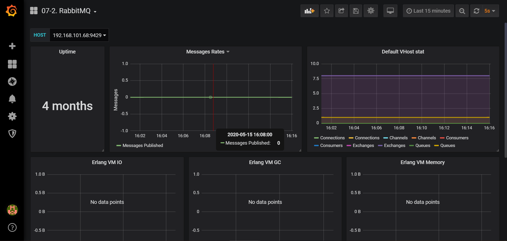

# Grafana模板 - RabbitMQ




```json
{
  "annotations": {
    "list": [
      {
        "builtIn": 1,
        "datasource": "-- Grafana --",
        "enable": true,
        "hide": true,
        "iconColor": "rgba(0, 211, 255, 1)",
        "name": "Annotations & Alerts",
        "type": "dashboard"
      }
    ]
  },
  "editable": true,
  "gnetId": null,
  "graphTooltip": 0,
  "id": 35,
  "iteration": 1589530511839,
  "links": [],
  "panels": [
    {
      "cacheTimeout": null,
      "colorBackground": false,
      "colorValue": false,
      "colors": [
        "rgba(245, 54, 54, 0.9)",
        "rgba(237, 129, 40, 0.89)",
        "rgba(50, 172, 45, 0.97)"
      ],
      "datasource": "Prometheus",
      "decimals": 0,
      "editable": true,
      "error": false,
      "format": "dtdurationms",
      "gauge": {
        "maxValue": 100,
        "minValue": 0,
        "show": false,
        "thresholdLabels": false,
        "thresholdMarkers": true
      },
      "gridPos": {
        "h": 7,
        "w": 4,
        "x": 0,
        "y": 0
      },
      "id": 9,
      "interval": null,
      "isNew": true,
      "links": [],
      "mappingType": 1,
      "mappingTypes": [
        {
          "name": "value to text",
          "value": 1
        },
        {
          "name": "range to text",
          "value": 2
        }
      ],
      "maxDataPoints": 100,
      "nullPointMode": "connected",
      "nullText": null,
      "options": {},
      "postfix": "",
      "postfixFontSize": "50%",
      "prefix": "",
      "prefixFontSize": "50%",
      "rangeMaps": [
        {
          "from": "null",
          "text": "N/A",
          "to": "null"
        }
      ],
      "sparkline": {
        "fillColor": "rgba(31, 118, 189, 0.18)",
        "full": false,
        "lineColor": "rgb(31, 120, 193)",
        "show": false
      },
      "tableColumn": "",
      "targets": [
        {
          "expr": "rabbitmq_uptime{instance=\"$host\"}",
          "format": "time_series",
          "intervalFactor": 2,
          "legendFormat": "",
          "refId": "A",
          "step": 20
        }
      ],
      "thresholds": "",
      "title": "Uptime",
      "type": "singlestat",
      "valueFontSize": "80%",
      "valueMaps": [
        {
          "op": "=",
          "text": "N/A",
          "value": "null"
        }
      ],
      "valueName": "avg"
    },
    {
      "aliasColors": {},
      "bars": false,
      "dashLength": 10,
      "dashes": false,
      "datasource": "Prometheus",
      "editable": true,
      "error": false,
      "fill": 1,
      "grid": {},
      "gridPos": {
        "h": 7,
        "w": 10,
        "x": 4,
        "y": 0
      },
      "height": "",
      "id": 2,
      "isNew": true,
      "legend": {
        "alignAsTable": false,
        "avg": false,
        "current": false,
        "max": false,
        "min": false,
        "show": true,
        "total": false,
        "values": false
      },
      "lines": true,
      "linewidth": 2,
      "links": [],
      "nullPointMode": "connected",
      "options": {},
      "percentage": false,
      "pointradius": 5,
      "points": false,
      "renderer": "flot",
      "seriesOverrides": [],
      "spaceLength": 10,
      "stack": false,
      "steppedLine": false,
      "targets": [
        {
          "expr": "sum by (job)  (irate(rabbitmq_queue_messages_published_total[5m]))",
          "format": "time_series",
          "intervalFactor": 2,
          "legendFormat": "Messages Published",
          "metric": "",
          "refId": "A",
          "step": 2
        },
        {
          "expr": "sum by (job)  (irate(rabbitmq_queue_messages_delivered_total[5m]) + irate(rabbitmq_queue_messages_delivered_no_ack_total[5m]) + irate(rabbitmq_queue_messages_get_total[5m])  + irate(rabbitmq_queue_messages_get_no_ack_total[5m]))",
          "format": "time_series",
          "hide": false,
          "interval": "",
          "intervalFactor": 2,
          "legendFormat": "Messages delivered",
          "metric": "",
          "refId": "B",
          "step": 2
        }
      ],
      "thresholds": [],
      "timeFrom": null,
      "timeRegions": [],
      "timeShift": null,
      "title": "Messages Rates",
      "tooltip": {
        "msResolution": false,
        "shared": true,
        "sort": 0,
        "value_type": "cumulative"
      },
      "type": "graph",
      "xaxis": {
        "buckets": null,
        "mode": "time",
        "name": null,
        "show": true,
        "values": []
      },
      "yaxes": [
        {
          "format": "none",
          "label": "Messages",
          "logBase": 1,
          "max": null,
          "min": null,
          "show": true
        },
        {
          "format": "short",
          "label": "",
          "logBase": 1,
          "max": null,
          "min": null,
          "show": true
        }
      ],
      "yaxis": {
        "align": false,
        "alignLevel": null
      }
    },
    {
      "aliasColors": {},
      "bars": false,
      "dashLength": 10,
      "dashes": false,
      "datasource": "Prometheus",
      "editable": true,
      "error": false,
      "fill": 1,
      "grid": {},
      "gridPos": {
        "h": 7,
        "w": 10,
        "x": 14,
        "y": 0
      },
      "id": 1,
      "isNew": true,
      "legend": {
        "avg": false,
        "current": false,
        "max": false,
        "min": false,
        "show": true,
        "total": false,
        "values": false
      },
      "lines": true,
      "linewidth": 2,
      "links": [],
      "nullPointMode": "connected",
      "options": {},
      "percentage": false,
      "pointradius": 5,
      "points": false,
      "renderer": "flot",
      "seriesOverrides": [],
      "spaceLength": 10,
      "stack": false,
      "steppedLine": false,
      "targets": [
        {
          "expr": "rabbitmq_connections",
          "format": "time_series",
          "intervalFactor": 2,
          "legendFormat": "Connections",
          "metric": "rabbitmq_connections",
          "refId": "A",
          "step": 2
        },
        {
          "expr": "rabbitmq_channels",
          "format": "time_series",
          "intervalFactor": 2,
          "legendFormat": "Channels",
          "metric": "rabbitmq_channels",
          "refId": "B",
          "step": 2
        },
        {
          "expr": "rabbitmq_consumers",
          "format": "time_series",
          "intervalFactor": 2,
          "legendFormat": "Consumers",
          "metric": "rabbitmq_consumers",
          "refId": "C",
          "step": 2
        },
        {
          "expr": "rabbitmq_exchanges",
          "format": "time_series",
          "intervalFactor": 2,
          "legendFormat": "Exchanges",
          "metric": "rabbitmq_exchanges",
          "refId": "D",
          "step": 2
        },
        {
          "expr": "rabbitmq_queues",
          "format": "time_series",
          "intervalFactor": 2,
          "legendFormat": "Queues",
          "metric": "rabbitmq_queues",
          "refId": "E",
          "step": 2
        }
      ],
      "thresholds": [],
      "timeFrom": null,
      "timeRegions": [],
      "timeShift": null,
      "title": "Default VHost stat",
      "tooltip": {
        "msResolution": false,
        "shared": true,
        "sort": 0,
        "value_type": "cumulative"
      },
      "type": "graph",
      "xaxis": {
        "buckets": null,
        "mode": "time",
        "name": null,
        "show": true,
        "values": []
      },
      "yaxes": [
        {
          "format": "short",
          "logBase": 1,
          "max": null,
          "min": null,
          "show": true
        },
        {
          "format": "short",
          "logBase": 1,
          "max": null,
          "min": null,
          "show": true
        }
      ],
      "yaxis": {
        "align": false,
        "alignLevel": null
      }
    },
    {
      "aliasColors": {},
      "bars": false,
      "dashLength": 10,
      "dashes": false,
      "datasource": "Prometheus",
      "editable": true,
      "error": false,
      "fill": 1,
      "grid": {},
      "gridPos": {
        "h": 7,
        "w": 8,
        "x": 0,
        "y": 7
      },
      "id": 6,
      "isNew": true,
      "legend": {
        "avg": false,
        "current": false,
        "max": false,
        "min": false,
        "show": true,
        "total": false,
        "values": false
      },
      "lines": true,
      "linewidth": 2,
      "links": [],
      "nullPointMode": "connected",
      "options": {},
      "percentage": false,
      "pointradius": 5,
      "points": false,
      "renderer": "flot",
      "seriesOverrides": [],
      "spaceLength": 10,
      "stack": false,
      "steppedLine": false,
      "targets": [
        {
          "expr": "irate(erlang_vm_statistics_bytes_output_total[5m])",
          "format": "time_series",
          "intervalFactor": 2,
          "legendFormat": "Output Bytes",
          "metric": "erlang_vm_statistics_bytes_output_total",
          "refId": "A",
          "step": 2
        },
        {
          "expr": "irate(erlang_vm_statistics_bytes_received_total[5m])",
          "format": "time_series",
          "intervalFactor": 2,
          "legendFormat": "Received Bytes",
          "metric": "erlang_vm_statistics_bytes_received_total",
          "refId": "B",
          "step": 2
        }
      ],
      "thresholds": [],
      "timeFrom": null,
      "timeRegions": [],
      "timeShift": null,
      "title": "Erlang VM IO",
      "tooltip": {
        "msResolution": false,
        "shared": true,
        "sort": 0,
        "value_type": "cumulative"
      },
      "type": "graph",
      "xaxis": {
        "buckets": null,
        "mode": "time",
        "name": null,
        "show": true,
        "values": []
      },
      "yaxes": [
        {
          "format": "bytes",
          "logBase": 1,
          "max": null,
          "min": null,
          "show": true
        },
        {
          "format": "short",
          "logBase": 1,
          "max": null,
          "min": null,
          "show": true
        }
      ],
      "yaxis": {
        "align": false,
        "alignLevel": null
      }
    },
    {
      "aliasColors": {},
      "bars": false,
      "dashLength": 10,
      "dashes": false,
      "datasource": "Prometheus",
      "editable": true,
      "error": false,
      "fill": 1,
      "grid": {},
      "gridPos": {
        "h": 7,
        "w": 8,
        "x": 8,
        "y": 7
      },
      "id": 7,
      "isNew": true,
      "legend": {
        "alignAsTable": false,
        "avg": false,
        "current": false,
        "max": false,
        "min": false,
        "rightSide": false,
        "show": true,
        "total": false,
        "values": false
      },
      "lines": true,
      "linewidth": 2,
      "links": [],
      "nullPointMode": "connected",
      "options": {},
      "percentage": false,
      "pointradius": 5,
      "points": false,
      "renderer": "flot",
      "seriesOverrides": [
        {
          "alias": "Words Reclaimed",
          "yaxis": 2
        }
      ],
      "spaceLength": 10,
      "stack": false,
      "steppedLine": false,
      "targets": [
        {
          "expr": "irate(erlang_vm_statistics_garbage_collection_number_of_gcs[5m])",
          "format": "time_series",
          "intervalFactor": 2,
          "legendFormat": "Number of GCs",
          "metric": "erlang_vm_statistics_garbage_collection_number_of_gcs",
          "refId": "A",
          "step": 2
        },
        {
          "expr": "irate(erlang_vm_statistics_garbage_collection_words_reclaimed[5m])",
          "format": "time_series",
          "intervalFactor": 2,
          "legendFormat": "Words Reclaimed",
          "metric": "erlang_vm_statistics_garbage_collection_words_reclaimed",
          "refId": "B",
          "step": 2
        }
      ],
      "thresholds": [],
      "timeFrom": null,
      "timeRegions": [],
      "timeShift": null,
      "title": "Erlang VM GC",
      "tooltip": {
        "msResolution": false,
        "shared": true,
        "sort": 0,
        "value_type": "cumulative"
      },
      "type": "graph",
      "xaxis": {
        "buckets": null,
        "mode": "time",
        "name": null,
        "show": true,
        "values": []
      },
      "yaxes": [
        {
          "format": "short",
          "logBase": 1,
          "max": null,
          "min": null,
          "show": true
        },
        {
          "format": "short",
          "logBase": 1,
          "max": null,
          "min": null,
          "show": true
        }
      ],
      "yaxis": {
        "align": false,
        "alignLevel": null
      }
    },
    {
      "aliasColors": {},
      "bars": false,
      "dashLength": 10,
      "dashes": false,
      "datasource": "Prometheus",
      "editable": true,
      "error": false,
      "fill": 1,
      "grid": {},
      "gridPos": {
        "h": 7,
        "w": 8,
        "x": 16,
        "y": 7
      },
      "id": 3,
      "isNew": true,
      "legend": {
        "avg": false,
        "current": false,
        "max": false,
        "min": false,
        "show": true,
        "total": false,
        "values": false
      },
      "lines": true,
      "linewidth": 2,
      "links": [],
      "nullPointMode": "connected",
      "options": {},
      "percentage": false,
      "pointradius": 5,
      "points": false,
      "renderer": "flot",
      "seriesOverrides": [],
      "spaceLength": 10,
      "stack": true,
      "steppedLine": false,
      "targets": [
        {
          "expr": "erlang_vm_memory_bytes_total{kind=\"processes\"}",
          "format": "time_series",
          "intervalFactor": 2,
          "legendFormat": "Processes Memory",
          "refId": "B",
          "step": 2
        },
        {
          "expr": "erlang_vm_memory_system_bytes_total{usage=\"atom\"}",
          "format": "time_series",
          "intervalFactor": 2,
          "legendFormat": "Atoms",
          "refId": "C",
          "step": 2
        },
        {
          "expr": "erlang_vm_memory_system_bytes_total{usage=\"binary\"}",
          "format": "time_series",
          "intervalFactor": 2,
          "legendFormat": "Binary",
          "refId": "D",
          "step": 2
        },
        {
          "expr": "erlang_vm_memory_system_bytes_total{usage=\"code\"}",
          "format": "time_series",
          "intervalFactor": 2,
          "legendFormat": "Code",
          "refId": "E",
          "step": 2
        },
        {
          "expr": "erlang_vm_memory_system_bytes_total{usage=\"ets\"}",
          "format": "time_series",
          "intervalFactor": 2,
          "legendFormat": "ETS",
          "refId": "F",
          "step": 2
        }
      ],
      "thresholds": [],
      "timeFrom": null,
      "timeRegions": [],
      "timeShift": null,
      "title": "Erlang VM Memory",
      "tooltip": {
        "msResolution": false,
        "shared": true,
        "sort": 0,
        "value_type": "individual"
      },
      "type": "graph",
      "xaxis": {
        "buckets": null,
        "mode": "time",
        "name": null,
        "show": true,
        "values": []
      },
      "yaxes": [
        {
          "format": "bytes",
          "logBase": 1,
          "max": null,
          "min": null,
          "show": true
        },
        {
          "format": "short",
          "logBase": 1,
          "max": null,
          "min": null,
          "show": true
        }
      ],
      "yaxis": {
        "align": false,
        "alignLevel": null
      }
    },
    {
      "aliasColors": {},
      "bars": false,
      "dashLength": 10,
      "dashes": false,
      "datasource": "Prometheus",
      "editable": true,
      "error": false,
      "fill": 1,
      "grid": {},
      "gridPos": {
        "h": 7,
        "w": 8,
        "x": 0,
        "y": 14
      },
      "id": 11,
      "isNew": true,
      "legend": {
        "avg": false,
        "current": false,
        "max": false,
        "min": false,
        "show": true,
        "total": false,
        "values": false
      },
      "lines": true,
      "linewidth": 2,
      "links": [],
      "nullPointMode": "connected",
      "options": {},
      "percentage": false,
      "pointradius": 5,
      "points": false,
      "renderer": "flot",
      "seriesOverrides": [],
      "spaceLength": 10,
      "stack": false,
      "steppedLine": false,
      "targets": [
        {
          "expr": "process_virtual_memory_bytes{instance=\"$host\"}",
          "format": "time_series",
          "intervalFactor": 2,
          "legendFormat": "Virtual Memory",
          "refId": "A",
          "step": 2
        },
        {
          "expr": "process_resident_memory_bytes{instance=\"$host\"}",
          "format": "time_series",
          "intervalFactor": 2,
          "legendFormat": "Resident Memory",
          "refId": "B",
          "step": 2
        }
      ],
      "thresholds": [],
      "timeFrom": null,
      "timeRegions": [],
      "timeShift": null,
      "title": "Process Memory",
      "tooltip": {
        "msResolution": true,
        "shared": true,
        "sort": 0,
        "value_type": "cumulative"
      },
      "type": "graph",
      "xaxis": {
        "buckets": null,
        "mode": "time",
        "name": null,
        "show": true,
        "values": []
      },
      "yaxes": [
        {
          "format": "bytes",
          "label": null,
          "logBase": 1,
          "max": null,
          "min": null,
          "show": true
        },
        {
          "format": "short",
          "label": null,
          "logBase": 1,
          "max": null,
          "min": null,
          "show": true
        }
      ],
      "yaxis": {
        "align": false,
        "alignLevel": null
      }
    },
    {
      "aliasColors": {},
      "bars": false,
      "dashLength": 10,
      "dashes": false,
      "datasource": "Prometheus",
      "editable": true,
      "error": false,
      "fill": 1,
      "grid": {},
      "gridPos": {
        "h": 7,
        "w": 8,
        "x": 8,
        "y": 14
      },
      "id": 8,
      "isNew": true,
      "legend": {
        "avg": false,
        "current": false,
        "max": false,
        "min": false,
        "show": true,
        "total": false,
        "values": false
      },
      "lines": true,
      "linewidth": 2,
      "links": [],
      "nullPointMode": "connected",
      "options": {},
      "percentage": false,
      "pointradius": 5,
      "points": false,
      "renderer": "flot",
      "seriesOverrides": [],
      "spaceLength": 10,
      "stack": false,
      "steppedLine": false,
      "targets": [
        {
          "expr": "process_open_fds{instance=\"$host\"}",
          "format": "time_series",
          "intervalFactor": 2,
          "legendFormat": "Open FDs",
          "metric": "",
          "refId": "A",
          "step": 2
        },
        {
          "expr": "process_max_fds{instance=\"$host\"}",
          "format": "time_series",
          "interval": "",
          "intervalFactor": 2,
          "legendFormat": "Max FDs",
          "refId": "B",
          "step": 2
        }
      ],
      "thresholds": [],
      "timeFrom": null,
      "timeRegions": [],
      "timeShift": null,
      "title": "File Descriptors",
      "tooltip": {
        "msResolution": true,
        "shared": true,
        "sort": 0,
        "value_type": "cumulative"
      },
      "type": "graph",
      "xaxis": {
        "buckets": null,
        "mode": "time",
        "name": null,
        "show": true,
        "values": []
      },
      "yaxes": [
        {
          "format": "none",
          "label": null,
          "logBase": 1,
          "max": null,
          "min": null,
          "show": true
        },
        {
          "format": "short",
          "label": null,
          "logBase": 1,
          "max": null,
          "min": null,
          "show": true
        }
      ],
      "yaxis": {
        "align": false,
        "alignLevel": null
      }
    },
    {
      "aliasColors": {},
      "bars": false,
      "dashLength": 10,
      "dashes": false,
      "datasource": "Prometheus",
      "decimals": null,
      "editable": true,
      "error": false,
      "fill": 1,
      "grid": {},
      "gridPos": {
        "h": 7,
        "w": 8,
        "x": 16,
        "y": 14
      },
      "id": 10,
      "isNew": true,
      "legend": {
        "avg": false,
        "current": false,
        "max": false,
        "min": false,
        "show": true,
        "total": false,
        "values": false
      },
      "lines": true,
      "linewidth": 2,
      "links": [],
      "nullPointMode": "connected",
      "options": {},
      "percentage": false,
      "pointradius": 5,
      "points": false,
      "renderer": "flot",
      "seriesOverrides": [
        {
          "alias": "Threads",
          "yaxis": 2
        }
      ],
      "spaceLength": 10,
      "stack": false,
      "steppedLine": false,
      "targets": [
        {
          "expr": "process_threads_total{instance=\"$host\"}",
          "format": "time_series",
          "interval": "",
          "intervalFactor": 2,
          "legendFormat": "Threads",
          "refId": "A",
          "step": 2
        },
        {
          "expr": "sum(irate(process_cpu_seconds_total{instance=\"$host\"}[30s])) without (kind) * 100",
          "format": "time_series",
          "interval": "",
          "intervalFactor": 2,
          "legendFormat": "CPU",
          "refId": "B",
          "step": 2
        }
      ],
      "thresholds": [],
      "timeFrom": null,
      "timeRegions": [],
      "timeShift": null,
      "title": "Native Threads & CPU",
      "tooltip": {
        "msResolution": true,
        "shared": true,
        "sort": 0,
        "value_type": "cumulative"
      },
      "type": "graph",
      "xaxis": {
        "buckets": null,
        "mode": "time",
        "name": null,
        "show": true,
        "values": []
      },
      "yaxes": [
        {
          "format": "percent",
          "label": null,
          "logBase": 1,
          "max": null,
          "min": null,
          "show": true
        },
        {
          "format": "short",
          "label": null,
          "logBase": 1,
          "max": null,
          "min": null,
          "show": true
        }
      ],
      "yaxis": {
        "align": false,
        "alignLevel": null
      }
    }
  ],
  "refresh": "5s",
  "schemaVersion": 18,
  "style": "dark",
  "tags": [
    "rabbitmq"
  ],
  "templating": {
    "list": [
      {
        "allValue": null,
        "current": {
          "tags": [],
          "text": "192.168.101.68:9429",
          "value": "192.168.101.68:9429"
        },
        "datasource": "Prometheus",
        "definition": "label_values(rabbitmq_up, instance)",
        "hide": 0,
        "includeAll": false,
        "label": "HOST",
        "multi": false,
        "name": "host",
        "options": [],
        "query": "label_values(rabbitmq_up, instance)",
        "refresh": 1,
        "regex": "",
        "skipUrlSync": false,
        "sort": 1,
        "tagValuesQuery": "",
        "tags": [],
        "tagsQuery": "",
        "type": "query",
        "useTags": false
      }
    ]
  },
  "time": {
    "from": "now-15m",
    "to": "now"
  },
  "timepicker": {
    "now": true,
    "refresh_intervals": [
      "5s",
      "10s",
      "30s",
      "1m",
      "5m",
      "15m",
      "30m",
      "1h",
      "2h",
      "1d"
    ],
    "time_options": [
      "5m",
      "15m",
      "1h",
      "6h",
      "12h",
      "24h",
      "2d",
      "7d",
      "30d"
    ]
  },
  "timezone": "browser",
  "title": "RabbitMQ"
}
```

