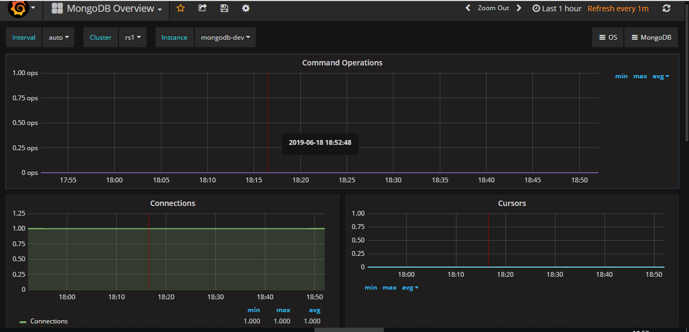

# MongoDB监控接入


> Percona Monitoring and Management (PMM)是一款开源的MySQL、MongoDB性能监控工具，PMM客户端负责收集DB监控数据，PMM服务端从已连接的客户端拉取数据，并通过第三方软件Grafana展示图表。


## 安装pmm-client

```sh
# 安装pmm-client
yum install https://www.percona.com/downloads/pmm/1.1.1/binary/redhat/7/x86_64/pmm-client-1.1.1-1.x86_64.rpm
```


## 配置服务端

目前统一由PMM服务端**10.1.100.200**管理数据库监控任务。

在mysql端执行：

```sh
pmm-admin config --server 10.1.100.200 --bind-address=<当前mysql实例IP地址> --client-address=<当前mysql实例IP地址> --client-name=<自定义客户端名称>
```

示例：

```sh
pmm-admin config --server 10.1.100.200 --bind-address=10.1.7.211 --client-address=10.1.7.211 --client-name=Dev
```

执行后会保存到文件`/usr/local/percona/pmm-client/pmm.yml`：

```sh
[root@b68-docker-prd pmm]# cat /usr/local/percona/pmm-client/pmm.yml
server_address: 10.1.100.200
client_address: 10.1.7.211
bind_address: 10.1.7.211
client_name: Dev
```


## 添加mongodb

```sh
[root@docker-dev pmm]# pmm-admin add mongodb --help
Usage:
  pmm-admin add mongodb [name] [flags]

Examples:
  pmm-admin add mongodb
  pmm-admin add mongodb --cluster bare-metal
Flags:
      --cluster string   cluster name
      --uri string       MongoDB URI, format: [mongodb://][user:pass@]host[:port][/database][?options] (default "localhost:27017")
```

示例：

```sh
pmm-admin add mongodb --cluster rs1 --uri mongodb://10.1.7.211:27017 mongodb-dev
```


## 查看配置

```sh
[root@docker-dev pmm]# pmm-admin list
pmm-admin 1.1.1

PMM Server      | 10.1.100.200 
Client Name     | Dev
Client Address  | 10.1.7.211 
Service Manager | linux-systemd

---------------- ---------------- ----------- -------- ------------------------------ ------------------------
SERVICE TYPE     NAME             LOCAL PORT  RUNNING  DATA SOURCE                    OPTIONS                 
---------------- ---------------- ----------- -------- ------------------------------ ------------------------
...                         
mongodb:metrics  mongodb-dev      42003       YES      10.1.7.211:27017               cluster=rs1
```


## 图表

- 数据接入成功后

监控图表页面：<http://10.1.100.200/graph>




---

官方文档：<https://www.percona.com/doc/percona-monitoring-and-management/conf-mongodb.html>