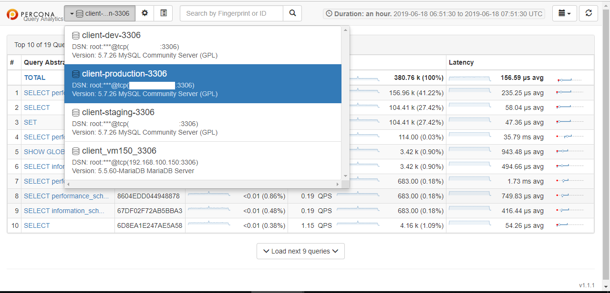
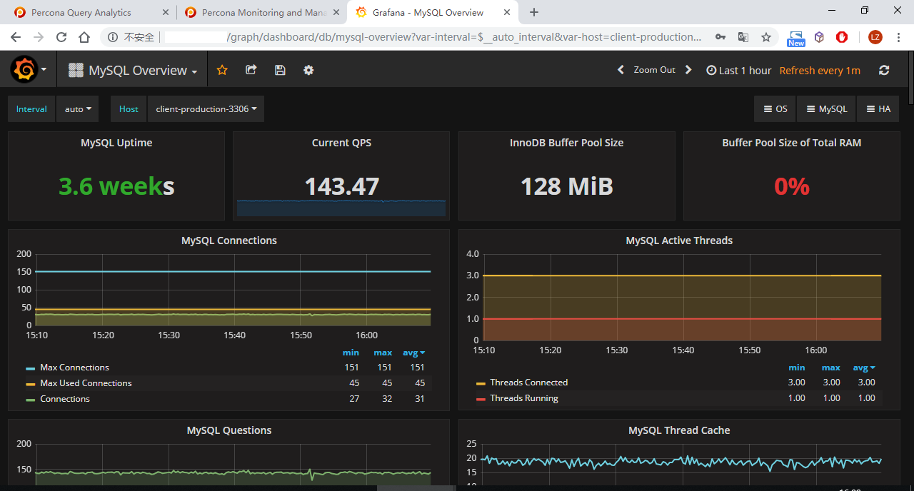

# MySQL监控接入


> Percona Monitoring and Management (PMM)是一款开源的MySQL、MongoDB性能监控工具，PMM客户端负责收集DB监控数据，PMM服务端从已连接的客户端拉取数据，并通过第三方软件Grafana展示图表。


## 安装pmm-client

```sh
# 安装pmm-client
yum install https://www.percona.com/downloads/pmm/1.1.1/binary/redhat/7/x86_64/pmm-client-1.1.1-1.x86_64.rpm
```


## 配置服务端

由服务端**192.168.100.99**管理数据库监控任务。

在mysql端执行：

```sh
pmm-admin config --server 192.168.100.99 --bind-address=<当前mysql实例IP地址> --client-address=<当前mysql实例IP地址> --client-name=<自定义客户端名称>
```

示例：

```sh
pmm-admin config --server 192.168.100.99 --bind-address=192.168.100.100 --client-address=192.168.100.100 --client-name=Production
```

执行后会保存到文件`/usr/local/percona/pmm-client/pmm.yml`：

```sh
[root@b68-docker-prd pmm]# cat /usr/local/percona/pmm-client/pmm.yml
server_address: 192.168.100.99
client_address: 192.168.100.100
bind_address: 192.168.100.100
client_name: Production
```


## 添加mysql

```sh
pmm-admin add mysql --user <mysql用户名> --password <mysql密码> --host <mysql实例IP地址> --port <mysql端口> <自定义本实例的名称>
```

示例：

```sh
pmm-admin add mysql --user root --password xxxxxx --host 192.168.100.100 --port 3306 client-production-3306
```


## 查看配置

```sh
[root@b68-docker-prd pmm]# pmm-admin list
pmm-admin 1.1.1

PMM Server      | 192.168.100.99
Client Name     | Production
Client Address  | 192.168.100.100
Service Manager | linux-systemd

-------------- ----------------------- ----------- -------- ---------------------------------- ------------------------
SERVICE TYPE   NAME                    LOCAL PORT  RUNNING  DATA SOURCE                        OPTIONS
-------------- ----------------------- ----------- -------- ---------------------------------- ------------------------
mysql:queries  client-production-3306  -           YES      root:***@tcp(192.168.100.100:3306)  query_source=perfschema
linux:metrics  client-production-3306  42000       YES      -                   
mysql:metrics  client-production-3306  42002       YES      root:***@tcp(192.168.100.100:3306)
```


## 图表

数据接入成功后

- 查询分析页面：<http://192.168.100.99/qan/>




- 监控图表页面：<http://192.168.100.99/graph>




---

官方文档：<https://www.percona.com/doc/percona-monitoring-and-management/conf-mysql.html>