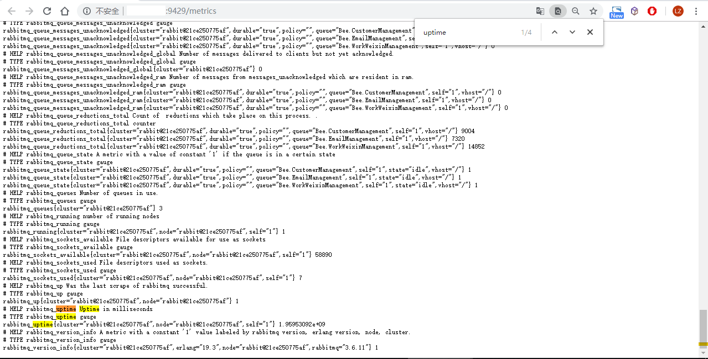

# RabbitMQ监控接入


> 在Docker中运行的rabbitmq，用docker镜像版的rabbitmq-exporter更方便。也可以使用二进制版的rabbitmq-exporter。


## Docker中的RabbitMQ

可通过docker镜像运行rabbitmq exporter：

```yaml
rabbitmq_exporter:
image: kbudde/rabbitmq-exporter
ports:
	- 9429:9429
environment:
	SERVICE_TAGS: "prometheus-target,rabbitmq-expo"
	RABBIT_URL: "http://127.0.0.1:15672"
	RABBIT_USER: "guest"
	RABBIT_PASSWORD: "guest"
	PUBLISH_PORT: "9429"
	OUTPUT_FORMAT: "JSON"
#   LOG_LEVEL: "debug"
network_mode: host
```


## VM安装的RabbitMQ

获取rabbitmq_exporter：

```sh
# go编译rabbitmq_exporter
go get https://github.com/kbudde/rabbitmq_exporter

# 或者wget下载release的二进制文件包
https://github.com/kbudde/rabbitmq_exporter/releases/download/v0.29.0/rabbitmq_exporter-0.29.0.linux-amd64.tar.gz
```


运行rabbitmq_exporter:

```sh
RABBIT_URL="http://127.0.0.1:15672" RABBIT_USER=guest  RABBIT_PASSWORD=guest ./rabbitmq_exporter
```


通过supervisor保持rabbitmq_exporter运行时，可作如下配置:

```ini
[program:rabbitmq-expo]
command=/srv/rabbitmq_exporter
directory=/srv
user=rabbitmq
environment=RABBIT_USER=admin,RABBIT_PASSWORD="xxxxxx",OUTPUT_FORMAT=JSON,PUBLISH_PORT=9429,RABBIT_URL=http://127.0.0.1:15672
startsecs=3
redirect_stderr=true
stdout_logfile_maxbytes=50MB
stdout_logfile_backups=3
stdout_logfile=/var/log/rabbitmq-expo.log
```


运行后，检查是否能导出监控数据。以192.168.100.200上的rabbitmq为例，打开<http://192.168.100.200:9429/metrics>。




最后，需要将此接口注册到Consul以便Prometheus能自动添加此target。方法见[应用接入说明](docs/monitoring/prometheus/self/prometheus-consul-guide.md)。


## 图表

单节点rabbitmq：


rabbitmq集群：


---

rabbitmq_exporter使用说明：<https://github.com/kbudde/rabbitmq_exporter>