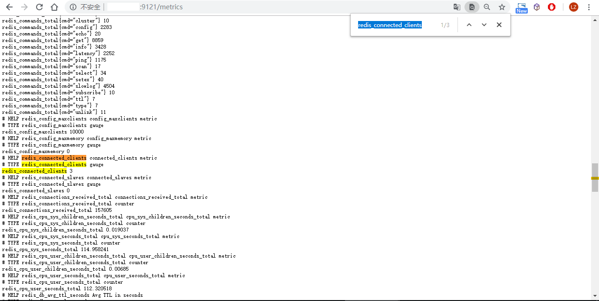
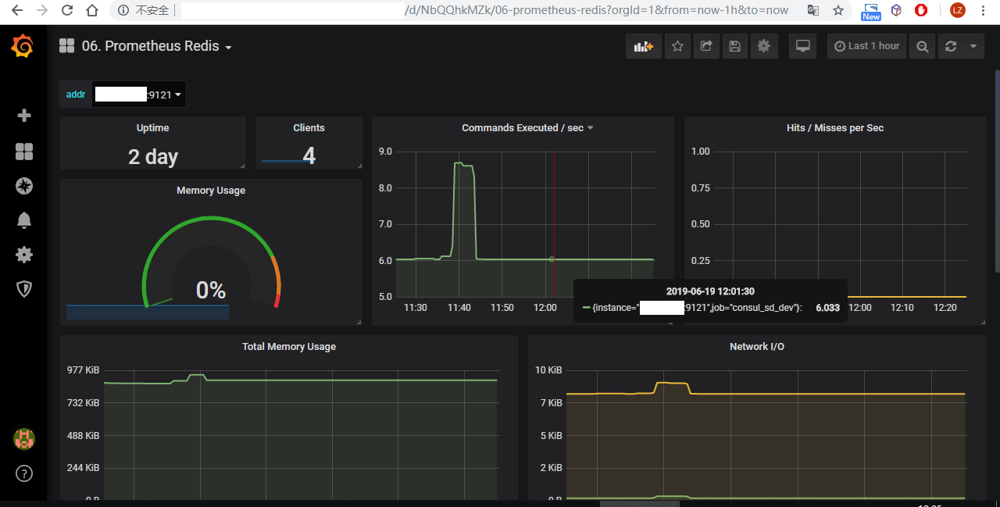

# Redis监控接入


> 在Docker中运行的redis，用docker镜像版的redis_exporter更方便。也可以使用二进制版的redis_exporter。


## Docker中的Redis

可通过docker镜像运行redis exporter：

```yaml
redis-expo:
	image: oliver006/redis_exporter
	ports:
		- 9121:9121
	network_mode: host
	environment:
	    REDIS_PASSWORD: "xxxxxxxxxxxxxx"
		SERVICE_TAGS: "prometheus-target,redis-expo"
	command: "--redis.addr redis://127.0.0.1:6379"
```


## VM安装的Redis

```sh
# 安装redis_exporter
wget https://github.com/oliver006/redis_exporter/releases/download/v1.0.0/redis_exporter-v1.0.0.linux-amd64.tar.gz
tar -xf redis_exporter-v1.0.0.linux-amd64.tar.gz -C /srv/
```


运行redis_exporter:

```sh
nohup ./redis_exporter --redis.addr "redis://127.0.0.1:6379" --redis.password "xxxxxxxxxx" --web.listen-address "0.0.0.0:9121" & 2>&1
```


通过supervisor保持redis_exporter运行时，可作如下配置:

```ini
[program:redis_exporter]
command=redis_exporter
directory=/srv/redis_exporter-v1.0.0.linux-amd64
user=root
environment=REDIS_PASSWORD="xxxxxx",REDIS_ADDR="redis://127.0.0.1:6379",REDIS_EXPORTER_WEB_LISTEN_ADDRESS="0.0.0.0:9121"
startsecs=3
redirect_stderr=true
stdout_logfile_maxbytes=50MB
stdout_logfile_backups=3
stdout_logfile=/var/log/redis_exporter.log
```


运行后，验证是否能输出redis监控数据。以192.168.100.200上的redis为例，打开<http://192.168.100.200:9121/metrics>，并搜索`redis_connected_clients`，非0正常，表明redis_exporter已连接上redis。




**最后，需要将此接口注册到Consul以便Prometheus能自动添加此target。方法见[应用接入说明](docs/monitoring/prometheus/self/prometheus-consul-guide.md)。**


## 图表




---

redis_exporter使用说明：<https://github.com/oliver006/redis_exporter>