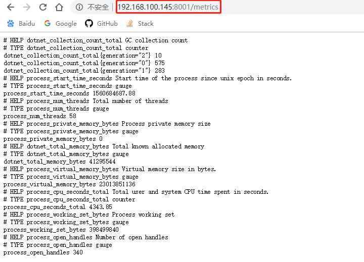
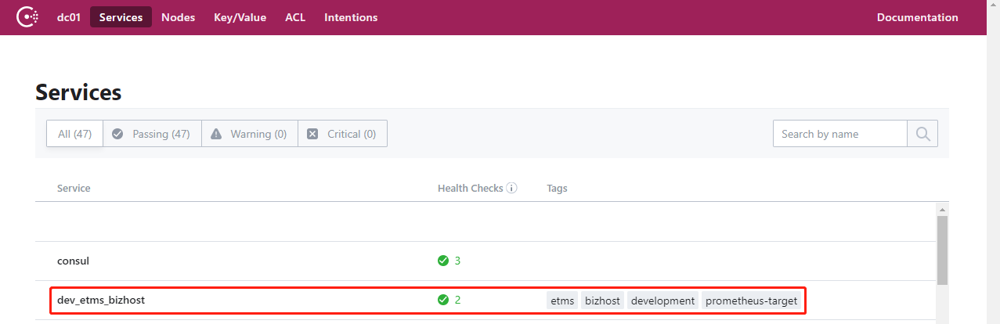
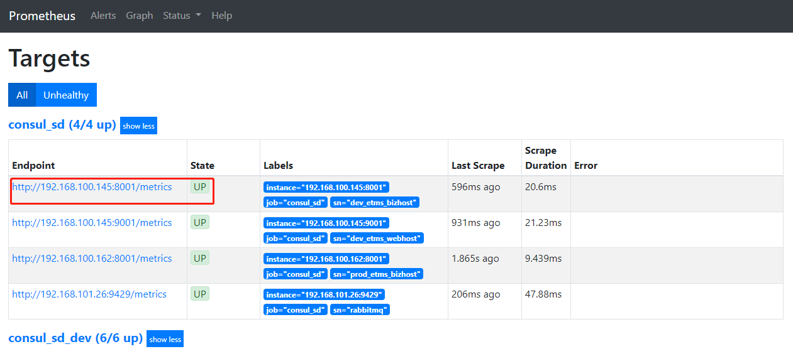
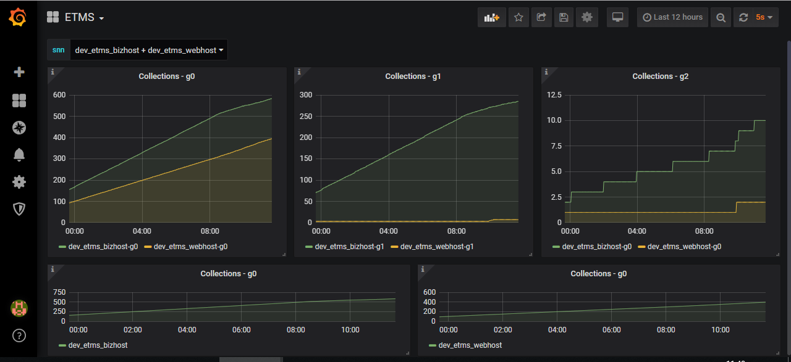

# 自研应用接入Prometheus监控


> Prometheus支持从Consul数据源自动发现要监控的服务并自动添加到Prometheus Targets。将各服务待监控指标以服务的形式注册到Consul（集群），便于统一管理维护。


## 前提条件

项目已集成prometheus exporter库，能提供prometheus支持的指标数据API。


---

## 步骤

以下以**development环境**的ETMS服务为例说明：


### 确认API正常

ETMS bizhost的metrics：<http://192.168.100.145:8001/metrics>



### 注册到Consul

Consul服务注册——统一配置仓库：http://git.pro.keep.com/YH/ServiceRegistrationConsul

*请基于个人分支提交PR*


ETMS bizhost相关配置的示例：

为了便于管理，可在ServiceRegistrationConsul/conf.d目录下新建一个目录etms。

新建文件ServiceRegistrationConsul/conf.d/etms/etms_bizhost.json：

```json
{
	"ID": "id_dev_etms_bizhost",
	"Name": "dev_etms_bizhost",
	"Tags": ["etms", "bizhost", "development", "prometheus-target"],
	"Address": "192.168.100.145",
	"Port": 8001,
	"Check": {
		"DeregisterCriticalServiceAfter": "90m",
		"HTTP": "http://192.168.100.145:8001/metrics",
		"Interval": "15s"
	},
	"Meta": {
		"version": "1.0"
	},
    "IsDeleted": false,
	"EnableTagOverride": false
}
```


如果有多个属于etms的服务地址需要注册，比如还有ETMS webhost，那最好一起写到一个文件。

这时，可新建文件ServiceRegistrationConsul/conf.d/etms/etms.json：

```json
[{
	"ID": "id_dev_etms_bizhost",
	"Name": "dev_etms_bizhost",
	"Tags": ["etms", "bizhost", "development", "prometheus-target"],
	"Address": "192.168.100.145",
	"Port": 8001,
	"Check": {
		"DeregisterCriticalServiceAfter": "90m",
		"HTTP": "http://192.168.100.145:8001/metrics",
		"Interval": "15s"
	},
	"Meta": {
		"version": "1.0"
	},
    "IsDeleted": false,
	"EnableTagOverride": false
},
{
	"ID": "id_dev_etms_webhost",
	"Name": "dev_etms_webhost",
	"Tags": ["etms", "webhost", "development", "prometheus-target"],
	"Address": "192.168.100.145",
	"Port": 8001,
	"Check": {
		"DeregisterCriticalServiceAfter": "90m",
		"HTTP": "http://192.168.100.145:9001/metrics",
		"Interval": "15s"
	},
	"Meta": {
		"version": "1.0"
	},
    "IsDeleted": false,
	"EnableTagOverride": false
}]
```


### 验证

- 查看Consul

在<http://192.168.100.140:8500/ui/dc01/services>上查看服务是否注册成功。按prometheus的设置，带有prometheus-target标签的服务项会被选择作为一个prometheus target。



- 

  - 查看Prometheus Targets

<http://prometheus.platform.development.keep.com/targets>




- 指标说明

说明上述metrics接口提供的指标名称和值的含义。


- 告警条件说明

给出监控数据异常的界定条件，以便添加告警规则。


### 图表

以下自定义图表展示的是`dotnet_collection_count_total`的值的变化：

```
dotnet_collection_count_total{generation="2"} N		#g2
dotnet_collection_count_total{generation="0"} N		#g0
dotnet_collection_count_total{generation="1"} N		#g1
```



