# 通过Zabbix的自动发现（规则）自动创建监控项


下图是一个已配置并启用的自动发现规则:

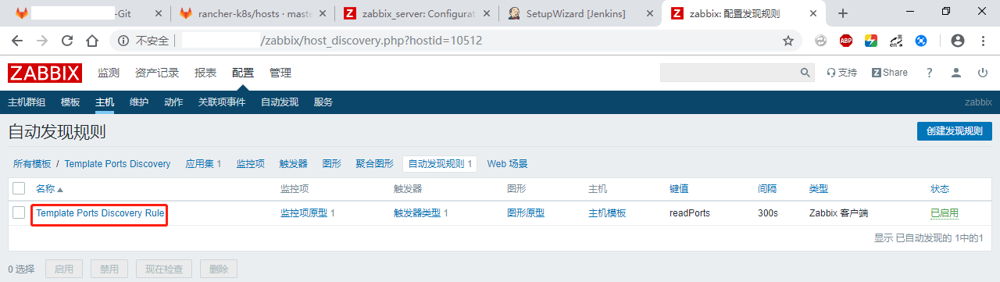


应用到165.194这个主机后，自动发现的监控项：


## 服务端配置

### 创建Template

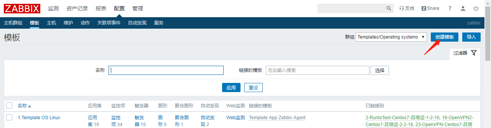


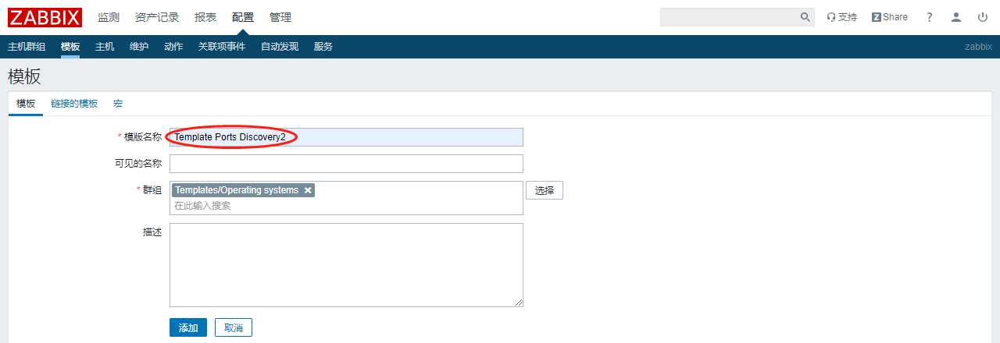


### 创建Discovery rule


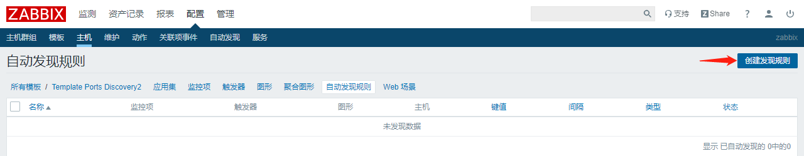

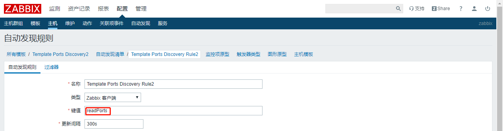

键值`readPorts`跟被监控端配置的参数有关，下面再提。


### 创建监控项原型

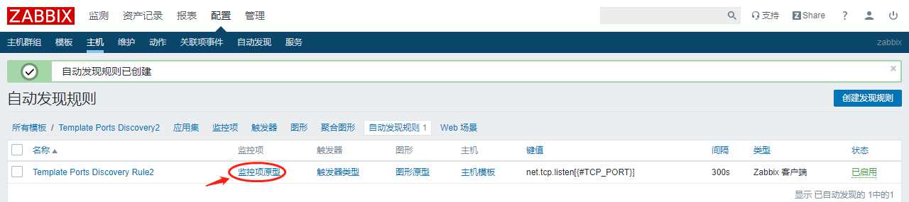


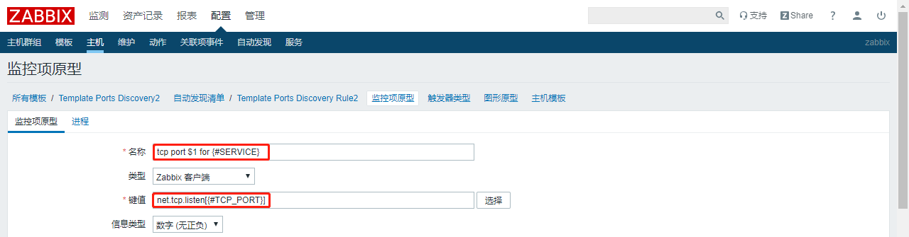

宏引用符号`{#SERVICE}`和`{#TCP_PORT}`跟被监控端返回的json数据有关。`net.tcp.listen[<port>]`表示监听目标机器的`<port>`端口状态，返回值为0或1，0表示Down，1表示Up。另外，`$1`表示键值里的第一个参数，即`<port>`。


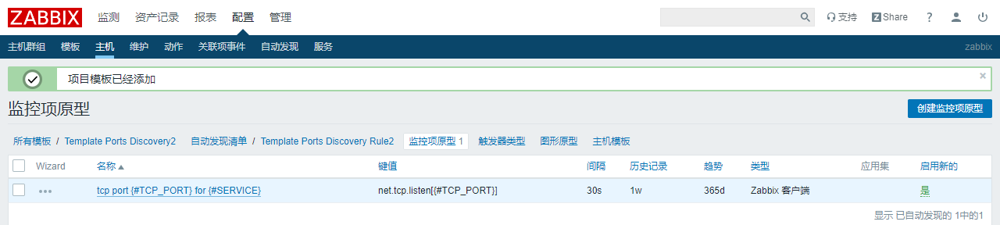


### 创建触发器原型

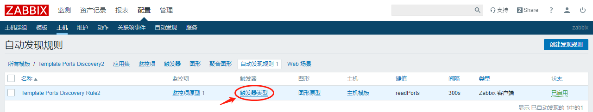


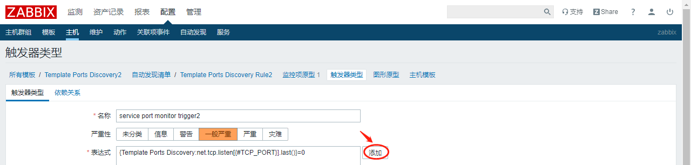


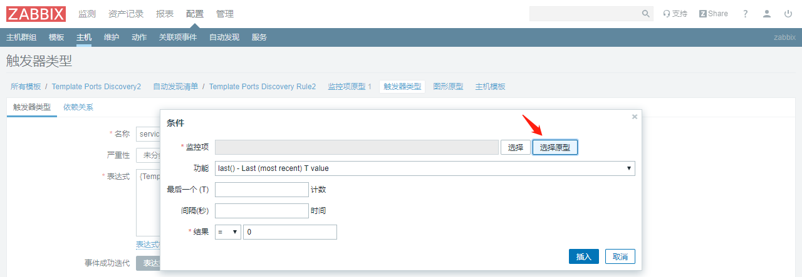


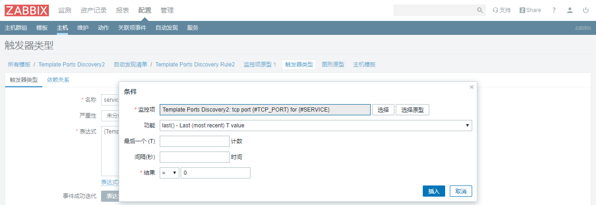


添加完监控项和触发器原型的样子：


最后，添加主机并关联此模板。


---

## 被监控端配置

首先，看一下/etc/zabbix目录下的文件。scripts目录是新加的，zabbix_agentd.conf也作了修改。

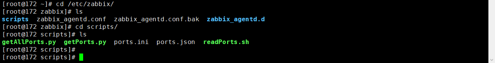


使用自动发现功能，需要返回符号zabbix要求的json数据：

例如：

```sh
{
    "data": [
        {
            "{#SERVICE}": "phjd_mysql",
            "{#TCP_PORT}": "28001"
        },
        {
            "{#SERVICE}": "philips_taxfree_tuangou_payment_management",
            "{#TCP_PORT}": "16200"
        }
    ]
}
```

其形式大致如下：

```sh
{
    "data": [
        {
            "{#KEY01}": "value01_01",
            "{#KEY02}": "value01_02",
            "{#KEY03}": "value01_03",
            ...
        },
        {
            "{#KEY01}": "value02_01",
            "{#KEY02}": "value02_02",
            "{#KEY02}": "value02_03",
            ...
        },
        ...
    ]
}
```


readPorts.sh脚本的内容很简单，就是读取已准备好的json数据文件ports.json，作为返回给zabbix server的值：

```sh
[root@172 scripts]# cat readPorts.sh 
#!/bin/sh

mypath=$(cd `dirname $0`; pwd)
cat $mypath/ports.json
```


为了返回给server端，需要再zabbix_agentd.conf中配置：

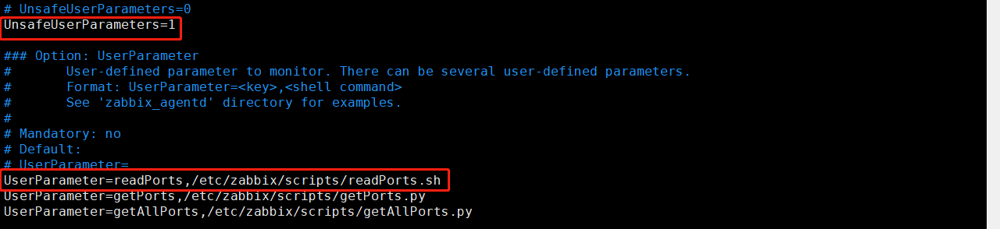


这样，server端就可以使用`readPorts`这个键值，以获取写在ports.json中的数据。`readPorts`下面定义的`getPorts、getAllPorts`是另外两个可用的自定义键值。

自动发现需监控的服务/端口，难点不在于读取，而在于自动生成json数据文件。此处的ports.json是根据ports.ini转换而来的。

ports.ini文件需人工填写：

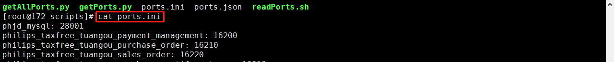


getPorts.py脚本如下，用于转换ports.ini为ports.json：

```python
#!/usr/bin/env python
#coding:utf-8
import os, json, re


mypath = os.path.dirname(os.path.realpath(__file__))
port_list = []
port_dict = {"data":None}

with open('%s/ports.ini' % mypath, 'r') as f:
    for line in f.readlines():
        line = line.strip()
        if line:
            try:
                port_srv = line.split(':')
                port_list.append({"{#TCP_PORT}": port_srv[1].strip(),
                                  "{#SERVICE}": port_srv[0].strip()})
            except:
                pass

port_dict["data"] = port_list
json_str = json.dumps(port_dict, sort_keys=True, indent=4)

# json_str已是json字符串，但每行尾部有一个多余的空格，zabbix不接受，须删除行尾空格
p = re.compile("\s+$")
for line in json_str.split('\n'):
    ss = re.sub(p, "", line)
    print ss
```


转换ports.ini为json形式：

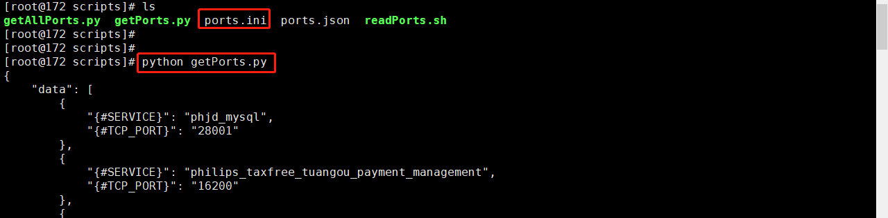


至于getAllPorts.py，它的功能是直接返回主机上实际开放的端口数据：

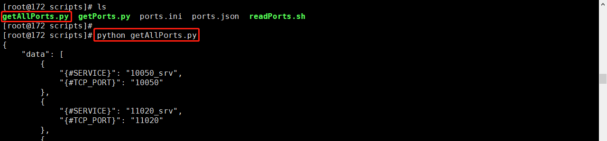


---

（End)

