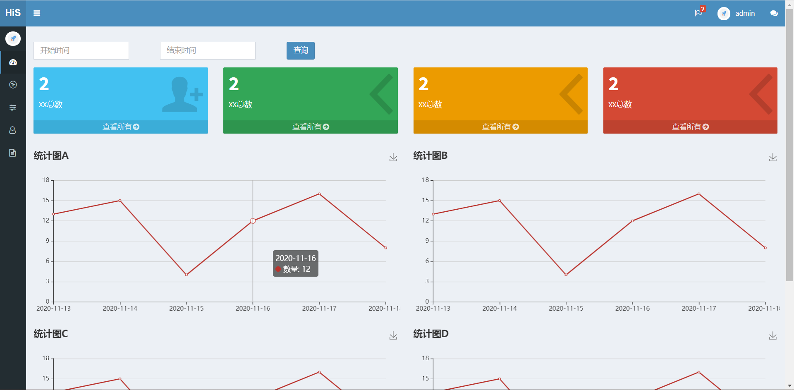
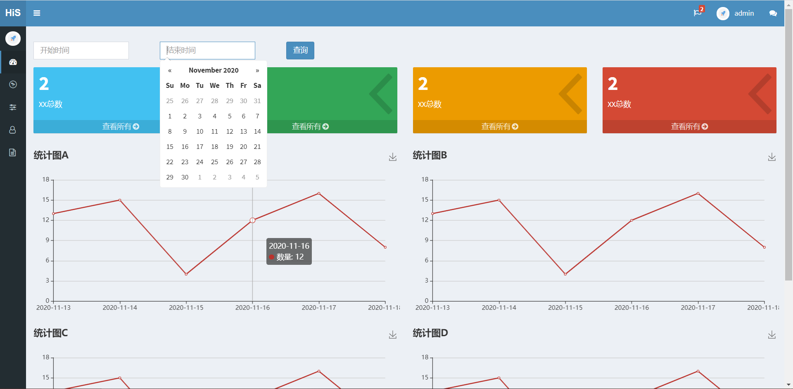

HiS - Ops

```sh
[root@VM_0_13_centos Ops]# cat /etc/supervisord.d/ops.ini 
[program:ops]
#command=/opt/Ops/venv/bin/python manage.py runserver 0.0.0.0:8848
#command=/opt/Ops/venv/bin/gunicorn Ops.wsgi:application -c gunicorn_conf.py
#command=/opt/Ops/venv/bin/gunicorn -k gevent Ops.wsgi:application -c gunicorn_conf.py
command=/opt/run-ops.sh
directory=/opt/Ops/Ops
user=root
startsecs=3
redirect_stderr=true
stdout_logfile_maxbytes=20MB
stdout_logfile_backups=3
stdout_logfile=/var/log/supervisor_run-ops.log
[root@VM_0_13_centos Ops]# 
[root@VM_0_13_centos Ops]# 
[root@VM_0_13_centos Ops]# cat /opt/run-ops.sh 
#!/bin/sh

set +e

ps -ef |grep :8848 |awk '$3==1{print $2}' |xargs kill -9
/opt/Ops/venv/bin/python manage.py runserver 0.0.0.0:8848
```








nginx conf:

```sh
upstream ops {
    server 172.17.0.13:8848;
    
}

server {
    listen 80;
    server_name ops.keep.com;

    access_log  /var/log/ops80-access.log;
    error_log  /var/log/ops80-error.log info;

    keepalive_timeout 5;

    root /opt/Ops/Ops;

    location /static/ {  
        autoindex on;     
        alias /opt/Ops/Ops/static/;
    }

    location /media/ {    
        autoindex on;     
        alias /opt/Ops/Ops/media/;
    }

    location /ws {
        proxy_pass http://ops80$request_uri;
        proxy_http_version 1.1;
        proxy_set_header Upgrade $http_upgrade;
        proxy_set_header Connection "upgrade";
    }
    
    location / {
        proxy_pass http://ops80;
        proxy_http_version 1.1;
        proxy_set_header Host $host;
        proxy_set_header X-Real-IP $remote_addr;
        proxy_set_header X-Forwarded-For $proxy_add_x_forwarded_for;

        proxy_set_header Upgrade $http_upgrade;
        proxy_set_header Connection "upgrade";
    }
}
```

