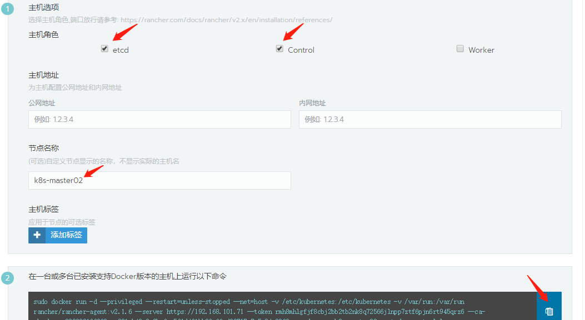
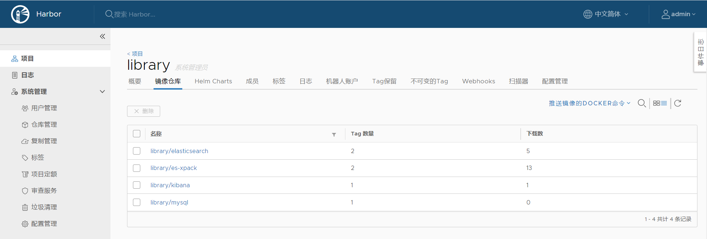

# K8s是什么

> *[Kubernetes (K8s)](https://kubernetes.io/docs/concepts/overview/what-is-kubernetes/) is an open-source system for automating deployment, scaling, and management of containerized applications.*
>
> [**Kubernetes (K8s)**](https://kubernetes.io/docs/concepts/overview/what-is-kubernetes/) 是一个开源容器编排引擎，用于自动化容器化应用程序的部署，扩展和管理。


*应用部署方式的演变历史：物理机部署  => 虚拟机部署  => 容器化部署*


# 为什么使用K8s


# 安装K8s


个人尝试过以下四种安装方式：


## kubeadm

官网提供的方法。大致过程是：

- 初始化环境，安装docker、配置防火墙等

- 先在各个节点yum安装kubelet、kubeadm、kubectl

- 在一个master节点kubeadm init 获得kubeadm join集群的命令
- 在其它节点上执行kubeadm join命令加入集群


## rancher

先通过docker启动一个rancher管理界面，然后从管理界面复制添加节点的命令，在待加入集群的节点上执行命令，逐个添加节点创建K8s集群。界面如下：





## rke

rancher官方提供的一个安装工具，通过一个节点配置文件描述集群各个节点信息。

例如：

```yaml
nodes:
  - address: 192.168.100.79
    user: rancher
    role: [controlplane,worker,etcd]
  - address: 192.168.100.80
    user: rancher
    role: [controlplane,worker,etcd]
  - address: 192.168.100.81
    user: rancher
    role: [controlplane,etcd]
```

执行：

```sh
rke up --config  <节点配置文件>
```

即可完成集群的初步安装，相比其它方式更快捷，但能安装的版本滞后于官网，最新的K8s版本可能尚未被rancher支持。

rancher集群管理界面类似下图：


3个master、etcd + 3个node:


## kubespray

这是一种通过ansible-playbook自动安装K8s的方式。默认和kubeadm一样需要能访问国外网站，否则有点镜像或二进制文件获取不到。也可自行修改相关地址，主要涉及以下几个文件：

- `roles/download/defaults/main.yml`
- `inventory/sample/group_vars/k8s-cluster/k8s-cluster.yml`

- `roles/kubespray-defaults/defaults/main.yaml`

修改其中的地址，替换成国内能访问到的镜像源，安装应该就能顺利进行了。默认会一并安装dashboard。


其主机清单（inventory）文件格式如下：

```yaml
[all]
node1    ansible_host=192.168.100.79 ip=192.168.100.79
node2    ansible_host=192.168.100.80 ip=192.168.100.80
node3    ansible_host=192.168.100.81 ip=192.168.100.81
node4    ansible_host=192.168.100.216 ip=192.168.100.216
node5    ansible_host=192.168.100.217 ip=192.168.100.217
node6    ansible_host=192.168.100.218 ip=192.168.100.218

[kube-master]
node1
node2

[etcd]
node1
node2
node3

[kube-node]
node3
node4
node5
node6

[k8s-cluster:children]
kube-master
kube-node
```

详见官方github: <https://github.com/kubernetes-sigs/kubespray/tree/release-2.14>


# 安装kubernetes dashboard

参考官方文档：<https://kubernetes.io/docs/tasks/access-application-cluster/web-ui-dashboard/>


在集群已经安装成功的前提下：

```sh
kubectl apply -f https://raw.githubusercontent.com/kubernetes/dashboard/v2.0.0/aio/deploy/recommended.yaml
```


获取登录令牌

```sh
kubectl -n kube-system describe secret $(kubectl -n kube-system get secret | grep kubernetes-dashboard-token|awk '{print $1}')|grep token:|awk '{print $2}'
```


访问

```sh
https://<master节点ip>:6443/api/v1/namespaces/kube-system/services/https:kubernetes-dashboard:/proxy/
```


或者绑定域名访问（涉及ingress）


# 使用K8s

以下操作在我个人使用的K8s环境：

```sh
[root@m01 myweb]# kubectl get nodes
NAME   STATUS   ROLES    AGE    VERSION
m01    Ready    master   255d   v1.15.1
m02    Ready    master   255d   v1.15.1
m03    Ready    master   255d   v1.15.1
n01    Ready    node     255d   v1.15.1
n02    Ready    node     255d   v1.15.1
n03    Ready    node     255d   v1.15.1
```


## 一些概念

### service

### RBAC

​	role based access control

### deployment

### ingress

### secret

### configmap


## kubectl 命令

kubectl  create


# myweb部署至K8s


## 重制镜像

之前我们是使用docker运行myweb这个demo的，并且为了简单，将mysql的用户名、密码写死在settings.py里了。

现在改成如下，让name, user, password, host, port分别从环境变量DB_NAME, DB_USER, DB_PASSWORD, DB_HOST, DB_PORT 获取。

```sh
DATABASES = { 
    'default': {
        'ENGINE': 'django.db.backends.mysql',
        'NAME': os.environ.get('DB_NAME'),
        'USER': os.environ.get('DB_USER')
        'PASSWORD': os.environ.get('DB_PASSWORD'),
        'HOST': os.environ.get('DB_HOST'),
        'PORT': os.environ.get('DB_PORT'),
        'OPTIONS': {}
    }
}
```


重新制作镜像 myweb:0.2，并上传至 harbor

涉及到环境变量的传递，可以通过docker-compose验证一下新镜像是否正常：

docker-compose.yml

```yaml
[root@localhost demo]# cat docker-compose.yml 
db:
    image: myweb:0.2
    environment:
      DB_NAME: "testpv"
      DB_USER: "root"
      DB_PASSWORD: "mysql"
      DB_HOST: 172.17.0.13
      DB_PORT: 3306
    restart: always
    #command: ['']
    volumes:
      - /opt/log:/var/log
    ports:
      - 8009:8000
```


测试没问题：

```sh
[root@localhost demo]# docker-compose up -d
Creating demo_db_1 ... done
[root@localhost demo]# docker-compose ps
  Name                 Command               State           Ports         
---------------------------------------------------------------------------
demo_db_1   supervisord -n -c /etc/sup ...   Up      0.0.0.0:8009->8000/tcp
[root@localhost demo]# curl http://localhost:8009/visit/add/

<link rel="stylesheet" type="text/css" href="/static/visit/style.css"/>
<div>
    <table class="gridtable">
        <thead>
        <tr>
            <th>ID</th>
            <th>date</th>
            <th>ip_addr</th>
        </tr>
        </thead>
        <tbody>
        <tr>
            <td>47</td>
            <td>2020-11-08 11:55:56</td>
            <td>172.17.0.1</td>
        </tr>
        </tbody>
    </table>
</div>
```


另外，也可以直接通过docker run启动，--env-file加载环境变量：

```sh
[root@localhost demo]# cat env
DB_NAME=testpv
DB_USER=root
DB_PASSWORD=mysql
DB_HOST=172.17.0.13
DB_PORT=3306
[root@localhost demo]# docker run -d --name myweb -p 8009:8000 --env-file=env myweb:0.2
```


## 推送镜像至harbor

```sh
[root@localhost demo]# docker tag myweb:0.2 harbor.lzzeng.cn/devops/myweb:0.2
[root@localhost demo]# docker image ls myweb
REPOSITORY          TAG                 IMAGE ID            CREATED             SIZE
myweb               0.2                 0245c29d6060        25 minutes ago      325MB
[root@localhost demo]# docker image ls |grep myweb
myweb                            0.2                              0245c29d6060        25 minutes ago      325MB
harbor.lzzeng.cn/devops/myweb    0.2                              0245c29d6060        25 minutes ago      325MB
[root@localhost demo]# 
[root@localhost demo]# docker push harbor.lzzeng.cn/devops/myweb:0.2
The push refers to repository [harbor.lzzeng.cn/devops/myweb]
7615e9027750: Pushed 
8daa36f6b1b1: Pushed 
c4b9879e46c2: Pushed 
879c0d8666e3: Mounted from devops/alerts 
20a7b70bdf2f: Mounted from devops/alerts 
3fc750b41be7: Mounted from devops/alerts 
beee9f30bc1f: Mounted from devops/alerts 
0.2: digest: sha256:4a74959ea51a5834436ecda47f9e9d461d4ec43a68ff1976c555dc6ba2878842 size: 1788
```


在Harbor上可以看到：


## 创建K8s资源对象


假设我们仍使用已经独立部署好的mysql，现在只需要写myweb的k8s部署文件。


### namespace

先来创建一个namespace

```sh
[root@m01 myweb]# kubectl create ns myweb
namespace/myweb created
```


### configmap

由于用到了supervisor，将其配置文件创建为一个configmap

```sh
[root@m01 myweb]# ls
myweb_supervisord.conf
[root@m01 myweb]# 
[root@m01 myweb]# #创建configmap
[root@m01 myweb]# 
[root@m01 myweb]# kubectl create -n myweb configmap myweb-supervisord-conf --from-file=myweb_supervisord.conf
configmap/myweb-supervisord-conf created
[root@m01 myweb]# 
[root@m01 myweb]# kubectl get cm -n myweb
NAME                     DATA   AGE
myweb-supervisord-conf   1      7s
[root@m01 myweb]#
```


通过--from-file参数创建的myweb-supervisord-conf内容如下：

```sh
# Please edit the object below. Lines beginning with a '#' will be ignored,
# and an empty file will abort the edit. If an error occurs while saving this file will be
# reopened with the relevant failures.
#
apiVersion: v1
data:
  myweb_supervisord.conf: |
    [program:myweb]
    command=/usr/local/bin/python manage.py runserver 0.0.0.0:8000
    directory=/opt/apps/myweb
    user=root
    startsecs=3
    redirect_stderr=true
    stdout_logfile_maxbytes=20MB
    stdout_logfile_backups=3
    stdout_logfile=/var/log/myweb_supervisor.log
kind: ConfigMap
metadata:
  creationTimestamp: "2020-11-08T10:11:46Z"
  name: myweb-supervisord-conf
  namespace: myweb
  resourceVersion: "1135081"
  selfLink: /api/v1/namespaces/myweb/configmaps/myweb-supervisord-conf
  uid: 42cd4d5c-48c4-4845-b1a9-102eb78f591a
```


也可以直接写一个yaml文件：

myweb-supervisord-conf.yml

```yaml
apiVersion: v1
data:
  myweb_supervisord.conf: |
    [program:myweb]
    command=/usr/local/bin/python manage.py runserver 0.0.0.0:8000
    directory=/opt/apps/myweb
    user=root
    startsecs=3
    redirect_stderr=true
    stdout_logfile_maxbytes=20MB
    stdout_logfile_backups=3
    stdout_logfile=/var/log/myweb_supervisor.log
```


然后

```sh
kubectl create -n myweb configmap myweb-supervisord-conf -f myweb-supervisord-conf.yml
```


### secret

假设mysql连接参数如下：

```sh
user=root
password=mysql
host=192.168.100.200
port=3306
name=testpv
```


可以通过命令行带参数的方式创建一个secret

```sh
[root@m01 myweb]# kubectl create -n myweb secret generic db-secret --from-literal=name=testpv --from-literal=user=root --from-literal=host=192.168.100.200 --from-literal=port=3306 --from-literal=password=mysql
secret/db-secret created
```


也可以先编写一个secret文件（data字段采用base64编码），再创建secret

```yaml
apiVersion: v1
kind: Secret
metadata:
  name: db-secret
  namespace: myweb
data:
  host: MTkyLjE2OC4xMDAuMjAwCg==
  name: dGVzdHB2
  password: bXlzcWwK
  port: MzMwNg==
  user: cm9vdA==
type: Opaque
```


从dashboard可以看到创建的保密字典db-secret内容：


### deployment、service和ingress

myweb-dep.yml

```yaml
apiVersion: apps/v1
kind: Deployment
metadata:
  name: myweb
  namespace: myweb
  labels:
    k8s-app: myweb
spec:
  replicas: 1
  selector:
    matchLabels:
      k8s-app: myweb
  template:
    metadata:
      labels:
        k8s-app: myweb
    spec:
      containers:
      - name: myweb
        image: harbor.lzzeng.cn/devops/myweb:0.2
        resources:
          limits:
            cpu: 1
            memory: 1000Mi
          requests:
            cpu: 0.5 
            memory: 500Mi
        env:
          - name: DB_NAME
            valueFrom:
              secretKeyRef:
                name: db-secret
                key: name
          - name: DB_USER
            valueFrom:
              secretKeyRef:
                name: db-secret
                key: user
          - name: DB_PASSWORD
            valueFrom:
              secretKeyRef:
                name: db-secret
                key: password
          - name: DB_HOST
            valueFrom:
              secretKeyRef:
                name: db-secret
                key: host
          - name: DB_PORT
            valueFrom:
              secretKeyRef:
                name: db-secret
                key: port
        ports:
        - containerPort: 8000
          name: ui
          protocol: TCP
```


myweb-svc.yml

```yaml
apiVersion: v1
kind: Service
metadata:
  name: myweb
  namespace: myweb
spec:
  type: NodePort
  ports:
  - port: 8000
    protocol: TCP
    targetPort: ui
    nodePort: 30888
  selector:
    k8s-app: myweb
```


myweb-ing.yml

```yaml
apiVersion: extensions/v1beta1
kind: Ingress
metadata:
  name: myweb
  namespace: myweb
spec:
  rules:
  - host: myweb.lzzeng.cn
    http:
      paths:
      - path: /
        backend:
          serviceName: myweb
          servicePort: 8000
```


### kubectl create

```sh
kubectl create -n myweb -f myweb-def.yml
kubectl create -n myweb -f myweb-svc.yml
kubectl create -n myweb -f myweb-ing.yml
```


是deployment文件中secret名称写错了，修改myweb-dep.yml，更新后正常：

```sh
kubectl apply -n myweb -f myweb-def.yml
```


# ingress gateway

traefik-ui


# helm 与 harbor

helm是K8s的chart管理工具, harbor是docker镜像、helm charts托管平台。


## 使用helm


编写一个helm chart


推送至harbor

```sh
helm push -u xxx -p xxxxxx  ./  <chart项目>
```


helm部署ELK

```sh
helm install elastic/elasticsearch -n elk-es --namespace elk
```


## 使用harbor


> 官方github：<https://github.com/goharbor/harbor>
>
> 官方文档：<https://goharbor.io/docs/2.0.0/install-config/>


创建自签名证书（一年期）：

```sh
openssl req -x509 -nodes -days 365 -newkey rsa:2048 -keyout ./tls.key -out ./tls.crt -subj "/CN=你的自定义harbor域名"
```


harbor.yml配置示例：


Harbor要启用helm charts管理功能，在安装时要添加`--with-chartmuseum`参数：

```sh
./install.sh --with-chartmuseum
```


Harbor的charts管理界面：


可以通过web界面上传打包好的chart，也可以使用helm push命令推送。


在使用时：

```sh
# 1. 添加repo
helm repo add --ca-file <ca file> --cert-file <cert file> --key-file <key file>     --username <username> --password <password> <repo name> https://<harbor地址>/chartrepo/<项目名称>

# 2. 获取chart包
# helm fetch <项目名称>/<chart名称>

# 2. 直接使用chart安装部署至K8s
helm install --name <自定义部署名> --namespace <指定部署到哪个名称空间> [其它选项] <项目名称>/<chart名称>
```


Harbor的镜像仓库管理界面：




# PV 与 storageClass


## 持久卷（PV）


## 存储类（storageClass）


# 参考

1. <https://kubernetes.io/docs/concepts/overview/what-is-kubernetes/>
2. <https://kubernetes.io/docs/tasks/access-application-cluster/web-ui-dashboard/>

3. <https://github.com/goharbor/harbor>
4. <https://doc.traefik.io/traefik/>
5. <https://rancher.com/docs/rancher/v2.x/en/>
6. <https://github.com/kubernetes-sigs>


---

End


