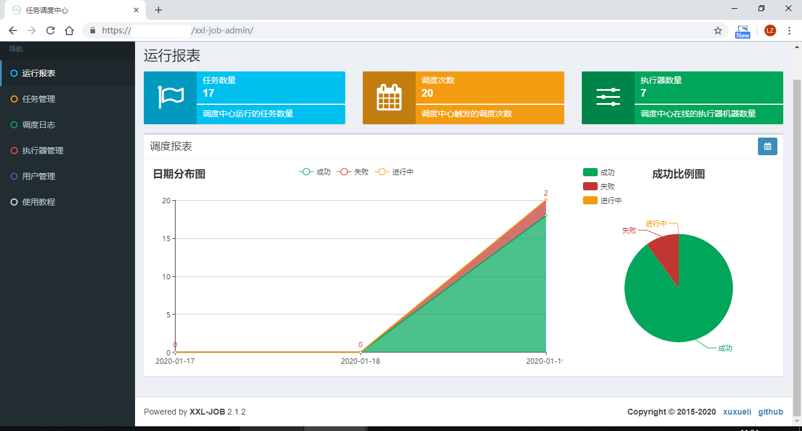
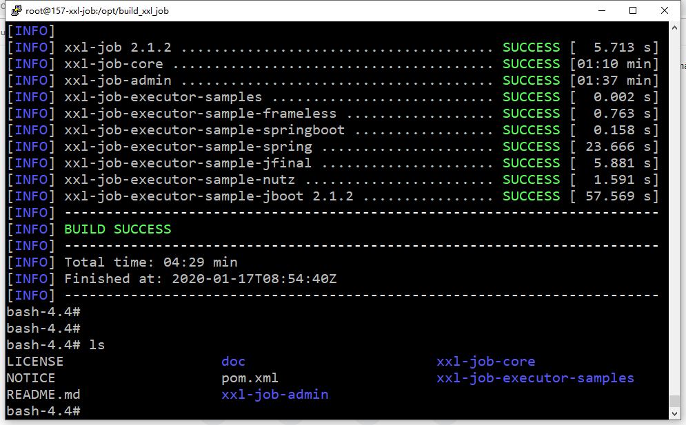
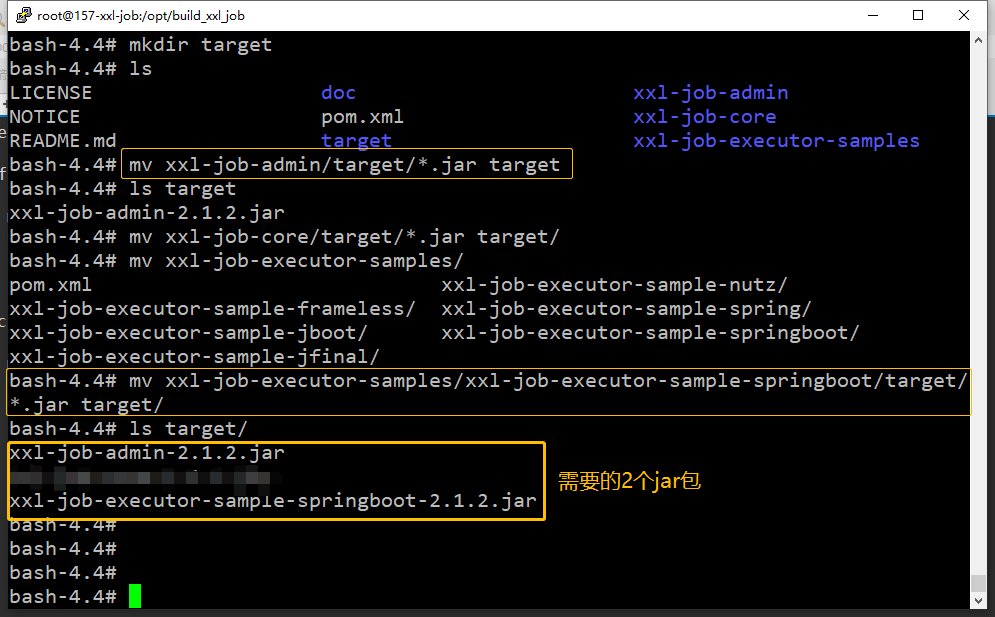
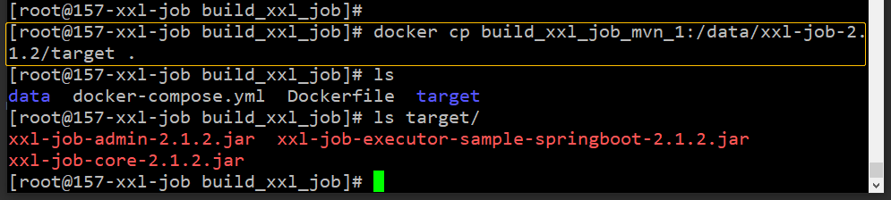

# 编译xxl-job-2.1.2


> xxl-job-2.0.2 只有一个admin用户，不能设置创建多个账号。v2.1.2可以设置多个账号。





## 运行一个maven容器

docker-compose.yml如下：

```yaml
mvn:
  image: maven:3.5-jdk-8-alpine
  volumes:
    - ./data:/data		# 源码包xxl-job-2.1.2.tar.gz在./data下
  command: ["tail", "-f", "/dev/null"]
```

或者

```sh
docker run -d --name mvn3 maven:3.5-jdk-8-alpine tail -f /dev/null
# 复制源码包到容器/data目录中
docker cp data/xxl-job-2.1.2.tar.gz mvn3:/data/
```


## 进入容器编译

```sh
docker exec -it mvn3 bash
# 编包
cd /data/xxl-job-{版本号}
mvn clean package
# 拷包
mkdir target
mv xxl-job-admin/target/*.jar target/
mv xxl-job-executor-samples/xxl-job-executor-sample-springboot/target/*.jar target/
```







将其从容器中拷贝到宿主机目录下：




停止xxl-job，替换原相应的所有jar包并重新启动。


**升级失败处理**

替换jar包并重新启动，发现启动失败。经分析是版本之间 数据库 的设计发生较大变化。因未提供数据迁移功能，通过手动复制旧版本的所有任务到新版本重建任务，完成本次升级过程。


## Supervisord配置

执行器（作为客户端）：

```ini
[program:xxl-job-executor]
command=java -jar /srv/xxl-job-executor-sample-springboot-2.1.2.jar --server.port=10080 --xxl.job.executor.ip=10.1.7.211  --xxl.job.executor.port=9999 --xxl.job.admin.addresses=https://job.keep.com/xxl-job-admin --xxl.job.executor.appname=xxl-job-executor-7-211
directory=/srv
user=root
startsecs=3
redirect_stderr=true
stdout_logfile_maxbytes=50MB
stdout_logfile_backups=3
stdout_logfile=/var/log/xxl-job-executor.log
```

调度服务（作为服务端）：

```ini
[program:xxl-job-admin_212]
command=java -jar /srv/xxl-target-2.1.2/xxl-job-admin-2.1.2.jar --spring.datasource.url=jdbc:mysql://127.0.0.1:3306/xxl_job?Unicode=true&characterEncoding=UTF-8 --spring.datasource.username=root --spring.datasource.password=mysql@dmin --server.port=8080
directory=/srv
user=root
startsecs=3
redirect_stderr=true
stdout_logfile_maxbytes=50MB
stdout_logfile_backups=3
stdout_logfile=/var/log/xxl-job-admin.log
```

