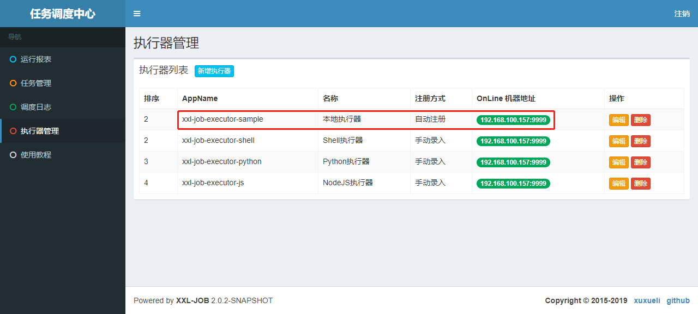
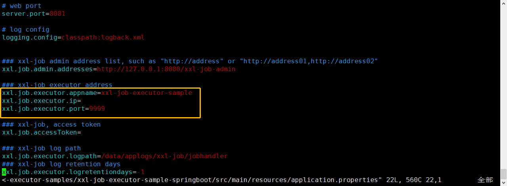
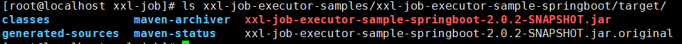
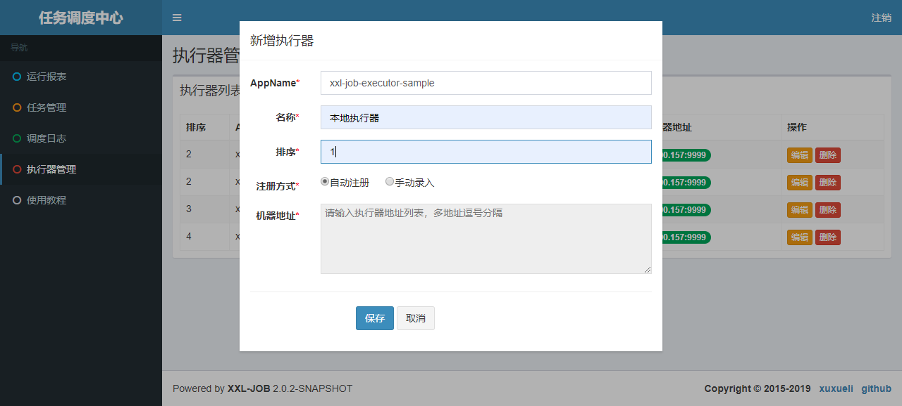
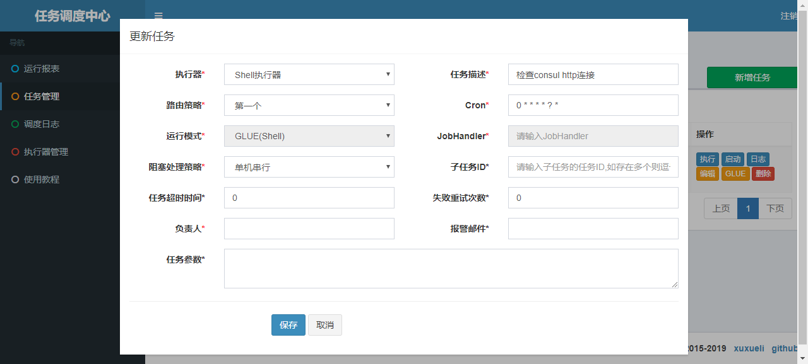
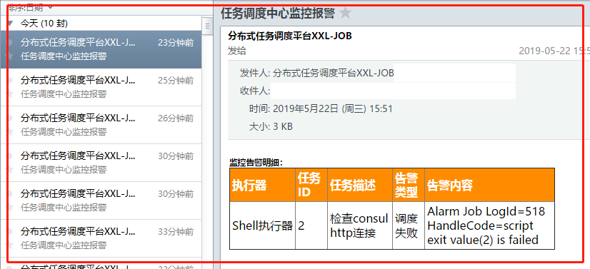

# xxl-job


## 新增执行器

- 编译执行器项目

  源码：https://github.com/xuxueli/xxl-job/




xxl-job-executor-sample是通过源码配置、编译后的组件xxl-job-executor-sample-springboot运行时提供的一个server，源码中修改的位置如下：



执行`mvn clean package`编译打包可生成jar文件



然后，通过supervisor使其在后台持续运行。


- 添加执行器到xxl-job-admin



注意：AppName与编译源码时配置的appname一致，才可以自动获取机器地址（端口）。否则，手动录入。


---

## 添加示例任务


任务设置




`0 * * * * ? *`表示每分钟（0秒时）调度一次，因间隔短，不设置任务超时及失败重试。任务参数内填多行也是作为一个参数（$1）传递给脚本的。路由策略“第一个”表示总是在第一个OnLine机器上执行。

该任务的示例脚本如下：

```sh
#!/bin/bash
echo "xxl-job: hello shell"

echo "脚本位置：$0"
echo "任务参数：$1"
echo "分片序号 = $2"
echo "分片总数 = $3"

failed=0
succeed=0
failed_urls=""
for url in $1 # 对每一行的url
do
  echo "current url: [$url]"
  status_code=$(curl -s -o /dev/null -w "%{http_code}" $url) # 检测http响应状态码
  echo "status_code: $status_code"
  if [ "$status_code" -ne 200 ]; then
    echo "Failed: Access $url failed."
    failed_urls="$failed_urls,$url"
    let failed=failed+1 # 失败+1
  else
    let succeed=succeed+1 # 成功+1
  fi
done

echo "Good bye!"
echo "Total: $failed failed $succeed succeed" # 日志中打印统计结果
if [ $failed -lt 0 ]; then
  echo "Failed Urls: $failed_urls"
fi

exit $failed # 退出状态值，非0表示失败
```

如果执行状态失败，将发出报警邮件。



